Section 9 : Controlling Program Flow
===

## Informations sur le papier
- Titre : Programmation C++
- Auteurs : `Etienne KOA`

## Aperçu de la section
+ Contrôle du déroulement du programme
   - Séquence
     - Ordonner les déclarations de manière séquentielle
   - Sélection
     - Faire des décisions
   - Itération
     - Boucler ou répéter

## Sélection - Prise de décision

+ Instruction « Si »
+ Instruction `If-else`
+ Instructions `If` imbriquées
+ Instruction `switch`
+ Opérateur conditionnel `?:`

## Boucle d'itération

+ boucle `for`
+ Boucle `for` basée sur une plage
+ boucle `while`
+ boucle `do-while`
+ `continue` et `break`
+ "Boucles" infinies
+ "Boucles" imbriquées

## Déclarations « Si »

+ `Si` l'expression est vraie, alors exécutez l'instruction.
+ `Si` l'expression est fausse, ignorez l'instruction

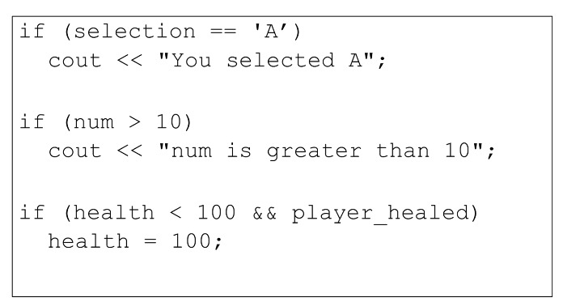

+ instruction de bloc

## Instruction `Bloquer`

+ Créez un bloc de code en incluant plus d'une instruction dans le code `block{}`.
+ Les blocs peuvent également contenir des déclarations de variables.
+ Ces variables ne sont visibles que dans la portée locale du bloc.

## Déclaration `If-else`

+ `Si` l'expression est `true` alors exécutez `statement1`.
+ `Si` l'expression est `false` alors exécutez `statement2`.

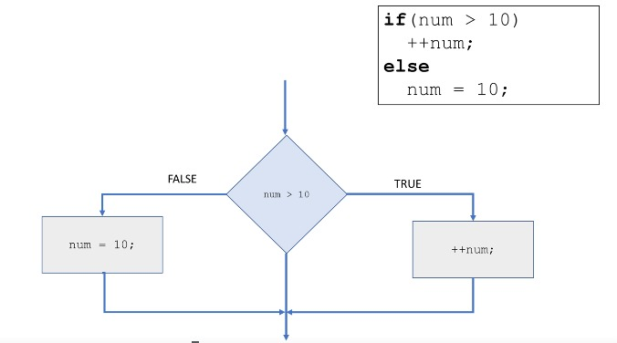

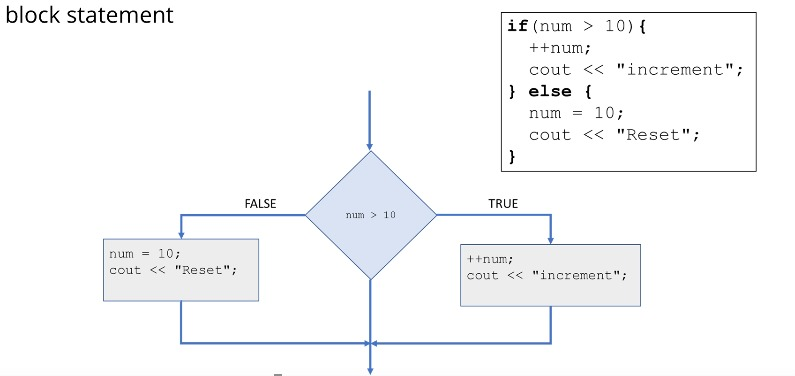

## Déclarations `if` imbriquées

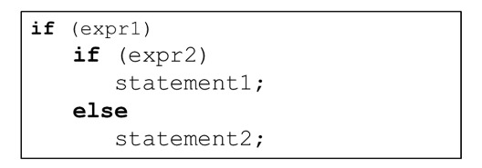

+ L'instruction `If` est imbriquée dans une autre.
+ Permet de tester plusieurs conditions.
+ `else` appartient au `if` proche.

#### The `switch` statement

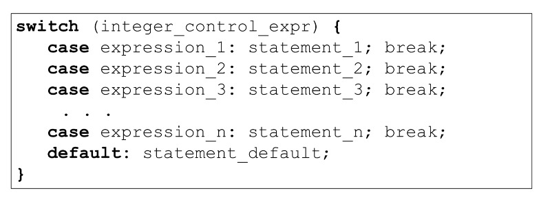

+ exemple : 

+ exemple de chute

+ avec une énumération

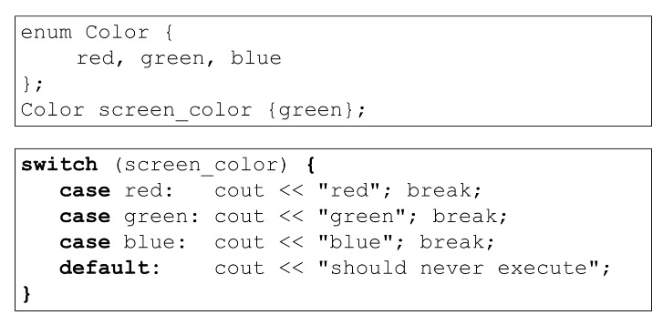

+ L'expression de contrôle doit être évaluée comme un type entier.
+ L'expression case doit être une expression constante qui s'évalue en entiers ou en littéraux entiers.
+ Une fois qu'une correspondance se produit, toutes les sections de cas suivantes sont exécutées « JUSQU'À » ce qu'un « break » soit atteint et que le « switch » soit terminé.

+ Meilleure pratique : fournissez une instruction de rupture pour chaque cas.
+ Meilleure pratique - « par défaut » est facultatif, mais doit être géré.

#### Opérateur conditionnel

+ `?:`

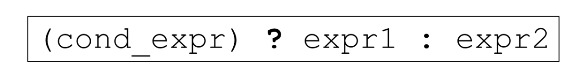

+ `cond_expr` est évalué comme une expression booléenne

   + si `cond_expr` est vrai alors la valeur de `expr1` est renvoyée.
   + si `cond_expr` est faux alors la valeur de `expr2` est renvoyée.

+ Semblable à la construction `if-else`
+ Opérateur ternaire
+ Très utile lorsqu'il est utilisé en ligne
+ Très facile à abuser !

+ Exemple

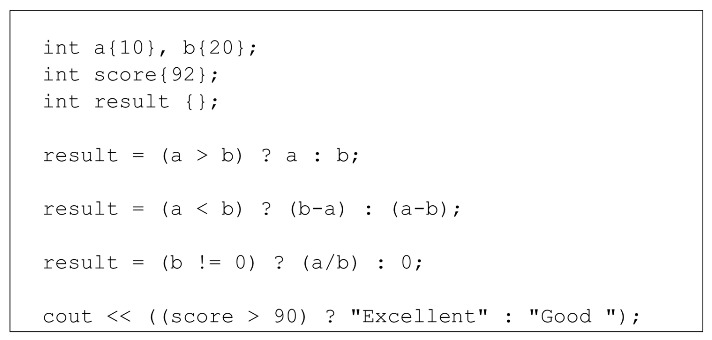

### Boucle

+ Itération

   + Le troisième élément de base de la programmation

     + `séquence, sélection, itération`

   + Itération ou répétition
   + Permet l'exécution d'une instruction ou d'un bloc d'instructions de manière répétée.
   + Les boucles sont constituées d'une condition de boucle et du corps qui contient les instructions à répéter.

+ Quelques cas d'utilisation typiques

+ Exécuter une boucle :

   + un nombre précis de fois
   + pour chaque élément d'une collection
   + tant qu'une condition spécifique reste vraie.
   + jusqu'à ce qu'une condition spécifique devienne fausse.
   + jusqu'à ce que nous atteignions la fin d'un flux d'entrée
   + pour toujours
   + bien d'autres encore

+ boucle `for`
   + Répétez un nombre spécifique de fois.
+ Boucle `Basée sur une plage`
   + une itération pour chaque élément d'une plage ou d'une collection
+ boucle `while`
   + Itérer pendant qu'une condition reste vraie.
   + s'arrêter lorsque la condition devient fausse.
   + vérifier la condition au début de chaque itération.
+ boucle `do-while`
   + Itérer pendant qu'une condition reste vraie.
   + Arrêtez-vous lorsqu'une condition devient fausse.
   + vérifier la condition à la fin de chaque itération

#### `for` Loop

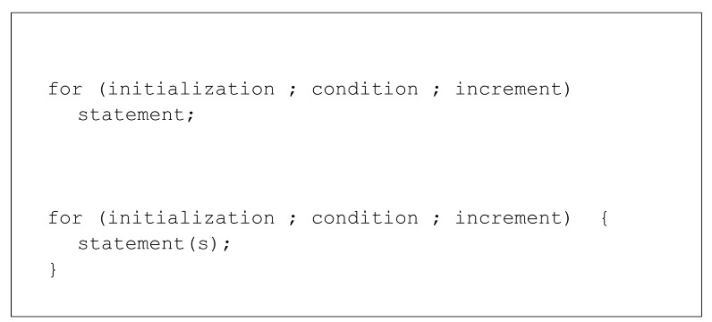

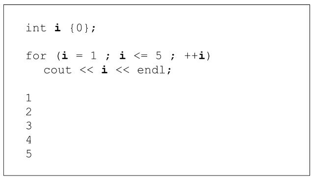

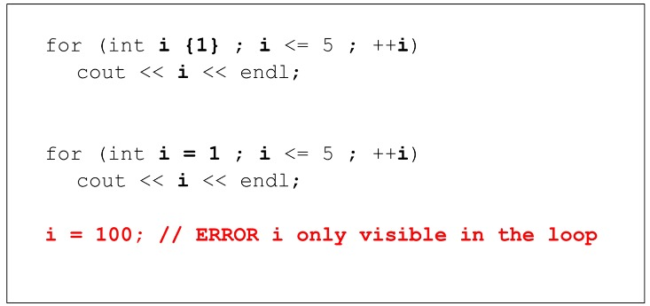

+ array example : 

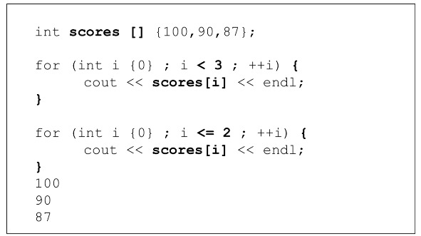

+ comma operator

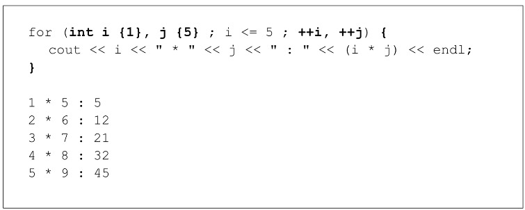

+ Quelques autres détails...

   + La boucle for de base est très claire et concise
   + Puisque les expressions de la boucle for sont toutes facultatives, il est possible d'avoir.

     + *pas d'initialisation*
     + *pas de test*
     + *pas d'incrément*

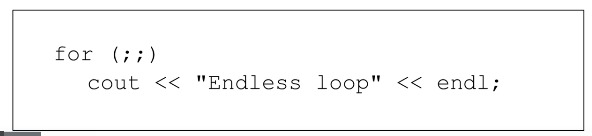

#### Range-based `for` Loop

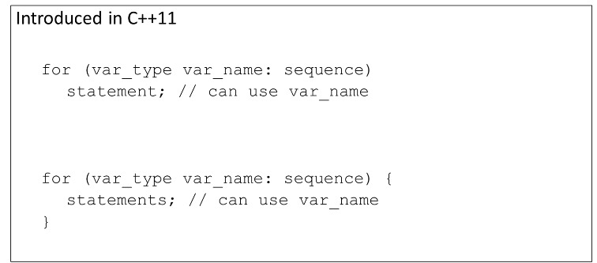

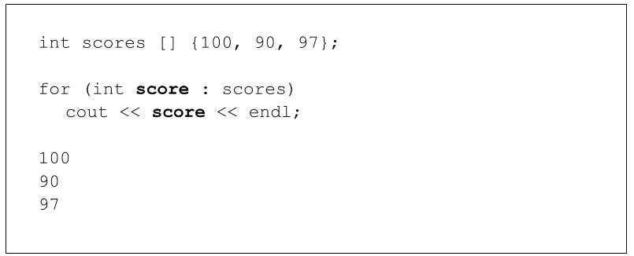

+ auto

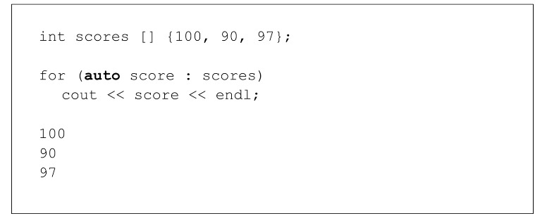

+ vector

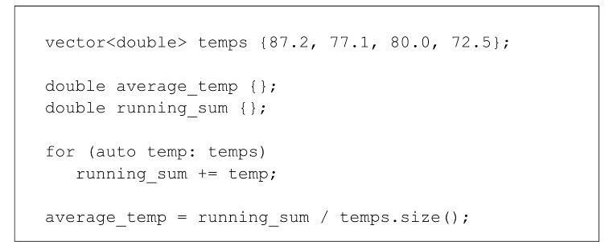

+ Initializer list

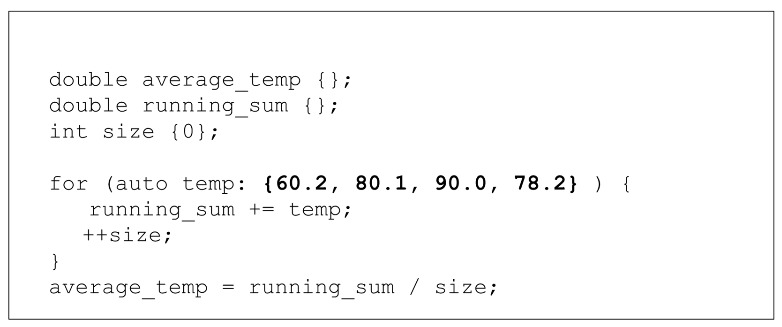

+ String

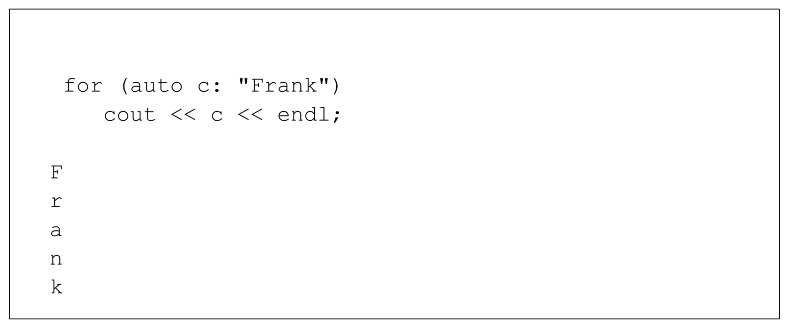

#### While Loop

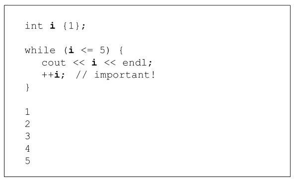

+ even numbers

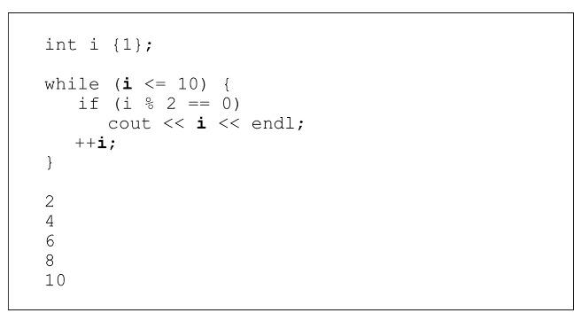

+ array example

+ input validation

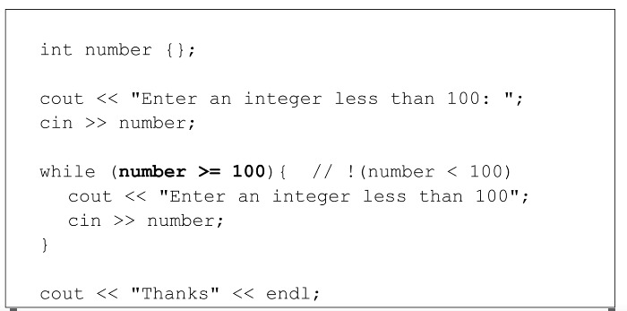

+ input validation - boolean flag

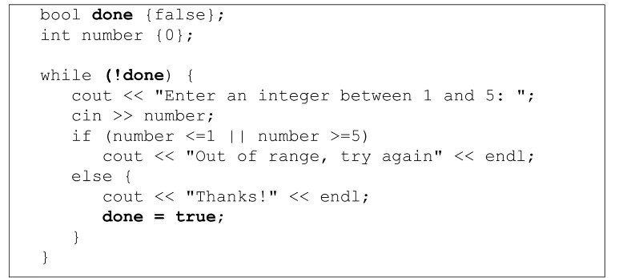

#### `do-while` Loop

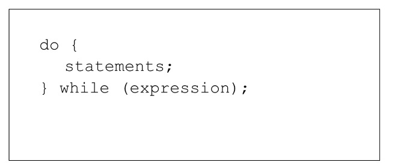

+ Input validation

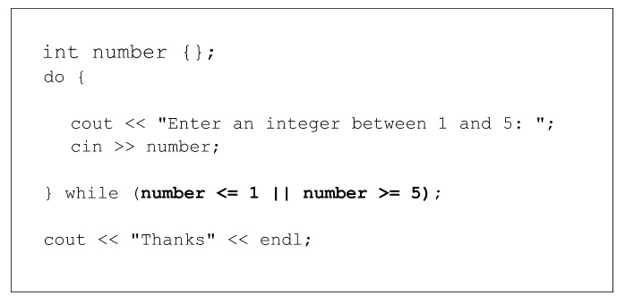

+ area calculation with calculate another

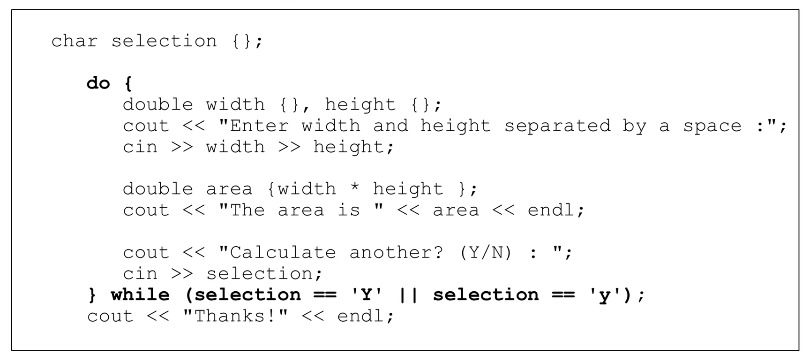

#### Instructions `continue` et `break`

+ `continue`
   + Aucune autre instruction dans le corps de la boucle n'est exécutée.
   + Le contrôle passe immédiatement directement au début de la boucle pour l'itération suivante.

+ `break`
   + Aucune autre instruction dans le corps de la boucle n'est exécutée.
   + Les boucles sont immédiatement terminées.
   + Control passe immédiatement à l'instruction qui suit la construction de la boucle.
  
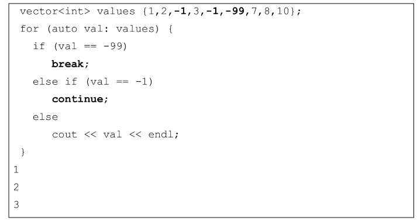

#### Boucles infinies

+ Boucles dont l'expression de condition est toujours évaluée à vrai.
+ Habituellement, cela est involontaire et constitue une erreur du programmeur.
+ Parfois, les programmeurs utilisent des boucles infinies et incluent et interrompent des instructions dans le corps pour les contrôler.
+ Parfois, des boucles infinies sont exactement ce dont nous avons besoin

   + Boucle d'événements dans un programme événementiel.
   + Système d'exploitation

+ exemple 

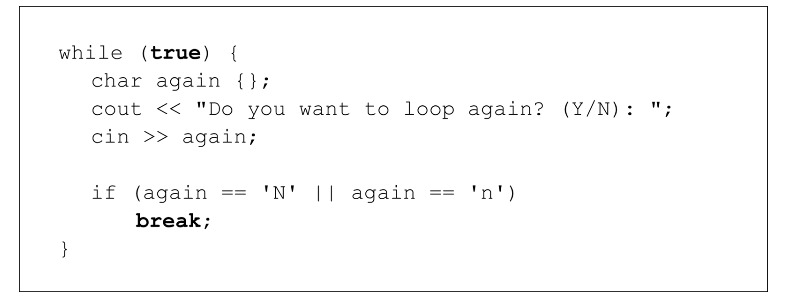

#### Boucles imbriquées
+ Boucle imbriquée dans une autre boucle.
+ Peut comporter autant de niveaux de profondeur que le programme en a besoin.
+ Très utile avec les structures de données multidimensionnelles.
+ Boucle externe vs boucle intérieure

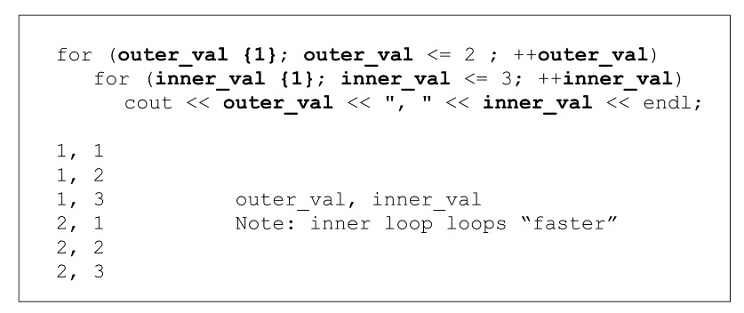

+ Multiplication table:

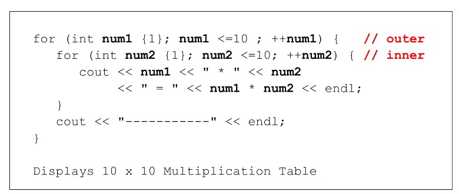

+ 2D Arrays - set all elements to 1000

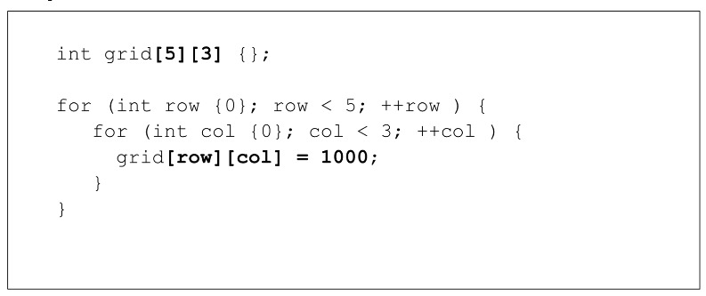

+ 2D Arrays - display elements

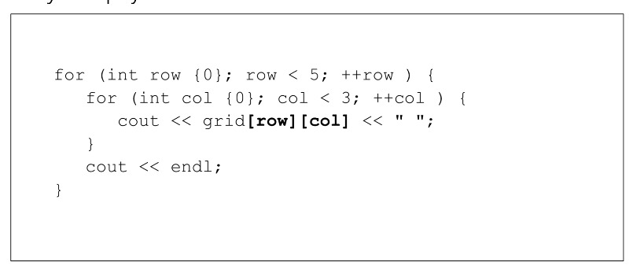

+ 2D Vrector - display elements

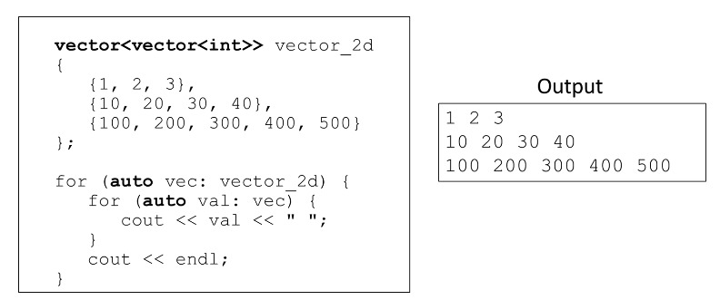

