Section 11 - Functions
===

## Information
- Title:  `Section 11 - Functions`
- Authors:  `ETIENNE KOA`

## Les fonctions
- Fonction
   - définition
   - prototype
   - Paramètres et passage par valeur
   - déclaration `return`
   - valeurs des paramètres par défaut
   - surcharge
   - passer des tableaux à la fonction
   - passage par référence
   - Fonctions `inline`
   - Type de retour « auto »
   - fonctions récursives

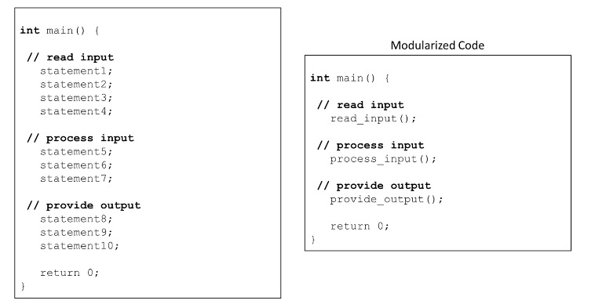

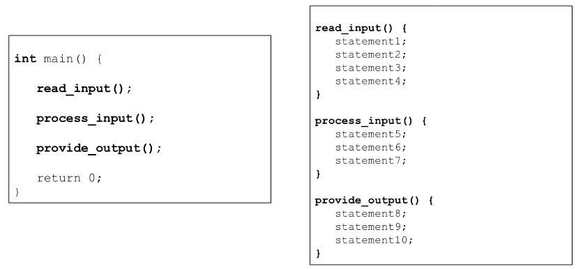

## Qu'est-ce qu'une fonction ?

+ Programmes `C++`
   + Bibliothèques standards `C++` (fonctions et classes)
   + Bibliothèques tierces (fonctions et classes)
   + Nos propres fonctions et classes

+ Des fonctions permettent la modularisation d'un programme
   + Séparez le code en unités logiques autonomes
   + Ces unités peuvent être réutilisées

+ Analogie huées/travailleurs

   + Écrivez votre code la spécification de la fonction
   + Comprendre ce que fait la fonction
   + Comprendre de quelles informations la fonction a besoin
   + Comprendre ce que renvoie la fonction
   + Comprendre les contraintes de performances

+ Ne vous inquiétez pas du fonctionnement interne de la fonction
   + Sauf si c'est vous qui écrivez la fonction !

+ Exemple `<cmath>`

   + Calculs mathématiques courants
   + Fonction globale appelée :

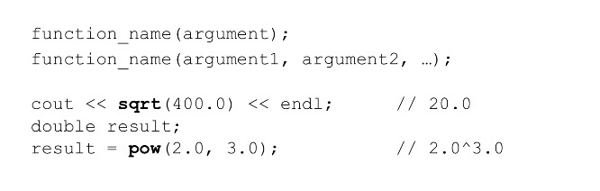

+ Fonctions définies par l'utilisateur

   + Nous pouvons définir nos propres fonctions
   + Voici un aperçu

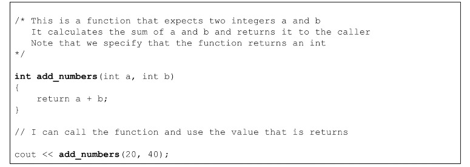

+ Fonctions définies par l'utilisateur
   + Renvoie zéro si l'un des arguments est négatif


[Mathematics functions](https://en.cppreference.com/w/cpp/header/cmath)

## Définition de la fonction

+ nom
   + le nom de la fonction
   + mêmes règles que pour les variables
   + devrait être significatif
   + généralement un verbe ou une phrase verbale

+ liste des paramètres
   + La variable passée dans la fonction
   + leurs types doivent être précisés

+ type de retour

   + le type de données renvoyées par la fonction

+ corps
   + les instructions exécutées lorsque la fonction est appelée.
   + entre accolades `{}`

+ Exemple sans paramètres
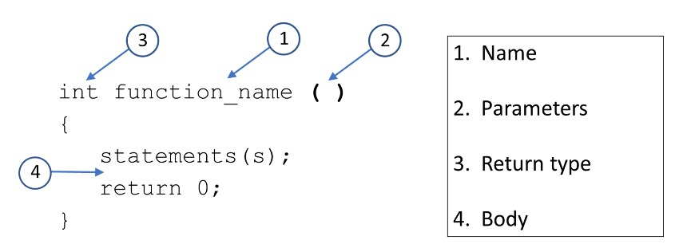

+ Exemple sans type de retour (void)
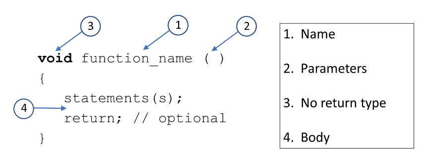

+ Exemple avec plusieurs paramètres
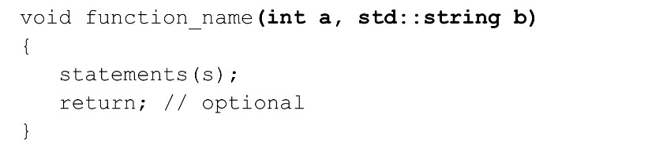


+ Une fonction sans type de retour et sans paramètres
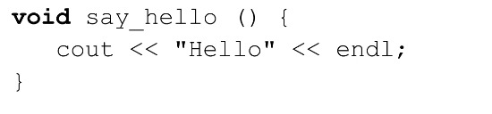

## Appeler une fonction

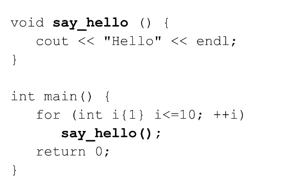
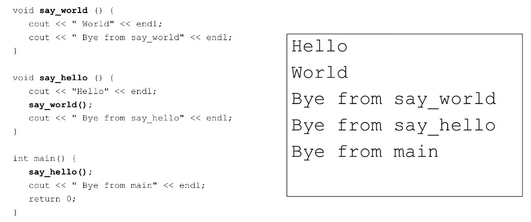

+ Les fonctions peuvent appeler d'autres fonctions
+ Le compilateur doit connaître les détails de la fonction « AVANT » qu'elle soit appelée !

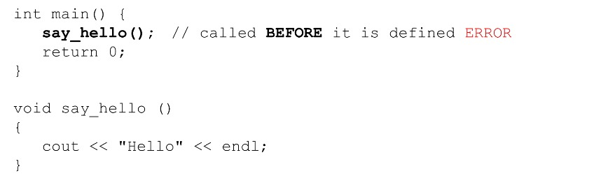

## Prototypes de fonctions

+ **Le compilateur doit « connaître » une fonction avant de l'utiliser**

+ Définir les fonctions avant de les appeler
   + OK pour les petits programmes
   + Pas une solution pratique pour les programmes plus importants

+ Utiliser des prototypes de fonctions
   + Indique au compilateur ce qu'il doit savoir sans une définition complète de la fonction
   + Également appelées déclarations anticipées
   + Placé en début de programme
   + Également utilisé dans nos propres fichiers d'en-tête `(.h)` - nous en reparlerons plus tard

+ Exemple

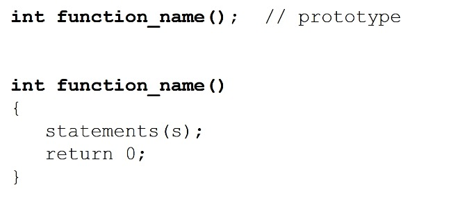
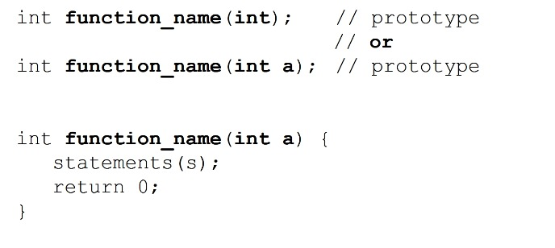
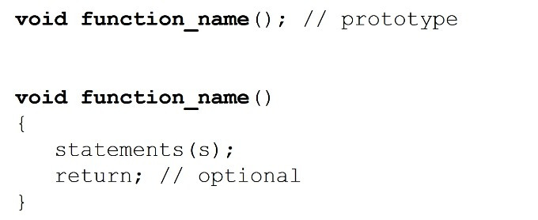
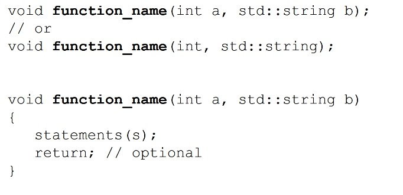


+ Une fonction sans type de retour et sans paramètres
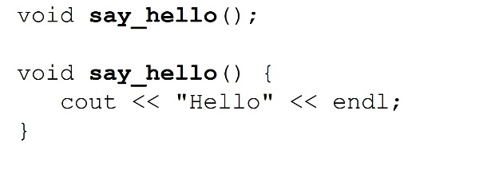


+ Appel d'une fonction
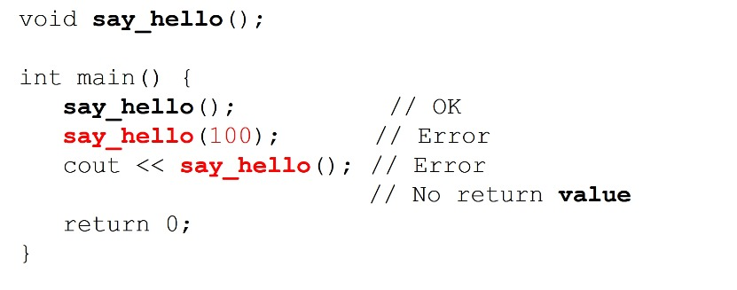


+ Exemple
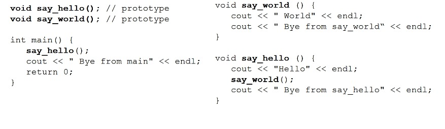

## Paramètres des fonctions

+ Lorsque nous appelons une fonction, nous pouvons transmettre des données à cette fonction
+ Dans l'appel de fonction, ils sont appelés arguments
+ Dans la définition de la fonction, ils sont appelés paramètres.
+ Ils doivent correspondre en nombre, en ordre et en type.

+ Exemple
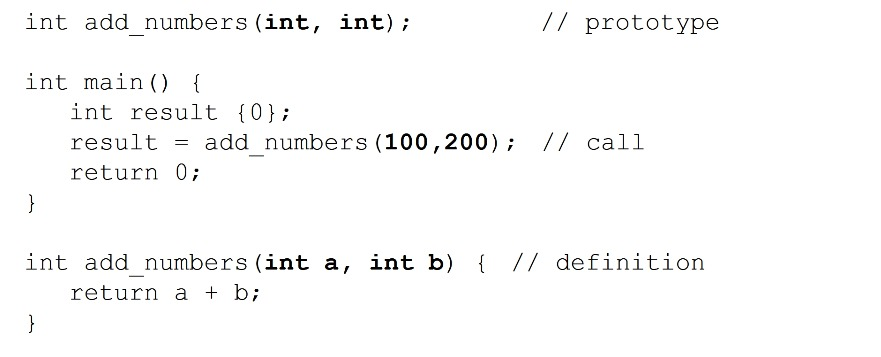
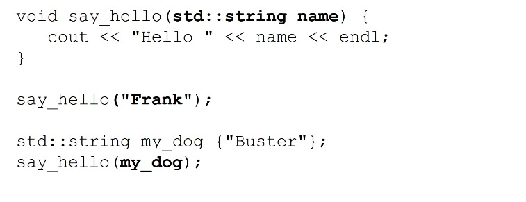


+ Passage par valeur

   + Lorsque vous transmettez des données dans une fonction, elles sont transmises par valeur.
   + Une copie des données est transmise à la fonction.
   + Quelles que soient les modifications que vous apportez au paramètre dans la fonction, cela n'affecte PAS l'argument qui a été transmis.

+ Paramètres formels et réels

   + `Paramètres formels` - les paramètres définis dans l'en-tête de la fonction.
   + `Paramètres réels` - le paramètre utilisé dans l'appel de fonction, les arguments.

+ Example

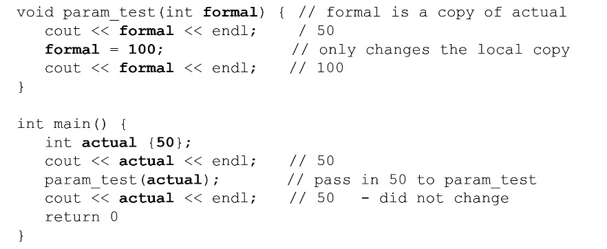

+ Déclaration de retour de fonction

     + si une fonction renvoie une valeur alors elle doit utiliser une instruction `return` qui renvoie une valeur.
     + Si une fonction ne renvoie pas de valeur `(void)` alors l'instruction `return` est facultative.
     + L'instruction `return` peut apparaître n'importe où dans le corps de la fonction.
     + L'instruction `return` quitte immédiatement la fonction.
     + Nous pouvons avoir plusieurs instructions `return` dans une fonction
       + Évitez de nombreuses instructions de retour dans une fonction.
     + La valeur de retour est le résultat de l'appel de fonction.

## Valeurs des arguments par défaut

+ Lorsqu'une fonction est appelée, tous les arguments doivent être fournis.
+ Parfois, certains arguments ont la plupart du temps les mêmes valeurs.
+ Nous pouvons dire au compilateur d'utiliser les valeurs par défaut si les arguments ne sont pas fournis.
+ Les valeurs par défaut peuvent être dans le prototype ou la définition, pas les deux
   + meilleure pratique - dans le prototype.
   + doit apparaître à la fin de la liste des paramètres.
+ Peut avoir plusieurs valeurs par défaut
   + doit apparaître consécutivement à la fin de la liste des paramètres.

+ Exemple - aucun argument par défaut
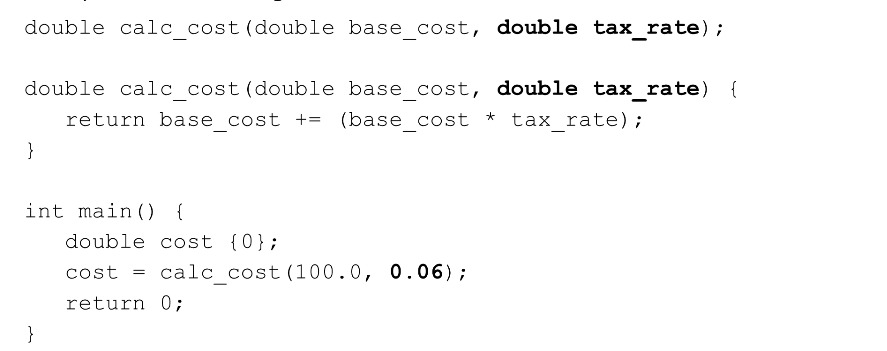

+ Exemple - argument par défaut unique
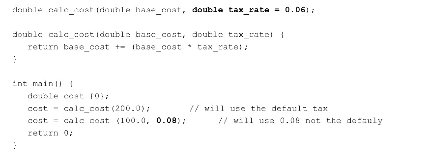

+ Exemple - plusieurs arguments par défaut
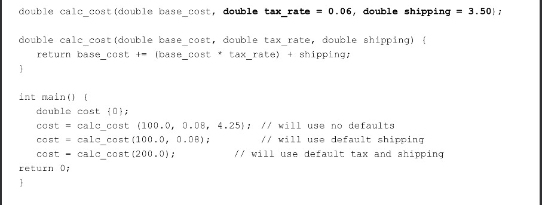

## Fonctions de surcharge

+ Nous pouvons avoir des fonctions qui ont une liste de paramètres différente qui portent le même nom.
+ Mécanisme d'abstraction puisqu'on peut simplement penser `imprimer` par exemple.
+ Un type de « polymorphisme »
   + Nous pouvons faire fonctionner le même nom avec différents types de données pour exécuter le comportement.

+ Le compilateur doit être capable de distinguer les fonctions en fonction des listes de paramètres et des arguments fournis.


+ Exemple
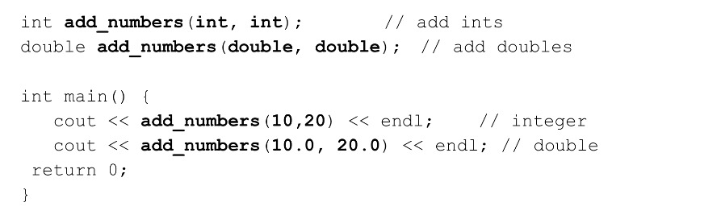
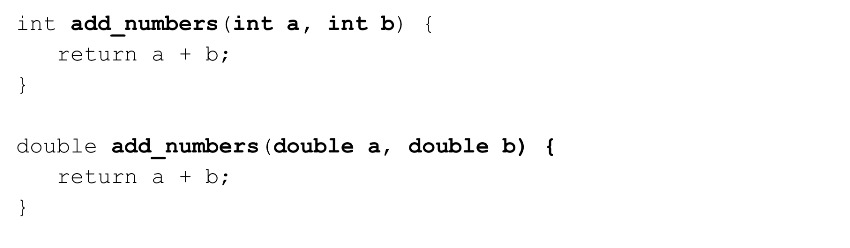
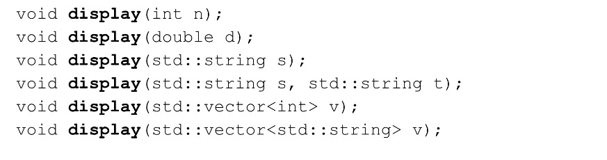


+ Le type de retour n'est pas pris en compte
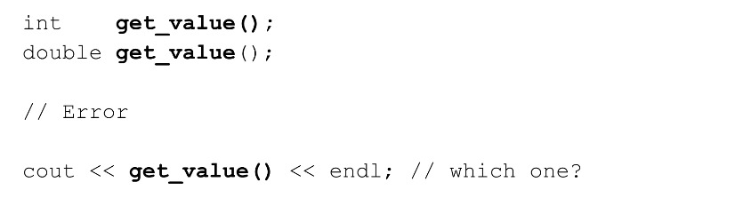

## Passer des tableaux aux fonctions

+ Nous pouvons passer un tableau à une fonction en fournissant des crochets dans la description formelle du paramètre.

+ Les éléments du tableau ne sont « PAS » copiés.
+ Puisque le nom du tableau correspond à l'emplacement du tableau en mémoire, cette adresse est ce qui est copié.
+ La fonction n'a donc aucune idée du nombre d'éléments - cette adresse est ce qui est copié.
+ La fonction n'a donc aucune idée du nombre d'éléments dans le tableau puisque tout ce qu'elle sait, c'est l'emplacement du premier élément (le nom du tableau).

+ Exemple

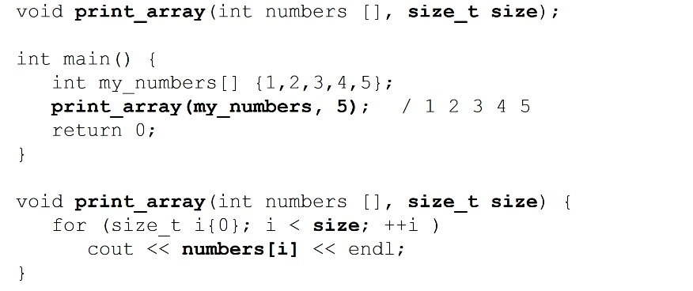


+ Puisque nous transmettons l'emplacement du tableau.
   + La fonction peut modifier le tableau réel !
   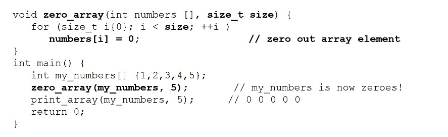

+ paramètres const
  + Nous pouvons dire au compilateur que les paramètres de la fonction sont `const` (lecture seule).
  + Cela pourrait être utile pour la fonction `print-array` car elle ne devrait `PAS` modifier le tableau.


## Passer par référence

+ Parfois, nous voulons pouvoir modifier le paramètre réel depuis le corps de la fonction.
+ Pour y parvenir, nous avons besoin de l'emplacement ou de l'adresse du paramètre réel.
+ Nous avons vu quel est l'effet avec le tableau, mais qu'en est-il des autres types de variables ?
+ Nous pouvons utiliser des paramètres de référence pour indiquer au compilateur de transmettre une référence au paramètre réel.
+ Le paramètre formel sera désormais un alias pour le paramètre réel.

+ Exemple
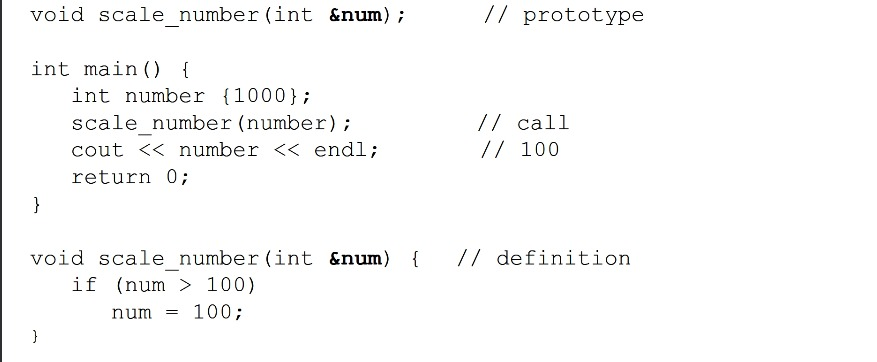
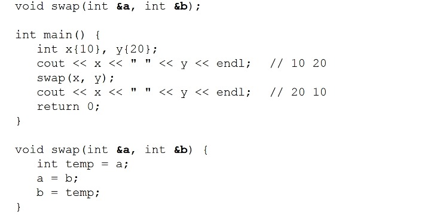

+ Exemple vectoriel - passage par valeur
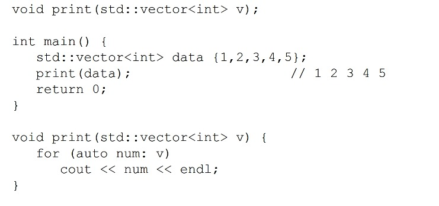

+ Exemple vectoriel - passer par référence
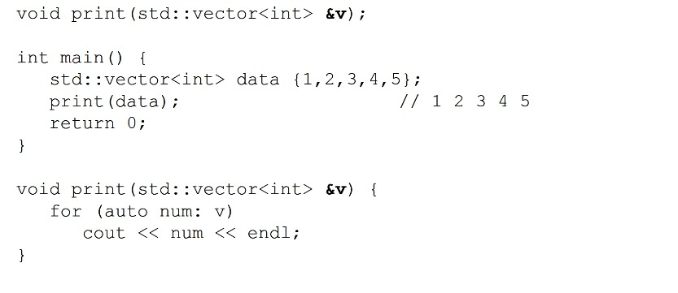

+ Exemple vectoriel - passer par référence const
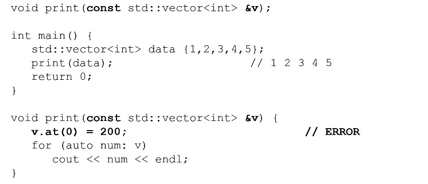

## Règles de portée

**Portée locale ou de bloc**

+ Identifiants déclarés dans le bloc {}
+ Uniquement visible dans le bloc {} où il a été déclaré.
+ Les variables locales de la fonction ne sont actives que pendant l'exécution de la fonction.
+ Les variables locales ne sont PAS conservées entre les appels de fonction.
+ Avec les blocs imbriqués, les blocs intérieurs peuvent « voir » mais les blocs extérieurs « voient » à l'intérieur.

**Variables locales statiques**

+ Déclaré avec les qualificatifs « statiques »

```
static int value {10};
```

+ La valeur EST conservée entre les appels de fonction.
+ Initialisé uniquement lors du premier appel de la fonction

**Portée Global**

+ Identifiant déclaré en dehors de toute fonction ou classe.
+ Visible par toutes les parties du programme après la déclaration de l'identifiant global.
+ Les constantes globales sont OK.
+ Meilleure pratique - n'utilisez pas de variables globales.


## Comment fonctionnent les appels de fonction ?

**La fonction utilise la 'pile d'appels de fonction'**
+ Analogue à une pile de livres
+ LIFO - Dernier entré, premier sorti
+ push et pop

**Cadre de pile ou enregistrement d'activation**
+ Les fonctions doivent rendre le contrôle à la fonction qui l'a appelé.
+ Chaque fois qu'une fonction est appelée, nous créons un nouvel enregistrement d'activation et le plaçons sur la pile.
+ Lorsqu'une fonction se termine, nous ouvrons l'enregistrement d'activation et revenons.
+ Les variables locales et les paramètres de fonction sont alloués sur la pile.

**La taille de la pile est finie - Stack Overflow**


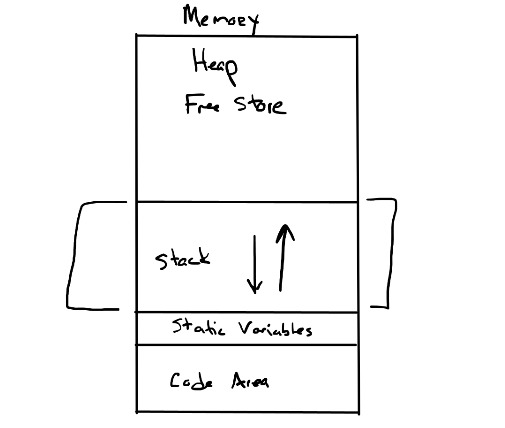


## Fonctions en ligne

+ Les appels de fonction entraînent une certaine surcharge.
+ Vous avez vu ce qui se passe sur la pile d'appels
+ Parfois nous avons des fonctions simples
+ On peut suggérer au compilateur de les compiler 'inline'
  + éviter la surcharge des appels de fonction
  + générer du code assembleur en ligne
  + plus rapide
  + pourrait provoquer une surcharge du code
+ Les optimisations des compilateurs sont très sophistiquées
  + Sera probablement intégré même sans votre suggestion

**Exemple**

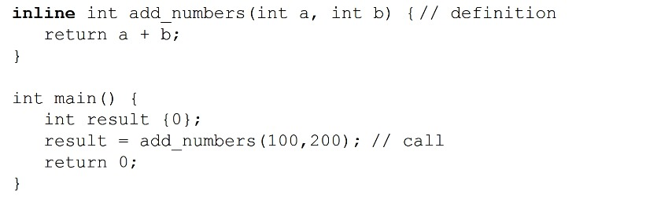


## Fonctions récursives
+ Une fonction récursive est une fonction qui s'appelle elle-même.
  + Soit directement, soit indirectement via une autre fonction
+ Résolution de problèmes récursive
  + Cas de base
  + Divisez le reste du problème en sous-problème et effectuez un appel récursif
+ Il existe de nombreux problèmes qui se prêtent à des solutions récursives
+ Mathématiques - Factorielle, Fibonacci, Fractales...

**Exemple - Factorielle**
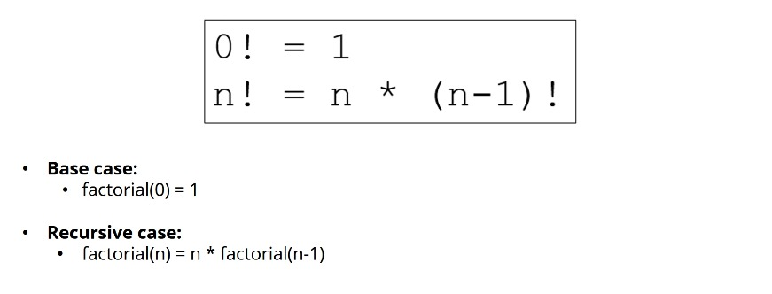
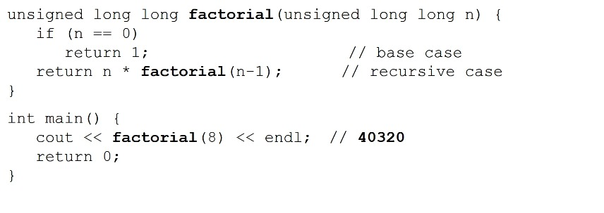

**Exemple - Fibonacci**
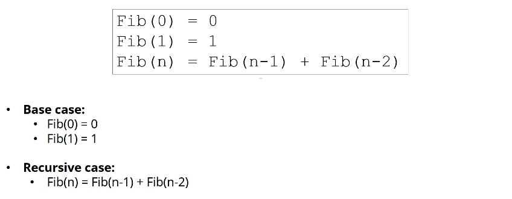

**Exemple - Factorielle**
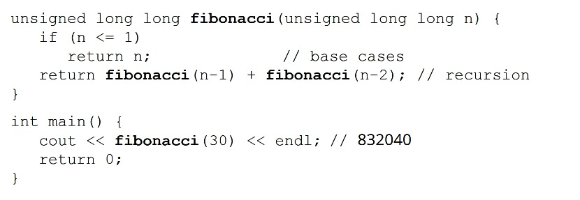


**Notes IMPORTANTES**

+ Si la récursivité ne s'arrête pas, vous aurez une récursivité infinie.
+ La récursivité peut nécessiter beaucoup de ressources.
+ N'oubliez pas le(s) cas de base
  + Il termine la récursion
+ N'utilisez des solutions récursives que lorsque cela a du sens
+ Tout ce qui peut être fait de manière récursive peut être fait de manière itérative
  + Erreur de débordement de pile
