Section 12 : Pointers and References
===

## Information
- Title:  `Section 12 : Pointers and References`
- Authors:  `Etienne KOA`


## Aperçu
- Qu'est-ce qu'un pointeur ?
- Déclarer des pointeurs
- Stockage des adresses dans des pointeurs
- Pointeurs de déréférencement
- Allocation dynamique de mémoire
- Arithmétique du pointeur
- Pointeurs et tableaux
- Passage par référence avec des pointeurs
- const et pointeurs
- Utiliser des pointeurs vers des fonctions
- Pièges potentiels du pointeur
- Qu'est-ce qu'une référence ?
- Réviser les références de passage aux fonctions
- Const et références
- Variables de référence dans les boucles for basées sur une plage
- Pièges potentiels des références
- Pointeurs bruts ou intelligents

## Qu'est-ce qu'un pointeur ?

+ Une variable
   + dont la valeur est une adresse

+ Que peut-il y avoir à cette adresse ?

   + Une autre variable
   + Une fonction

+ Les pointeurs pointent vers des variables ou des fonctions ?

+ Si `x` est une variable entière et que sa valeur est 10 alors je peux déclarer un pointeur vers elle.

+ Pour utiliser les données vers lesquelles pointe le pointeur, vous devez connaître son type.

## Pourquoi utiliser des pointeurs ?

Ne puis-je pas simplement utiliser la variable ou la fonction elle-même ?

**Oui, mais pas toujours**

+ À l'intérieur des fonctions, des pointeurs peuvent être utilisés pour accéder aux données définies en dehors de la fonction. Ces variables peuvent ne pas être dans la portée, vous ne pouvez donc pas y accéder par leur nom.

+ Les pointeurs peuvent être utilisés pour fonctionner sur des tableaux de manière très efficace

+ Nous pouvons allouer de la mémoire dynamiquement sur le tas ou sur le magasin gratuit
   + Cette mémoire n'a même pas de nom de variable.
   + La seule façon d'y accéder est via un pointeur

+ Avec `OO`. les pointeurs sont le fonctionnement du polymorphisme !

+ Peut accéder à des adresses spécifiques en mémoire
   + utile dans les applications embarquées et systèmes

## Déclarer des pointeurs

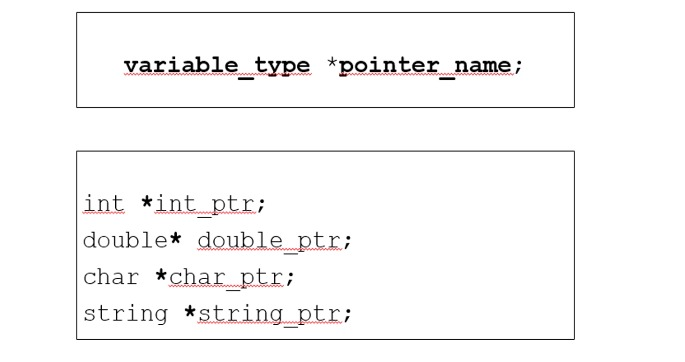

**Initialisation des variables de pointeur pour «pointer nulle part»**

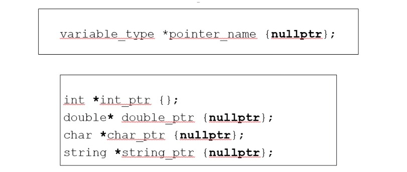

+ Toujours initialiser les pointeurs
+ Les pointeurs non initialisés contiennent des données inutiles et peuvent « pointer n'importe où »
+ L'initialisation à zéro ou `nullptr(C++ 11)` représente l'adresse zéro
   + Implique que le pointeur « ne pointe nulle part »
+ Si vous n'initialisez pas un pointeur pour qu'il pointe vers une variable ou une fonction, vous devez l'initialiser à «`nullptr` pour le « rendre nul ».


## Accès à l'adresse du pointeur ?

+ `&` l'opérateur d'adresse

+ Les variables sont stockées dans des adresses uniques
+ Opérateur unaire
+ Évalue à l'adresse de son opérande
   + L'opérande ne peut pas être une constante ou une expression évaluée à des valeurs temporaires.

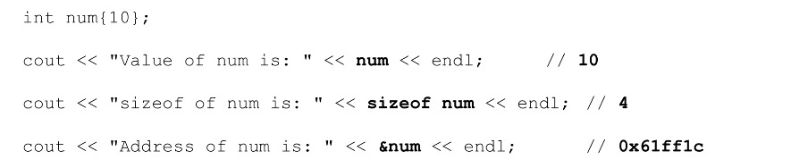

<br/>

+ `&` l'opérateur d'adresse - Exemple

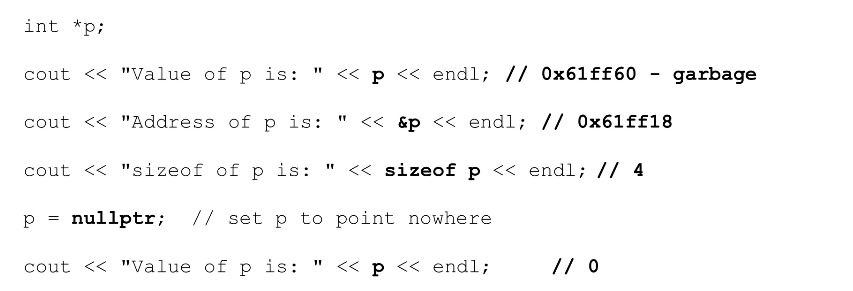

<br/>

+ `sizof` une variable de pointeur

+ Ne confondez pas la taille d'un pointeur et la taille de ce qu'il ^pointe
+ Tous les pointeurs d'un programme ont la même taille
+ Ils peuvent pointer vers des types très grands ou très petits

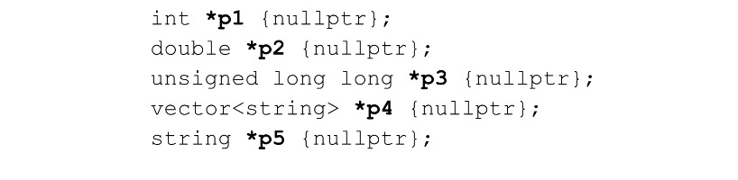

<br/>

**Typed Pointers**

+ Le compilateur s'assurera que l'adresse stockée dans une variable de pointeur est du type correct.

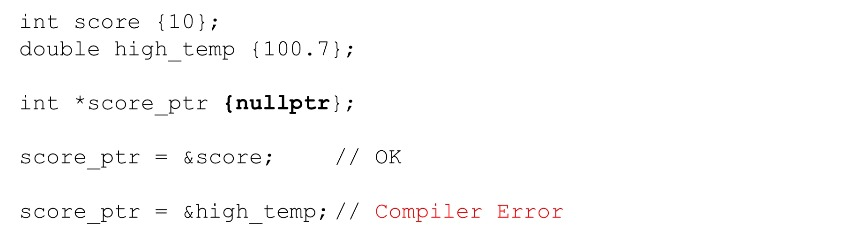

<br/>

+ `&` l'opérateur d'adresse
+ Les `Pointeurs` sont des variables donc ils peuvent changer
+ Les `pointeurs` peuvent être nuls
+ Les « pointeurs » peuvent être non initialisés

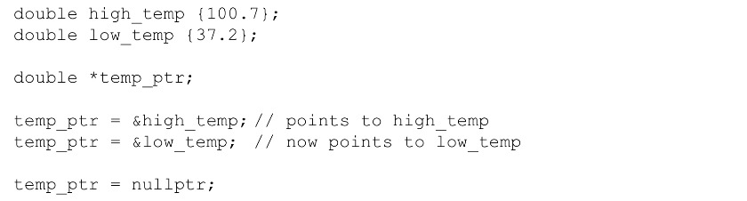

<br/>

## Déférence d'un pointeur

**Accédez aux données vers lesquelles nous pointons - en déférant un pointeur**

+ Si `score_ptr` est un pointeur et a une adresse valide
+ Ensuite, vous pouvez accéder aux données à l'adresse contenue dans le `score_ptr` en utilisant l'opérateur de déférence `*`

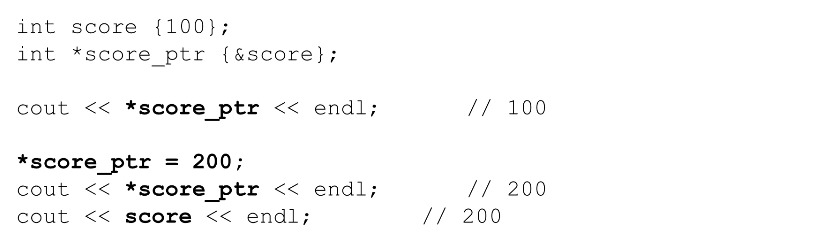

<br/>

+ Accédez aux données vers lesquelles nous pointons

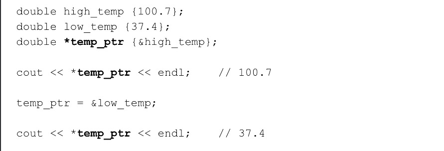
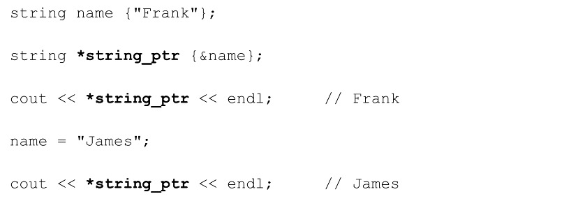

<br/>

## Allocation de mémoire dynamique

**Stockage d'allocation à partir du tas au moment de l'exécution**

+ Souvent, nous ne savons pas de quelle quantité de stockage nous avons besoin jusqu'à ce que nous en ayons besoin

+ Nous pouvons allouer du stockage pour une durée et une durée d'exécution variables

+ Rappeler les tableaux `C++`

   + Nous avons dû fournir explicitement la taille et cela a été corrigé
   + Mais les vecteurs grandissent et rétrécissent dynamiquement

+ Nous pouvons utiliser des pointeurs pour accéder au stockage de tas nouvellement alloué

<br/>

**utiliser `new` pour allouer du stockage**

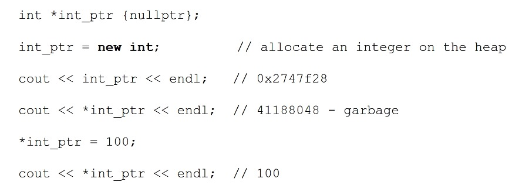

<br/>

**en utilisant `delete` pour désallouer le stockage**

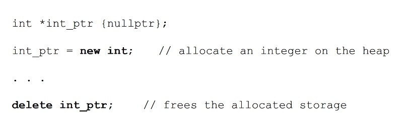

<br/>

**utiliser `new[]` pour allouer du stockage d' un tableau**

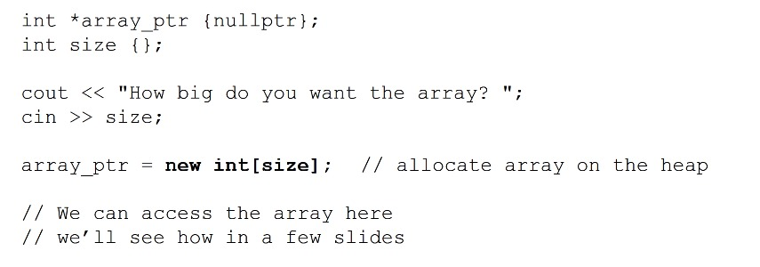

<br/>

**utiliser `delete[]` pour libérer le stockage d'un tableau**

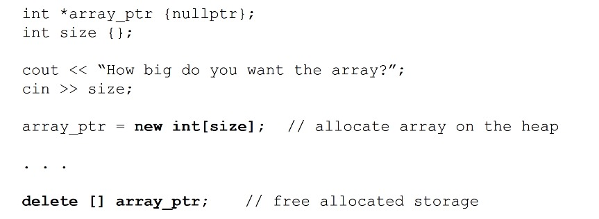

## Relation entre les tableaux et les pointeurs
+ La valeur d'un nom de tableau est l'adresse du premier élément du tableau
+ La valeur de la variable pointeur est une adresse
+ Si le pointeur pointe vers le même type de données que l'élément du tableau, alors le pointeur et le nom du tableau peuvent être utilisés de manière interchangeable (presque).

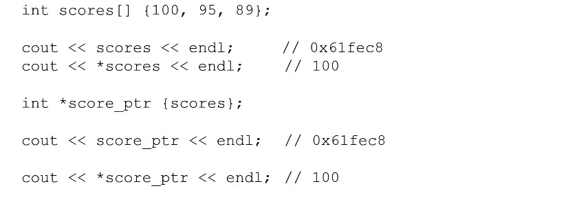
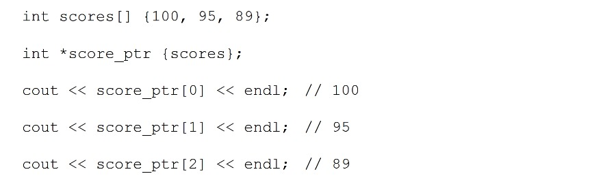

**Utilisation de pointeurs dans les expressions**

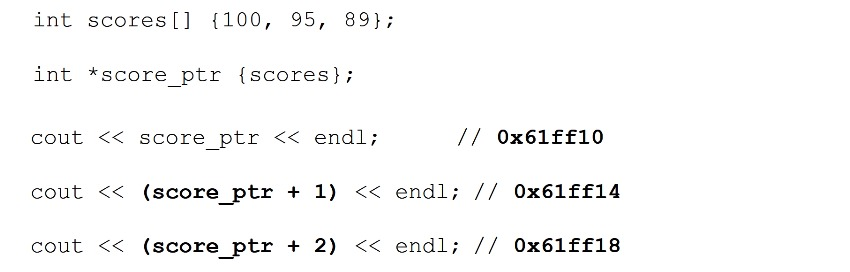
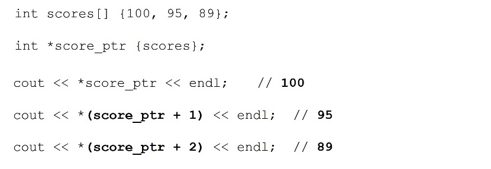

<br/>

**Équivalence des notations indice et décalage**

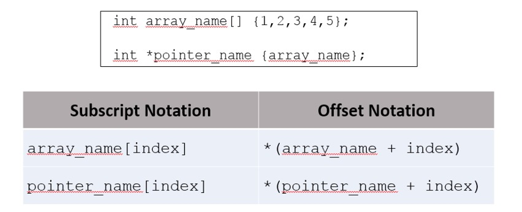

## Arithmétique du pointeur

+ Les pointeurs peuvent être utilisés dans

   + Expressions d'affectation
   + Expressions arithmétiques
   + Expressions de comparaison

+ `C++` permet l'arithmétique des pointeurs
+ L'arithmétique des pointeurs n'a de sens qu'avec les tableaux bruts

**`++` et `--`**

+ `(++)` : incrémente un pointeur pour pointer vers l'élément suivant du tableau `int_ptr++` ;
+ `(--)` : décrémente un pointeur pour pointer vers l'élément précédent du tableau `int_ptr--` ;

**`+` et `-`**

+ `(+)` : incrémente le pointeur de `n * sizeof(type)`

```
int_ptr += n; ou int_ptr = int_ptr + n;
```

+ `(-)` : décrémenter le pointeur de `n * sizeof(type)`

```
int_ptr -= n; ou int_ptr = int_ptr - n;
```


**Soustraire deux pointeurs**

+ Déterminer le nombre d'éléments entre les pointeurs
+ Les deux pointeurs doivent pointer vers le même type de données

```
   int n = int_ptr2 - int_ptr1 ;
```


**Comparaison de deux pointeurs `==` et `!=`**

+ Déterminer si deux pointeurs pointent vers le même emplacement
   + ne compare PAS les données là où elles pointent !

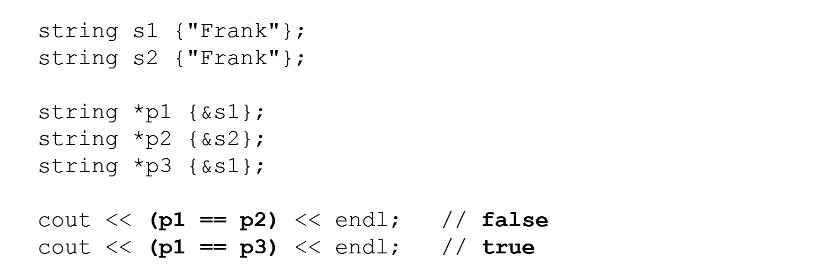

**La comparaison des pointeurs de données pointe vers**

+ Déterminer si deux pointeurs pointent vers les mêmes données
   + vous devez comparer les pointeurs référencés

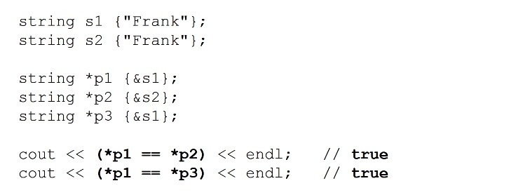

## `Const` et `Pointeurs`

**`const` et pointeurs**

+ Il existe plusieurs façons d'auqlifier les pointeurs en utilisant `const`
   + Pointeurs vers des constantes
   + Pointeurs constants
   + Pointeur constant vers des constantes

**Pointeurs vers des constantes**

+ Les données pointées par les pointeurs sont constantes et ne peuvent pas être modifiées
+ Le pointeur lui-même peut changer et pointer ailleurs.

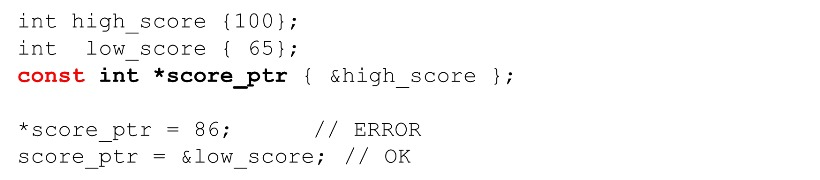

**Pointeurs constants**

+ Les données pointées par les pointeurs peuvent être modifiées.
+ Le pointeur lui-même « ne peut pas » changer et pointer ailleurs.

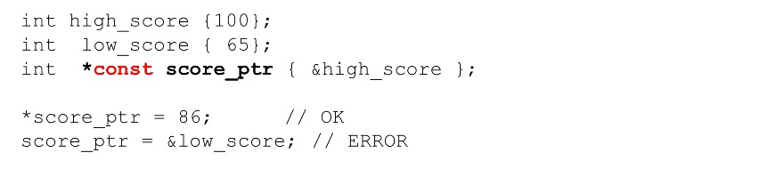

**Pointeurs constants vers des constantes**

+ Les données pointées par le pointeur sont constantes et « ne peuvent pas » être modifiées.
+ Le pointeur lui-même « ne peut pas » changer et pointer ailleurs.

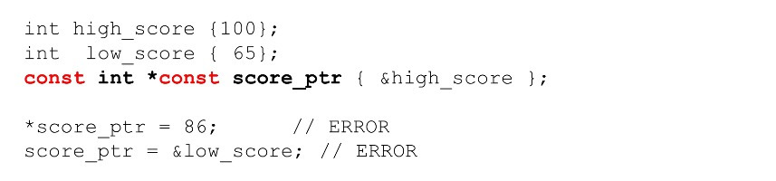

## Renvoyer un pointeur depuis une fonction
+ Les fonctions peuvent également renvoyer des pointeurs

```
        type *function();
```

+ Devrait renvoyer des pointeurs vers
  + Mémoire allouée dynamiquement dans la fonction
  + Aux données transmises
+ Ne renvoie jamais de pointeur vers une variable de fonction locale

**Passage par référence avec pointeurs - définition de la fonction**

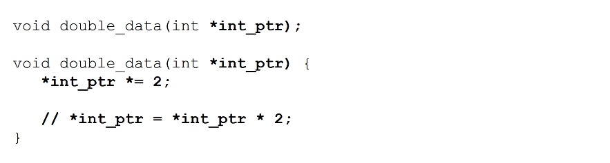

**Passage par référence avec pointeurs - appel de la fonction**

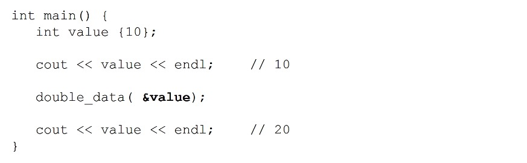

**Renvoyer un paramètre**

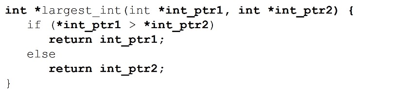
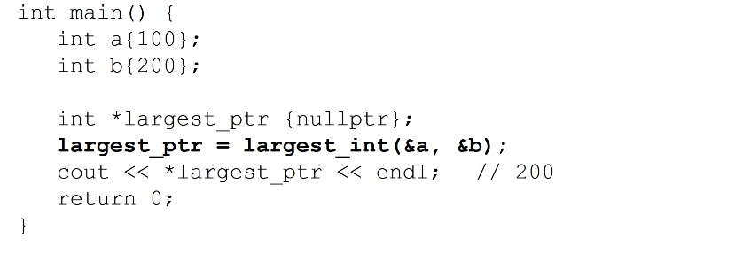

**Renvoi de la mémoire allouée dynamiquement**

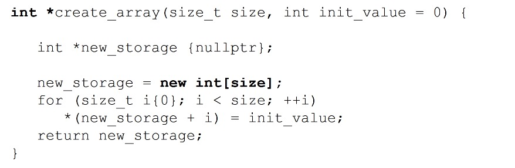
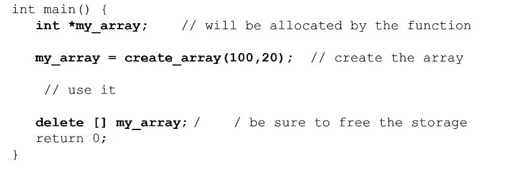

**Ne renvoyez jamais un pointeur vers une variable locale !!**

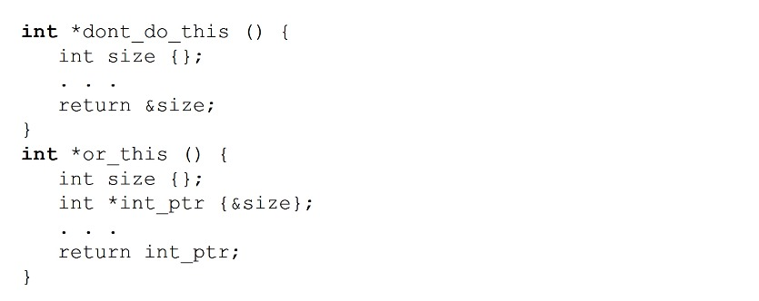

## Pièges potentiels des pointeurs

+ Pointeurs non initialisés
+ Pointeurs pendants
+ Ne vérifie pas si le nouveau n'a pas réussi à allouer de la mémoire
+ Fuite de mémoire

**Pointeurs non initialisés**

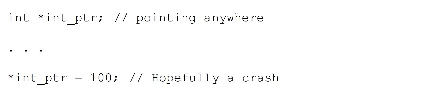

```
int * int_ptr; // pointant n'importe où

...

*int_ptr = 100 ; // Espérons un crash
```

**Pointeur pendant**

+ Pointeur qui pointe vers la mémoire libérée
   + Par exemple, 2 pointeurs pointent vers les mêmes données
   + 1 pointeur libère les données avec suppression
   + L'autre pointeur accède aux données de version

+ Pointeur qui pointe vers une mémoire invalide
   + Nous avons vu cela lors du retour d'un pointeur vers une variable locale de fonction

**Ne pas vérifier si `new` a échoué**

+ Si `new` échoue, une exception est levée
+ Nous pouvons utiliser la gestion des exceptions pour détecter les exceptions
+ Le déréférencement d'un pointeur nul entraînera le crash de votre programme.

**Fuite de mémoire**

+ Oublier de libérer la mémoire allouée avec suppression
+ Si vous perdez le pointeur vers le stockage alloué sur le tas, vous n'avez aucun moyen d'accéder à nouveau à ce stockage.
+ La mémoire est orpheline ou a fui
+ L'un des problèmes de pointeur les plus courants


## Qu'est-ce qu'une référence ?

+ Un alias pour une variable
+ Doit être initialisé à une variable lors de sa déclaration
+ Ne peut pas être nul
+ Une fois initialisé, il ne peut pas être fait référence à une variable différente
+ Très utile comme paramètres de fonction
+ Il pourrait être utile de considérer une référence comme un pointeur constant automatiquement déréférencé

**Utilisation de références dans une boucle `for` basée sur une plage**


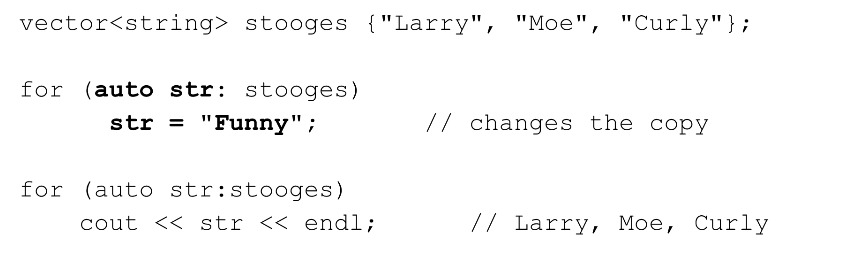
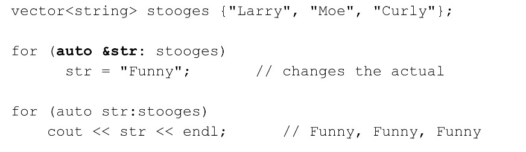
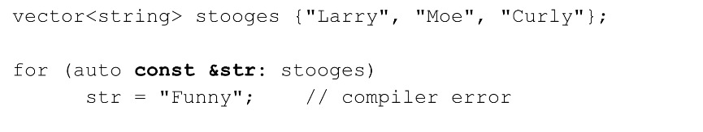
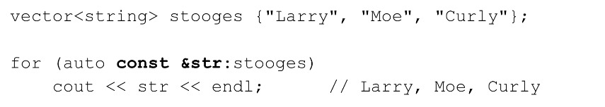

+ Passer des références aux fonctions
   + Merci de vous référer à la section 11 

## Valeurs L et Valeurs R

**Valeurs L**
+ valeurs qui ont des noms et sont adressables
+ modifiables si ce ne sont pas des constantes

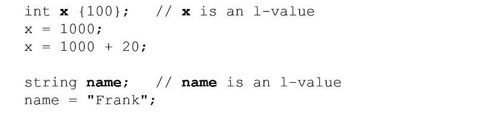
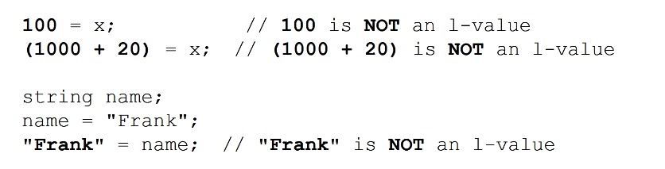

## Valeurs R

+ Valeur R (non adressable et non cessible)
   + Une valeur qui n'est pas une valeur L
     + à droite d'une expression d'affectation
     + un littéral
     + un temporaire qui se veut non modifiable

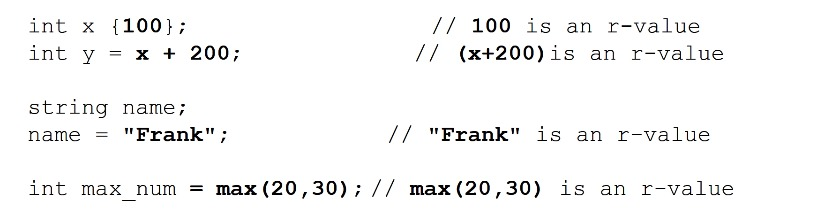

<br/>

+ Les valeurs R peuvent être attribuées explicitement aux valeurs L

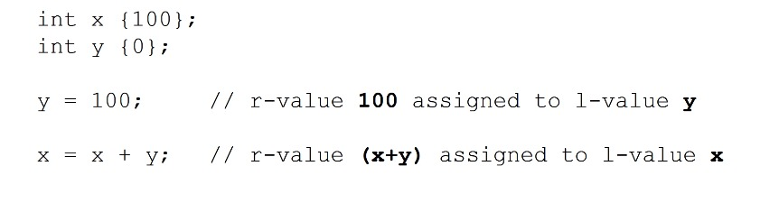

**références de valeur l**
+ Les références que nous avons utilisées sont des références de valeur L
   + Parce que nous faisons référence aux valeurs L

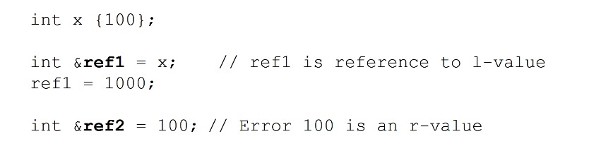

<br/>

+ Pareil quand on passe par référence

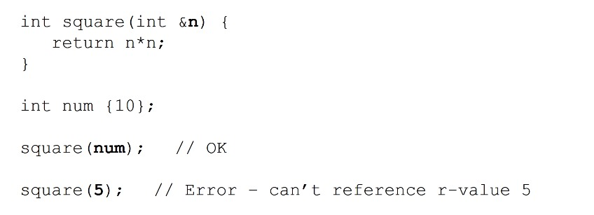

## Récapitulatif de la section

#### 1) Quand utiliser les paramètres de pointeurs ou de références

+ Passage par valeur
   + Lorsque la fonction ne modifie "pas" le paramètre réel et
   + le paramètre est petit et efficace pour copier comme de simples types (int, char, double, etc.)

+ Passage par référence à l'aide d'un pointeur
   + Lorsque la fonction "modifie" le paramètre réel, et
   + le paramètre coûte cher à copier, et
   + c'est OK pour le pointeur, une valeur `nullptr` est autorisée

+ Passage par référence utilisant un pointeur `const` vers `const`
   + Lorsque la fonction ne modifie "pas" le paramètre réel et
   + le paramètre coûte cher à copier, et
   + c'est OK sur le pointeur, on autorise une valeur `nullptr`, et
   + Vous ne souhaitez pas modifier le pointeur lui-même

+ Passage par référence à l'aide d'une référence
   + Lorsque la fonction modifie le paramètre réel, et
   + le paramètre coûte cher à copier, et
   + c'est OK pour le pointeur, une valeur `nullptr` est autorisée

+ Passage par référence utilisant une référence `const`
   + Lorsque la fonction ne modifie "pas" le paramètre réel et
   + le paramètre coûte cher à copier, et
   + c'est OK pour le pointeur, on autorise un `nullptr`


