Section 13 - OOP - Classes and Objects
===


## Information
- Title:  `Section 13 - OOP - Classes and Objects`
- Authors:  `Etienne KOA`


## Aperçu
- Qu'est-ce que la programmation orientée objet ?
- Que sont les classes et les objets ?
- Déclarer le classement et créer des objets
- Opérateurs de points et de pointeurs
- Modificateurs d'accès « public » et « privé »
- Méthodes, Constructeurs et Destructeurs
   + méthodes `class`
   + constructeurs surchargés par défaut
   + copier et déplacer les constructeurs
   + copie superficielle vs copie profonde
   + pointeur `this`

+ Membres de la classe « statiques »
+ `struct` contre `class`
+ `friend` d'une classe


## Qu'est-ce que la programmation orientée objet ?

**Qu'est-ce que la programmation orientée objet ?**

+ Programmation procédurale
+ Limites de la programmation procédurale
+ OO Concepts de programmation et leurs avantages
+ OO Limites de programmation

**Programmation procédurale**

+ L'accent est mis sur les processus ou les actions qu'un programme entreprend
+ Les programmes sont généralement un ensemble de fonctions
+ Les données sont déclarées séparément
+ Les données sont transmises sous forme d'arguments aux fonctions
+ Assez facile à apprendre

**Limites de la programmation procédurale**

+ Les fonctions doivent connaître la structure des données
   + Si la structure des données change, de nombreuses fonctions doivent être modifiées

+ À mesure que les programmes grandissent, ils deviennent plus nombreux :

   + difficile à comprendre
   + difficile à entretenir
   + difficile à prolonger
   + difficile à déboguer
   + code difficile à réutiliser
   + fragile et plus facile à casser

**Qu'est-ce que la programmation orientée objet ?**

+ Classes et objets

   + L'accent est mis sur les classes qui modélisent des entités de domaine du monde réel
   + permet aux développeurs de penser à un niveau d'abstraction plus élevé
   + utilisé avec succès dans de très gros programmes

+ Encapsulation
   + Les objets contiennent des données ET des opérations qui fonctionnent sur ces données
   + Type de données abstrait (ADT)

+ Masquage d'informations
   + La logique spécifique à l'implémentation peut être masquée
   + Utilisateurs du code de classe à l'interface puisqu'ils n'ont pas besoin de connaître l'implémentation
   + plus d'abstraction
   + plus facile à tester, déboguer, maintenir et étendre

+ Réutilisabilité
   + plus facile de réutiliser les classes dans d'autres applications
   + développement plus rapide
   + qualité supérieure

+ Héritage
   + peut créer de nouvelles classes à partir de classes existantes
   + réutilisabilité
   + classes polymorphes

+ Polymorphosme et plus encore...


**Limites**

+ Pas une panacée
   + La programmation OO n'améliorera pas le mauvais code
   + ne convient pas à tous types de problèmes
   + tout ne se décompose pas en une classe

+ Courbe d'apprentissage
   + généralement une courbe d'apprentissage plus raide, en particulier pour `C++`
   + de nombreux langages OO, de nombreuses variantes de concepts OO

+ Conception
   + Habituellement, une conception plus initiale est nécessaire pour créer de bons modèles et hiérarchies

+ Les programmes peuvent être :
   + taille plus grande
   + plus lent
   + plus complexe

## Que sont les classes et les objets ?

**Classes et objets**

+ **Cours**
   + plan à partir duquel les objets sont créés
   + un type de données défini par l'utilisateur
   + a des attributs (données)
   + a des méthodes (fonctions)
   + peut masquer les données et les méthodes
   + fournit une interface publique

+ **Exemples de cours**
   + Account
   + Employee
   + Image
   + `std::vector`
   + `std::string`

+ **Objets**

   + créé à partir d'une classe
   + représente une instance spécifique d'une classe
   + peut traiter de très nombreux objets
   + chacun a sa propre identité
   + chacun peut utiliser les méthodes de classe définies


**Classes et objets**

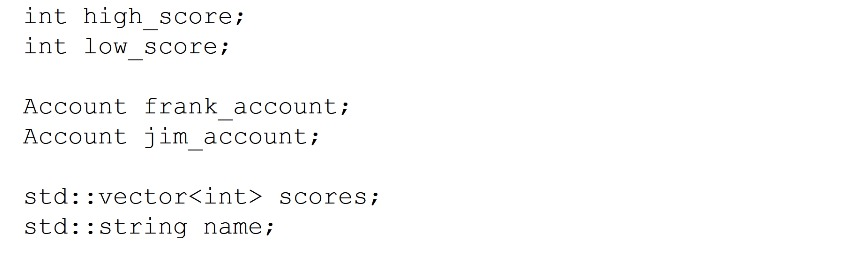


```
int high_score;
int low_score;

Account frank_account;
Account jim_account;

std::vector<int> scores;
std::string name;
```

## Déclarer une classe et créer des objets

**Déclarer une classe**

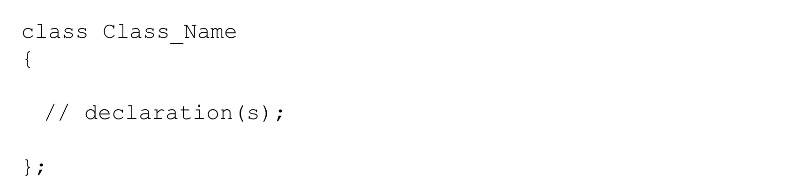

```
class Class_Name
{
  // declaration (s);
}
```

**Player**

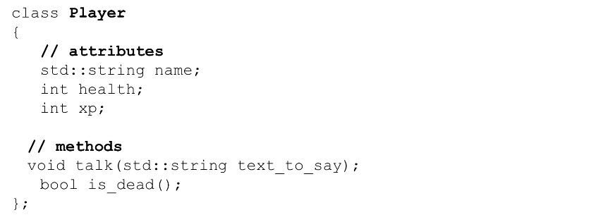

```
class Player
{
  // attributes
  std:string name;
  int health;
  int xp;

  // methods
  void talk (std::string, text_to_say){
    bool_is_dead();
  }
};
```

**Création d'objets**


```
Player frank;
Player hero;

Player *enemy = new Player();
delete enemy;
```

**Account**

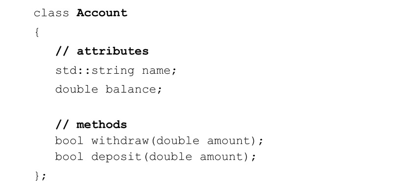

```
class Account
{
  // attributes
  std:string name;
  double balance;

  // methods
  bool withdraw(double amount);
  bool deposit(double amount);
};
```

**Création d'objets**

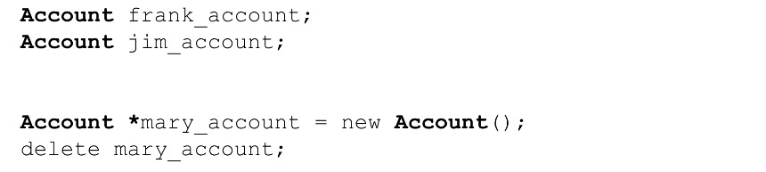
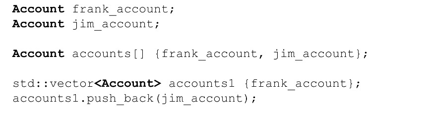

```
Account frank_account;
Account jim_account;

Account *mary_account = new Account();
delete mary_account;
```

```
Account frank_account;
Account jim_account;

Accounts accounts[] {frank_account, jim_account};

std::vector<Account> accounts1 {frank_account};
accounts1.push_back(jim_account);
```

## Accessing Class Members

+ Nous pouvons accéder
   + attributs de classe
   + méthodes de classe

+ Certains membres de la classe ne seront pas accessibles (nous en reparlerons plus tard)

+ Nous avons besoin d'un objet pour accéder aux variables d'instance

Si nous avons un objet (opérateur point)

+ **Utilisation de l'opérateur point**

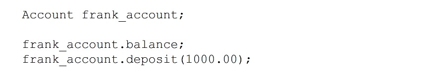

```
Account frank_account;

frank_account.balance;
frank_account.deposit(1000.00);
```

Si nous avons un pointeur vers un objet (membre de l'opérateur pointeur)

+ Déréférencez le pointeur puis utilisez l'opérateur point.


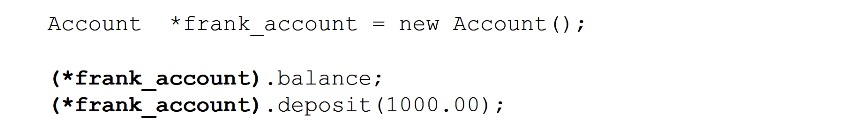

```
Account *frank_account = new Account();

(*frank_account).balance;
(*frank_account).deposit(1000.00);
```

+ Ou utilisez l'opérateur membre de pointeur (opérateur flèche)

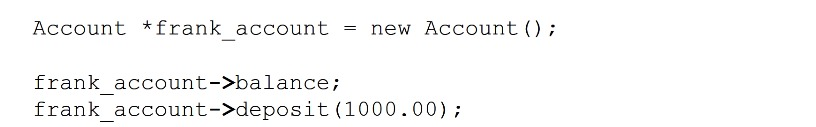

```
Account * frank_account = new Account();

frank_account -> balance;
frank_account -> deposit(1000.00);
```

## Publique et privée

+ **public, privé  et protégé**

+ `public`
   + accessible partout

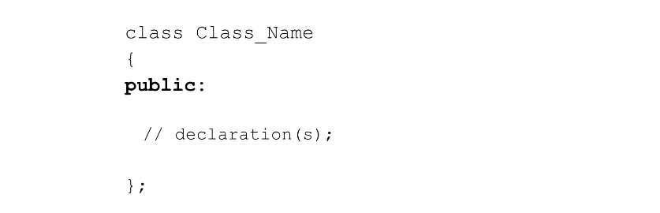

```
      class Class_Name 
      {
        public : 

        // declaration(s);
      };
```

+ `private`
  + accessible uniquement aux membres ou amis de la classe

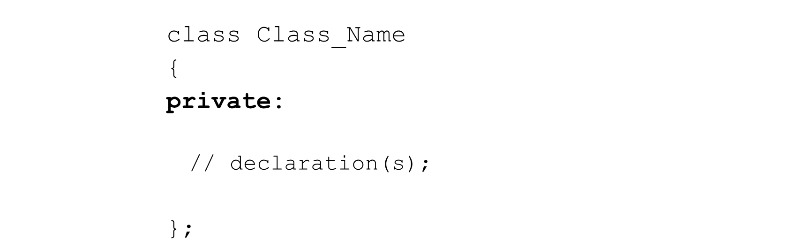

```
      class Class_Name 
      {
        private : 

        // declaration(s);
      };
```

+ `protected`
  + utilisé avec l'héritage - nous en parlerons dans la section suivante

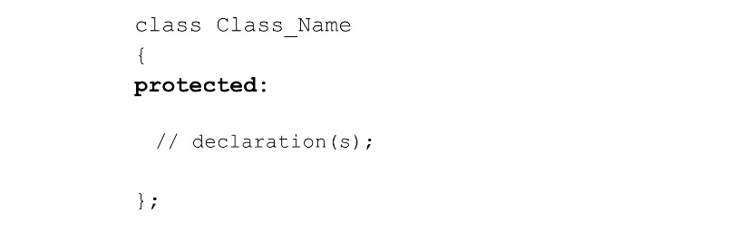

```
      class Class_Name 
      {
        protected : 

        // declaration(s);
      };
```

**Déclarer une classe**

+ **Player**


**Création d'objets**

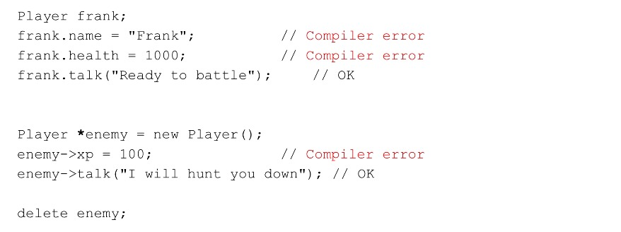

**Déclarer une classe**

+ **Account**

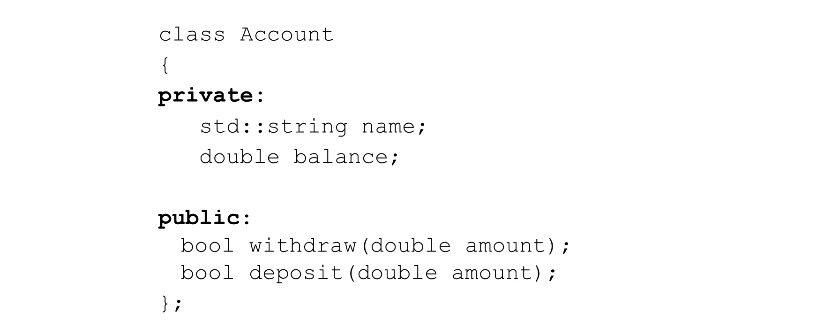

**Création d'objets**

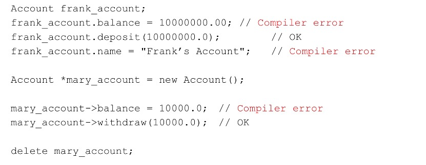


## Implémentation des méthodes membres

+ Très similaire à la façon dont nous avons implémenté les fonctions

+ Les méthodes membres ont accès aux attributs des membres
   + Vous n'avez donc pas besoin de les passer en arguments !

+ Peut être implémenté dans la déclaration de classe
   + Implicite en ligne

+ Peut être implémenté en dehors de la déclaration de classe
   + Besoin d'utiliser `Class_name ::method_name`

+ Peut séparer la spécification de la mise en œuvre
   + Fichier `.h` pour la déclaration de classe
   + Fichier `.cpp` pour l'implémentation de la classe

**À l'intérieur de la déclaration de classe**

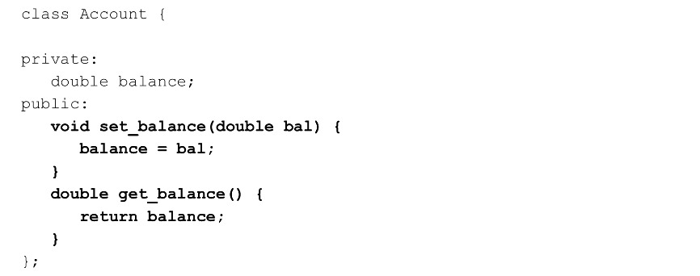

<br/>

**En dehors de la déclaration de classe**

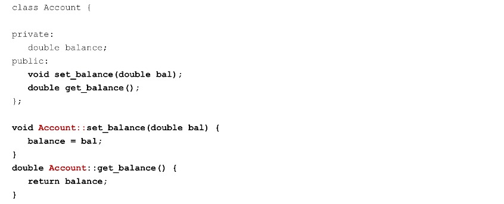

<br/>


**Séparer la spécification de la mise en œuvre**

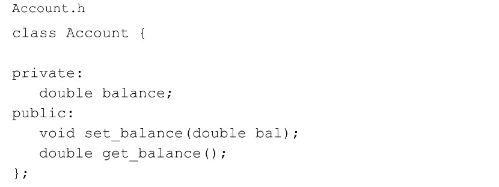


+ Inclure les gardes

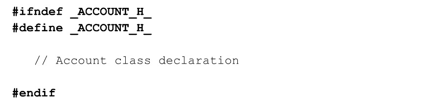
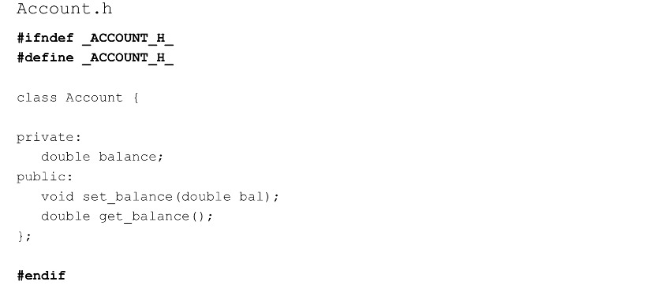
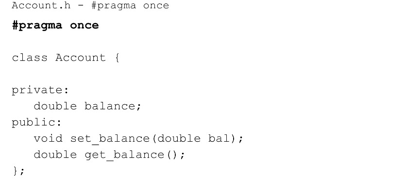
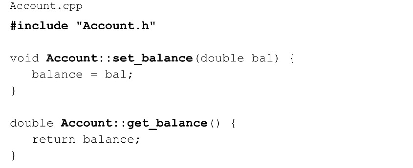


## Constructeurs

+ Méthode membre spécial
+ Invoqué lors de la création de l'objet
+ Utile pour l'initialisation
+ Même nom que la classe
+ Aucun type de retour n'est spécifié
+ Peut être surchargé

**Constructeurs de joueurs**

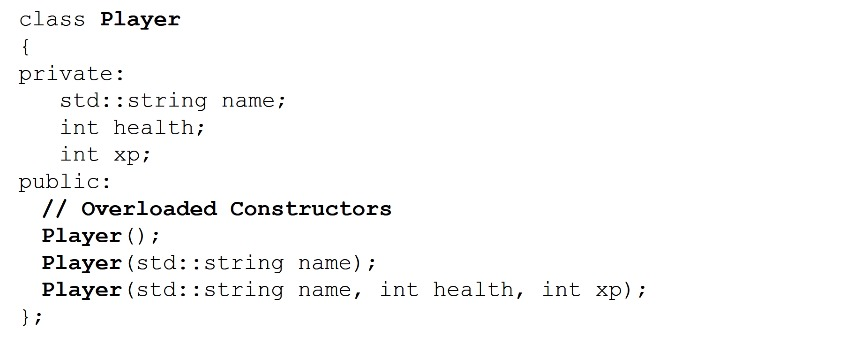

**Constructeurs de comptes**

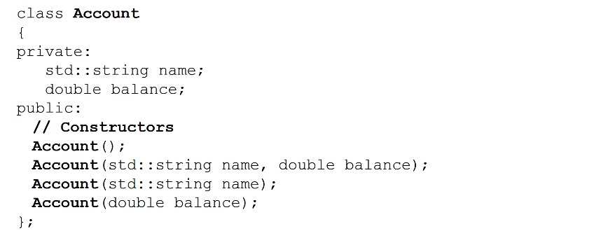

**Destructeurs**

+ Méthode membre spécial
+ Même nom car la classe a procédé avec un tilde (~)
+ Invoqué automatiquement lorsqu'un objet est détruit
+ Aucun type de retour et aucun paramètre
+ Un seul destructeur est autorisé par classe - ne peut pas être surchargé !
+ Utile pour libérer de la mémoire et d'autres ressources


**Player Destructor**
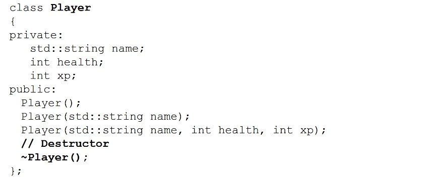

**Account Destructor**
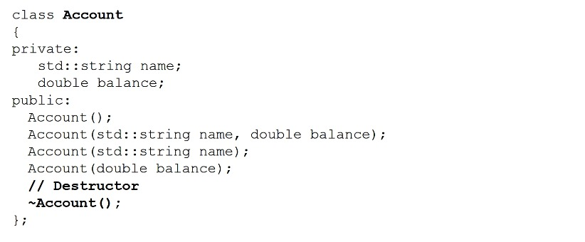

**Creating objects**
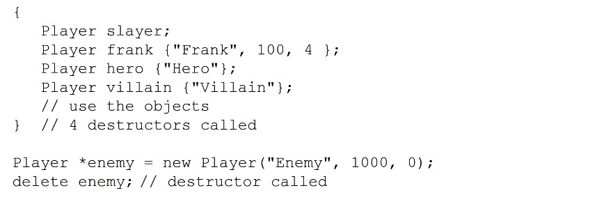

## Le constructeur par défaut

+ N'attend aucun argument
   + Également appelé constructeur sans arguments

+ Si vous n'écrivez aucun constructeur pour une classe
   + `C++` générera un `Default Constructor` qui ne fait rien

+ Appelé lorsque vous instanciez un nouvel objet sans argument


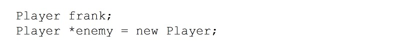
```
Player frank;
Player *enemy = new Player;
```

**Déclarer une classe**
+ Compte - en utilisant le constructeur par défaut

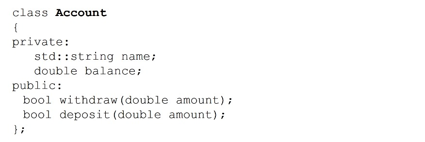

**Création d'objets**
+ Utilisation du constructeur par défaut

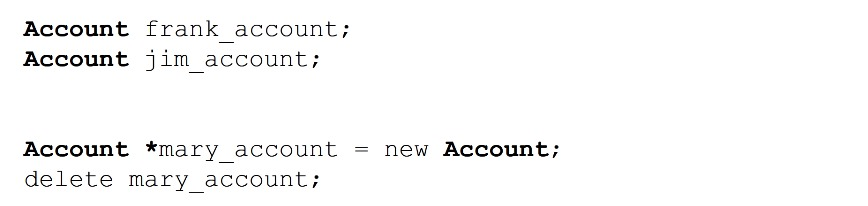

**Déclarer une classe**
+ Compte - constructeur sans argument défini par l'utilisateur

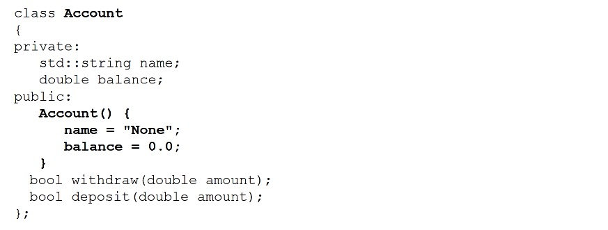

+ Compte - pas de constructeur par défaut

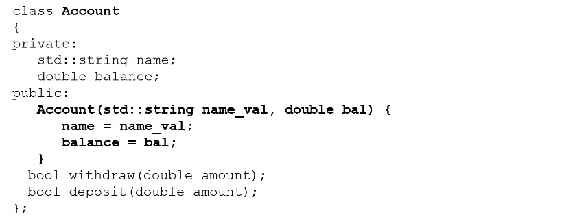

**Création d'objets**
+ Utilisation du constructeur par défaut

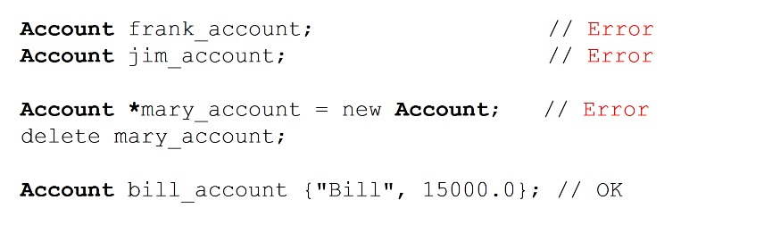


## Surcharge des constructeurs

+ Les classes peuvent avoir autant de constructeurs que nécessaire.
+ Chacun doit avoir une signature unique
+ Le constructeur par défaut n'est plus généré par le compilateur une fois qu'un autre constructeur est déclaré.

**Constructeurs surchargés**
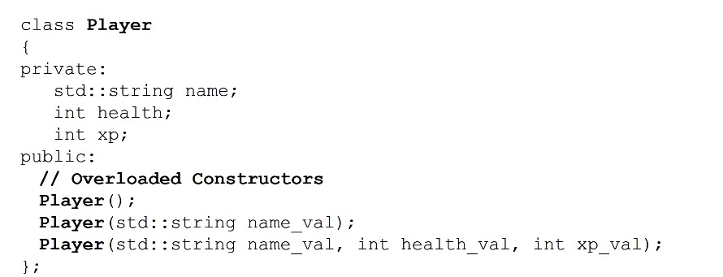
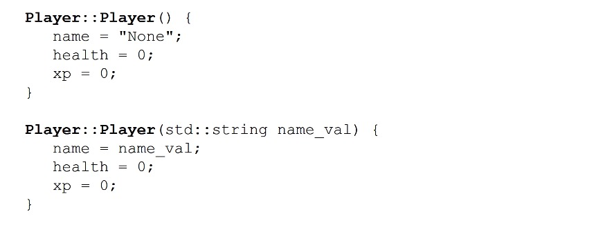
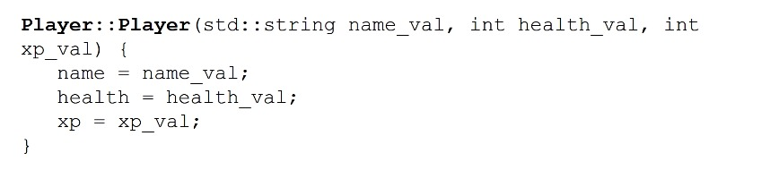

**Création d'objets**
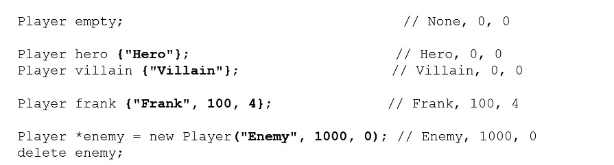


## Listes d'initialisation du constructeur

+ Jusqu'à présent, toutes les valeurs des membres de données ont été définies dans le corps du constructeur

+ Listes d'initialisation du constructeur
   + sont plus efficaces
   + la liste d'initialisation suit immédiatement la liste des paramètres
   + initialise les données membres lors de la création de l'objet !
   + l'ordre d'initialisation est l'ordre de déclaration dans la classe

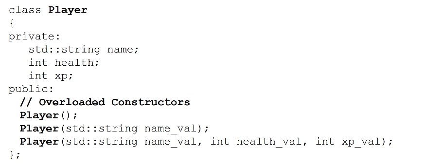

**Player()**

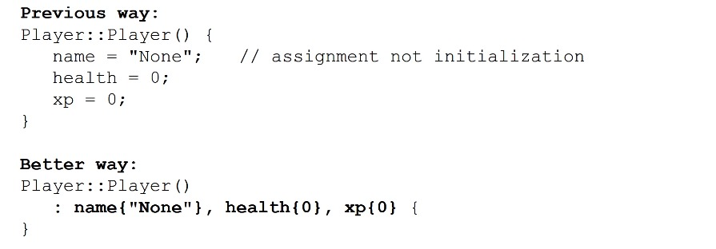

**Player(std::string)**

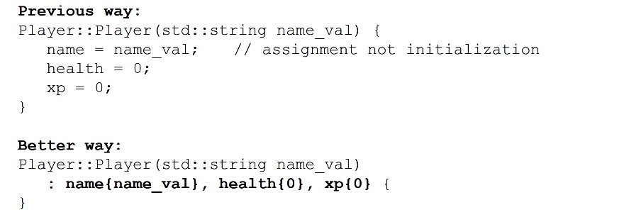

**Player(std::string, int, int)**

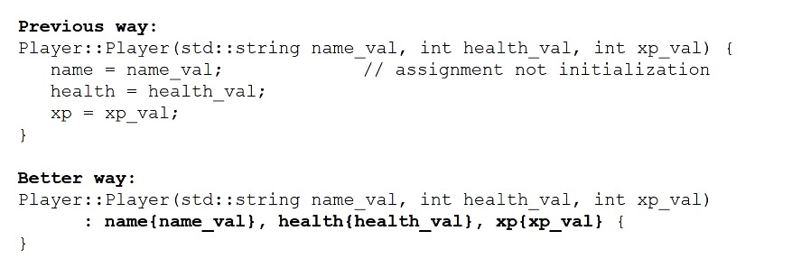
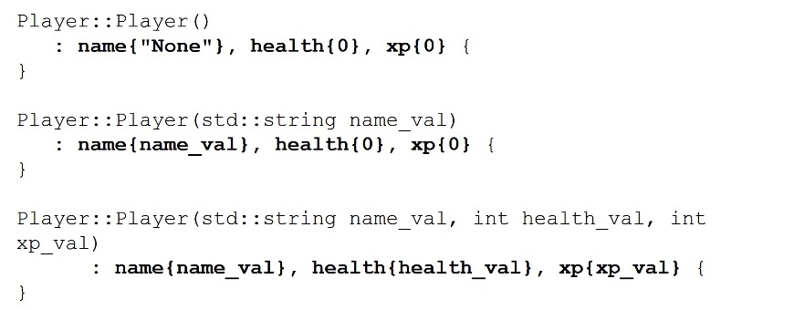

## Délégation des constructeurs

+ Souvent, le code des constructeurs est très similaire
+ Un code dupliqué peut entraîner des erreurs
+ `C++` permet de déléguer des constructeurs
   + le code pour un constructeur peut en appeler un autre dans la liste d'initialisation
   + évite la duplication de code


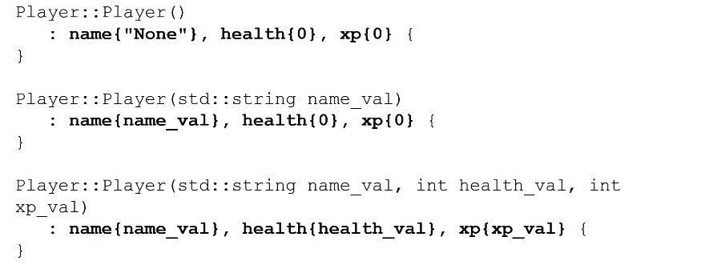
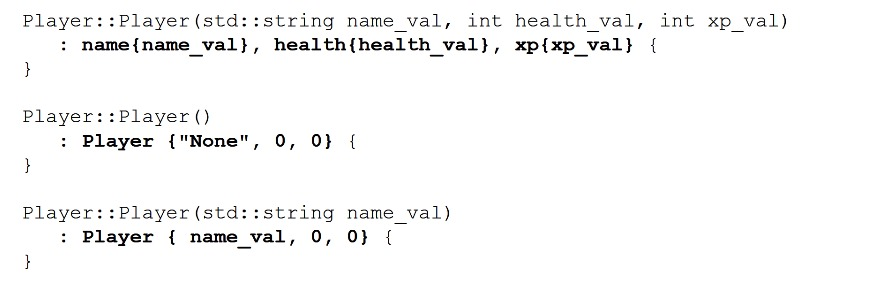

## Paramètres du constructeur par défaut

+ Peut souvent simplifier notre code et réduire le nombre de constructeurs surchargés.
+ Les mêmes règles s'appliquent que celles que nous avons apprises avec les fonctions non membres.

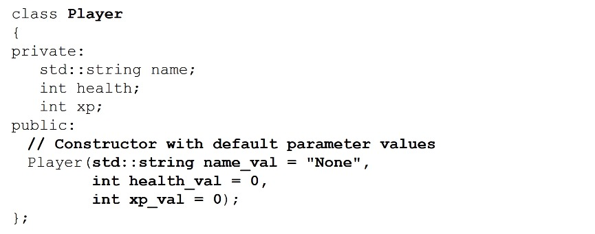
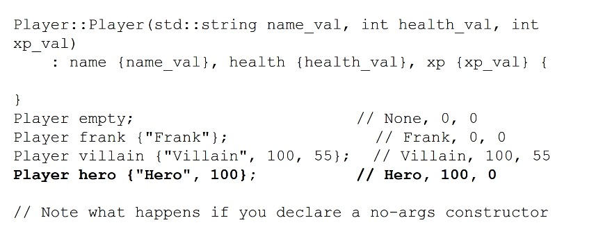


## Copier le constructeur

+ Lorsque les objets sont copiés, `C++` doit créer un nouvel objet à partir d'un objet existant.
+ Quand fait-on une copie d'un objet ?
   + passer l'objet par valeur en paramètre
   + renvoyer un objet d'une fonction par valeur
   + construire un objet basé sur un autre de la même classe

+ `C++` doit avoir un moyen d'y parvenir afin qu'il fournisse un constructeur de copie défini par le compilateur si vous ne le faites pas.

**Transmettre l'objet par valeur**

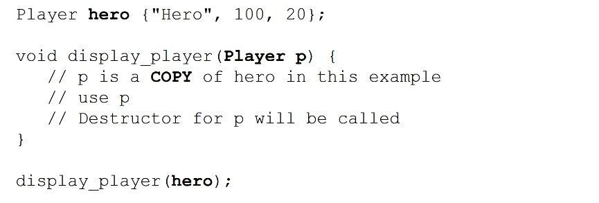

**Renvoyer l'objet par valeur**

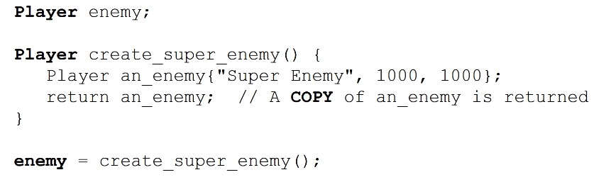
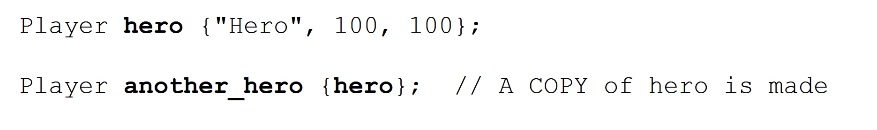

+ Si vous ne fournissez pas votre propre façon de copier des objets par valeur, le compilateur fournit une méthode par défaut pour copier des objets.

+ Copie les valeurs de chaque membre de données dans le nouvel objet
   + copie par défaut des membres

+ Parfaitement bien dans de nombreux cas

+ Attention si vous avez un membre de données de pointeur

   + Le pointeur sera copié
   + Pas ce qu'il indique
   + ``Shallow` vs. `Deep copy` - plus dans la prochaine vidéo

**Les meilleures pratiques**

+ Fournissez un constructeur de copie lorsque votre classe a des membres de pointeur bruts
+ Fournissez au constructeur de copie un paramètre `const reference`.
+ Utilisez les classes `STL` car elles fournissent déjà des constructeurs de copie.
+ Évitez d'utiliser des membres de données de pointeur bruts si possible.

**Déclaration du constructeur de copie**

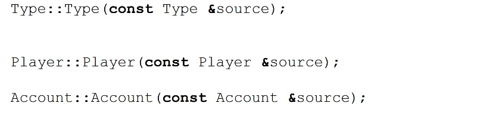

**Implémentation du constructeur de copie**


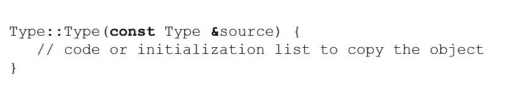
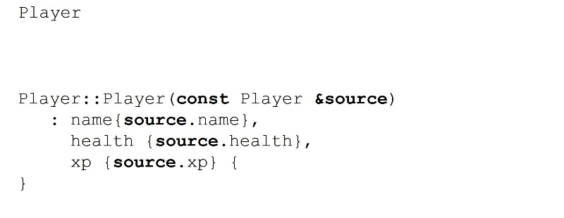
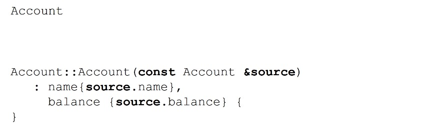


## Copie Sallow avec le constructeur de copie

**Copie superficielle ou profonde**

+ Considérez une classe qui contient un pointeur en tant que donnée membre.
+ Le constructeur alloue le stockage de manière dynamique et initialise le pointeur.
+ Destructor libère la mémoire allouée par le constructeur.
+ Que se passe-t-il dans le constructeur de copie par défaut ?

**Constructeur de copie par défaut**
+ copie réservée aux membres
+ Chaque membre de données est copié à partir de l'objet source
+ Le pointeur n'est pas copié ce vers quoi il pointe (copie superficielle)
+ <span style="color : red">Problème :</span> lors de la libération du stockage dans le constructeur, l'autre objet fait toujours référence au stockage libéré !

**Peu profond**

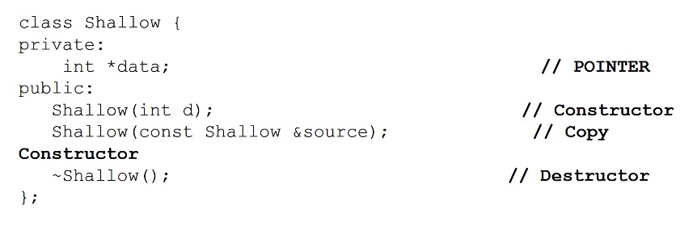

**Constructeur peu profond**
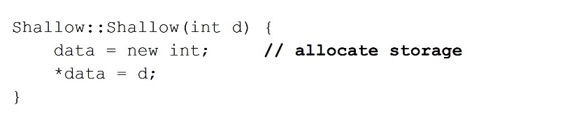

**Destructeur peu profond**
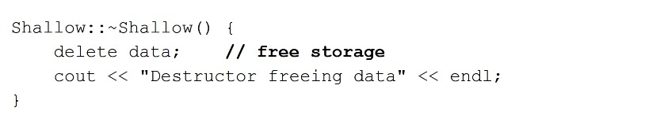

**Constructeur de copie superficielle**
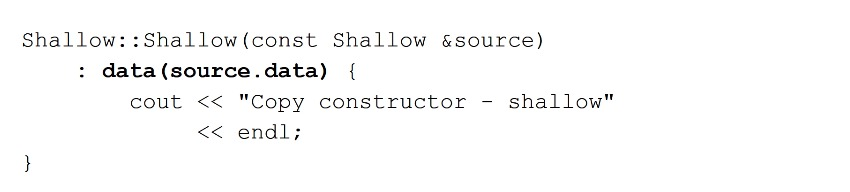

+ Copie superficielle - seul le pointeur est copié - pas vers quoi il pointe !
+ <span style="color : red">Problème :</span> `source` et l'objet nouvellement créé pointent TOUS LES DEUX vers la MÊME zone de `données`.

**Shallow - une méthode simple qui attend une copie**

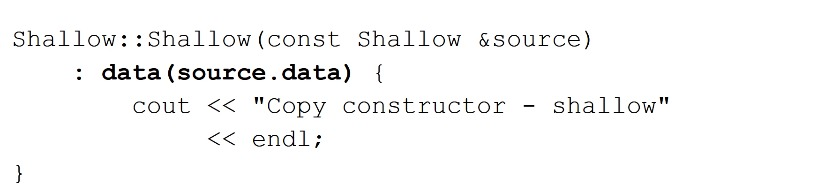

+ Copie superficielle - seul le pointeur est copié - pas vers quoi il pointe !
+ <span style="color : red">Problème :</span> `source` et l'objet nouvellement créé pointent TOUS LES DEUX vers la MÊME zone de `données`.

**Exemple principal - va probablement planter**

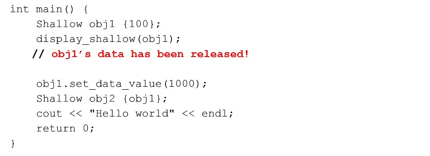

## Copie approfondie avec le constructeur de copie

**Constructeur de copie utilisateur-fournisseur**

+ Créer une « copie » des données pointées
+ Chaque copie aura un pointeur vers un stockage unique dans le tas
+ Copie complète lorsque vous avez un pointeur brut en tant que membre de données de classe

**Profond**

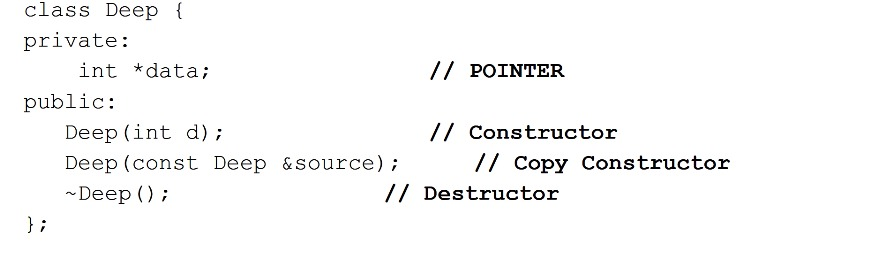

**Constructeur profond**

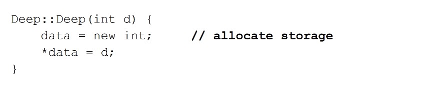

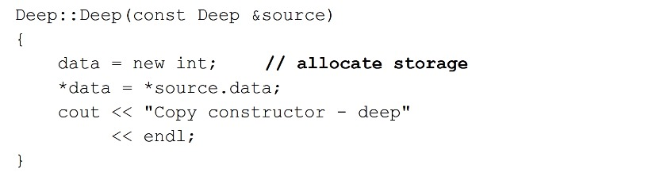

+ Copie approfondie - créez de nouvelles valeurs de stockage et de copie

**Constructeur de copie profonde - constructeur délégué**

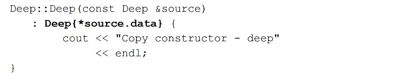

+ Déléguez à `Deep (int)` et transmettez la source `int (*source.data)` vers laquelle pointe.

**Deep - une méthode simple qui attend une copie**

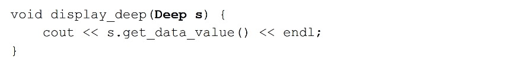

+ Lorsque `s` sort du champ d'application, le destructeur est appelé et libère `data`.
+ <span style="color:red">Pas de problème :</span> puisque le stockage en cours de publication est unique à `s`.

**Exemple principal - ne plantera pas**

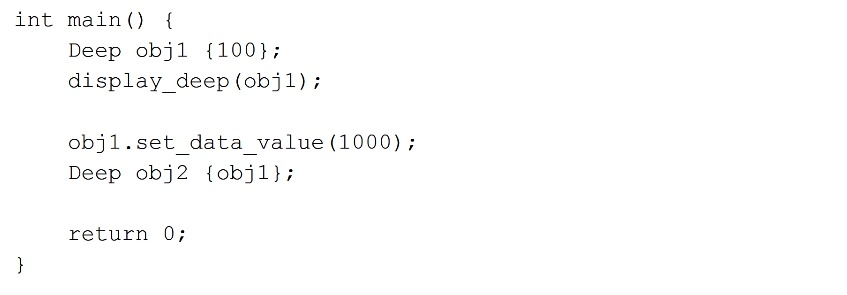


## Déplacer le constructeur

+ Parfois, lorsque nous exécutons du code, le compilateur crée des valeurs temporaires sans nom
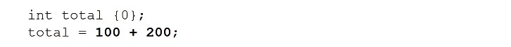

+ `100 + 200` est évalué `et 300` est stocké dans une valeur temporaire sans nom.
+ Ensuite, `300` est ensuite stocké dans la variable total
+ Ensuite, la valeur de température est supprimée

+ La même chose se produit également avec les objets

**Quand est-ce utile ?**

+ Parfois, les constructeurs de copie sont appelés plusieurs fois automatiquement en raison de la sémantique de copie vers `C++`.
+ Les constructeurs de copie effectuant une copie approfondie peuvent avoir un goulot d'étranglement important en termes de performances.
+ `C++11` a introduit la sémantique des déplacements et le constructeur de déplacements
+ Le constructeur de déplacement déplace un objet plutôt que de le copier.
+ Facultatif mais recommandé lorsque vous disposez d'un pointeur brut.
+ L'élision de copie `-C++` peut optimiser complètement la copie `(RVO - Return Value Optimization)`.


**références de valeur r**
+ Utilisé dans la sémantique mobile et la transmission parfaite
+ La sémantique de déplacement concerne uniquement les références à la valeur R
+ Utilisé par le constructeur de déplacement et l'opérateur d'affectation de déplacement pour déplacer efficacement un objet plutôt que de le copier.
+ Opérateur de référence de valeur R (&&).

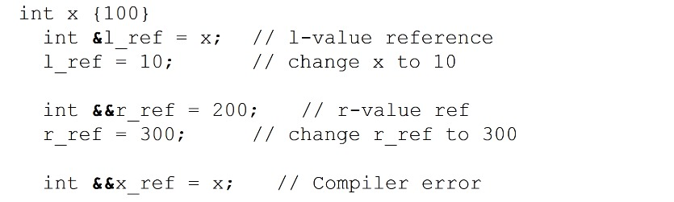

**Paramètres de référence de valeur L**

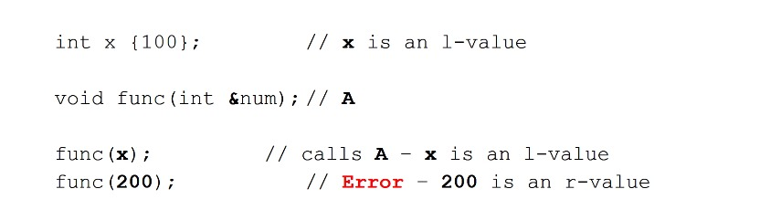

+ erreur : impossible de lier une référence lvalue non const de type `int&` à une rvalue de type `int`.

**paramètres de référence de valeur r**

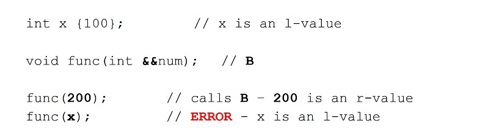

+ erreur : impossible de lier la référence rvalue de type `int&&` à la lvalue de type `int`.

**Paramètres de référence de valeur l et de valeur r**

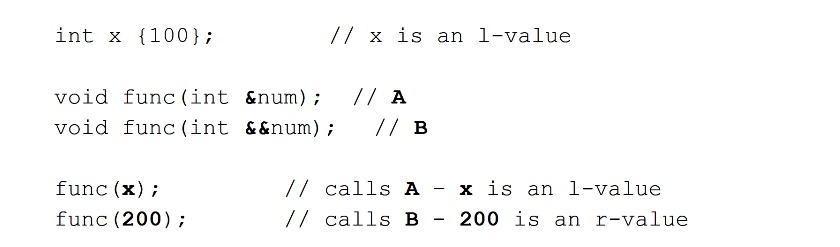

**Exemple : Déplacer la classe**

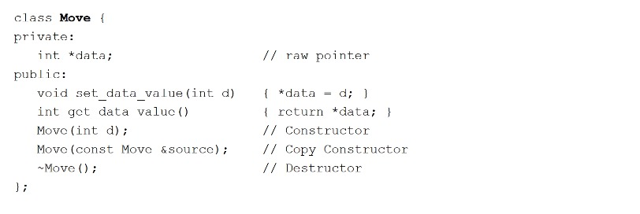

**Déplacer le constructeur de copie de classe**

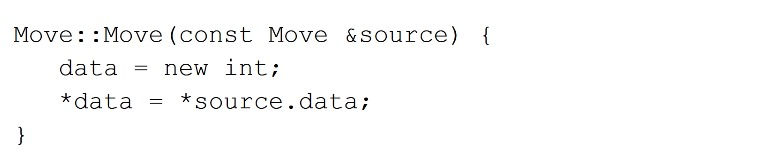

+ Allouer le stockage et la copie

**Copie inefficace**

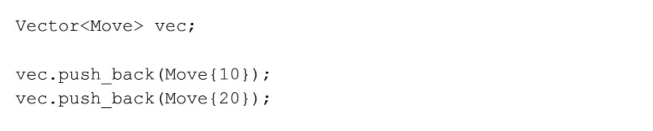

+ Les constructeurs de copie seront appelés pour copier les temps.

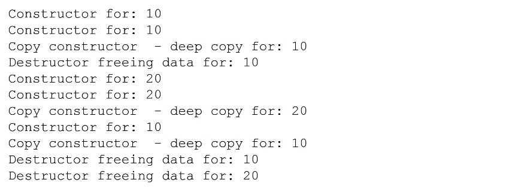

**Qu'est ce que ça fait ?**
+ Au lieu de faire une copie complète du constructeur de déplacement
   + déplace la ressource
   + copie simplement l'adresse de la ressource de la source vers l'objet actuel
   + Et, annule le pointeur dans le pointeur source

+ Très efficace

**syntaxe - référence de valeur r**

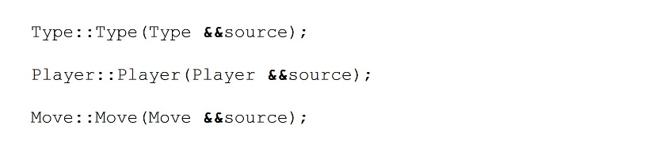

**Constructeur de déplacement de classe de déplacement**

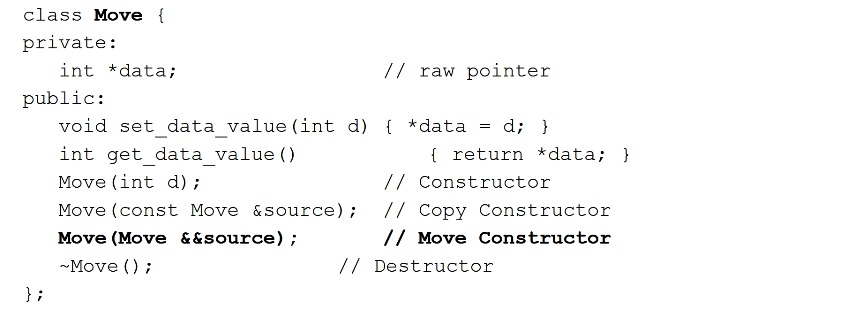


+ "voler" les données puis annuler le pointeur source

**efficace**
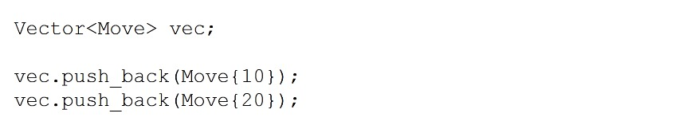

+ Les constructeurs de déplacement seront appelés pour les valeurs r temporaires.

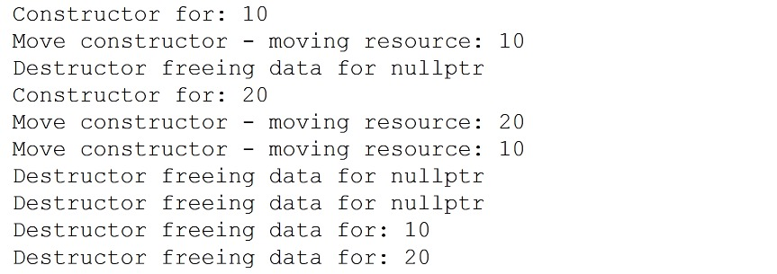

## Le pointeur `this`

**pointeur `this`**

+ `this` est un mot-clé réservé
+ Contient l'adresse de l'objet - c'est donc un pointeur vers l'objet.
+ Ne peut être utilisé que dans le cadre d'une classe
+ Tous les accès des membres se font via le pointeur `this`
+ Peut être utilisé par le programmeur
   + Pour accéder aux données membres et aux méthodes
   + Pour le déterminer, deux objets sont identiques (plus d'informations dans la section suivante)
   + Peut être déférent `(*this)` pour donner l'objet actuel

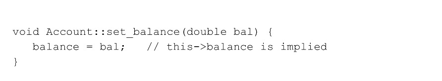

+ Pour lever l'ambiguïté, utilisez l'identifiant

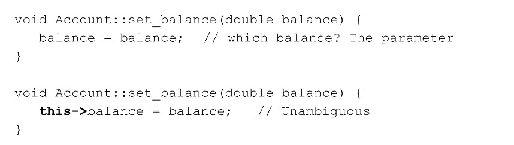

**Pour déterminer l'identité de l'objet**

+ Parfois, il est utile de savoir si deux objets sont le même objet

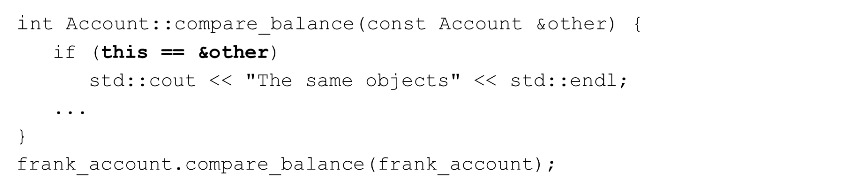

+ Nous utiliserons à nouveau le pointeur `this` lorsque nous surchargerons l'opérateur d'affectation

## Utiliser const avec les classes
+ Passer les arguments à la méthode membre de la classe en tant que `const`
+ On peut aussi créer des objets `const`
+ Que se passe-t-il si nous appelons une fonction membre sur des objets `const` ?
+ `const`-exactitude

**Création d'un objet const**
+ `villain` est un objet const donc ses attributs ne peuvent pas changer


+ Que se passe-t-il lorsque nous appelons des méthodes membres sur un objet const ?

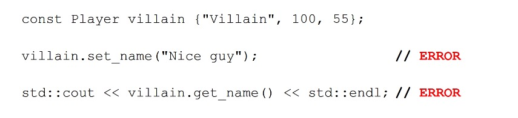
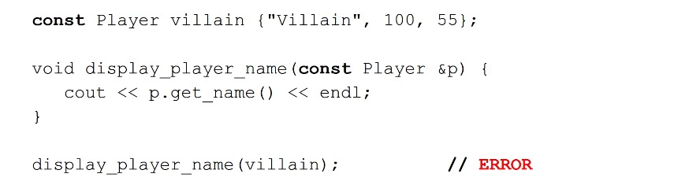


**Utiliser const avec des classes**
+ méthodes `const`

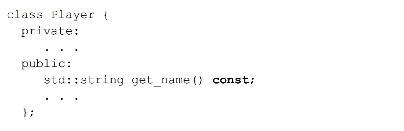

+ const-exactitude

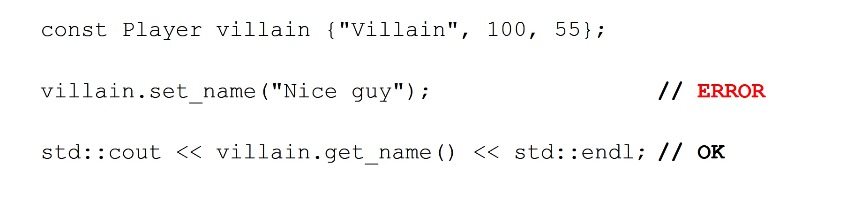

+ méthodes `const`

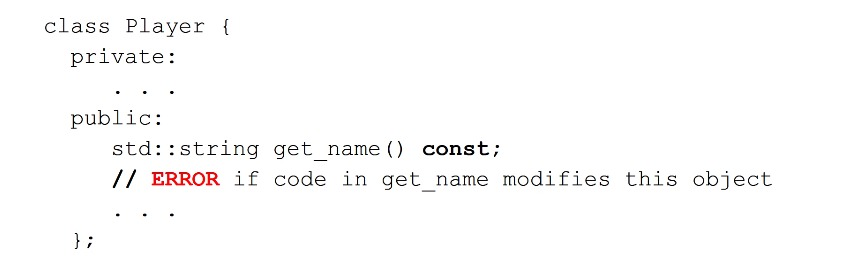


## Membres de la classe statique

+ Les données membres de classe peuvent être déclarées comme statiques
   + Une seule donnée membre qui appartient à la classe, pas aux objets
   + Utile pour stocker des informations à l'échelle de la classe

+ Les fonctions de classe peuvent être déclarées comme statiques
   + Indépendant de tout objet
   + Peut être appelé en utilisant le nom de la classe

**Classe de joueur - membres `static`**

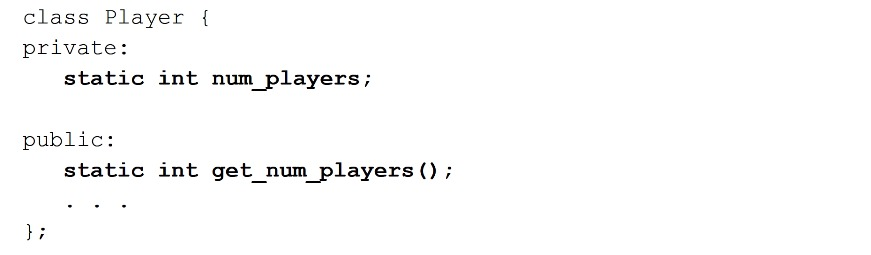

**Classe de joueur - initialise les données « statiques »**
+ Généralement dans `Player.cpp`

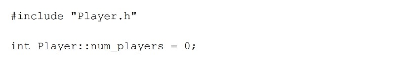

**Classe Player - Méthode statique implémentée**

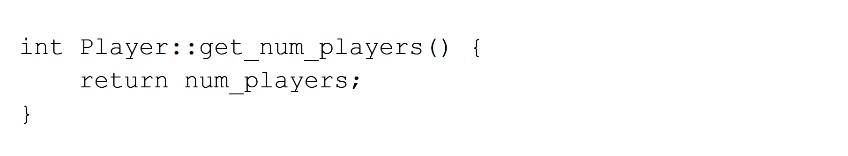

**Classe Player - mettre à jour le constructeur**

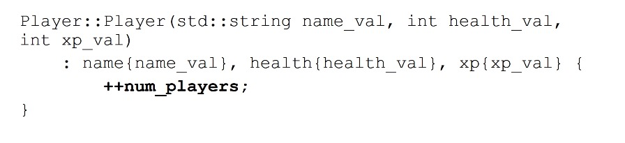

**Classe de joueur - Destructeur**

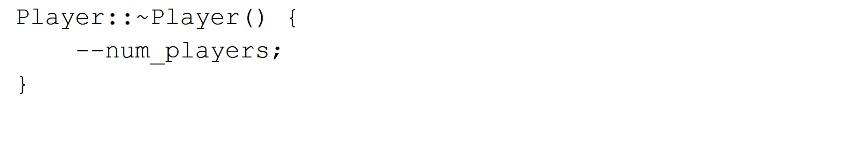

**main.cpp**

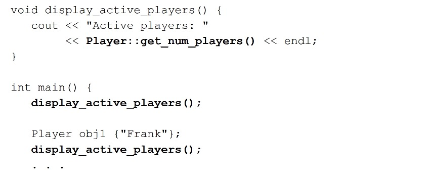

## Structures vs Classes

+ En plus de définir une `classe`, nous pouvons déclarer une `struct`.
+ `struct` vient du langage de programmation `C`
+ Essentiellement la même chose qu'une « classe »
   + Les membres sont « publics » par défaut

**classe**
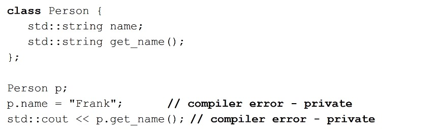


**structure**
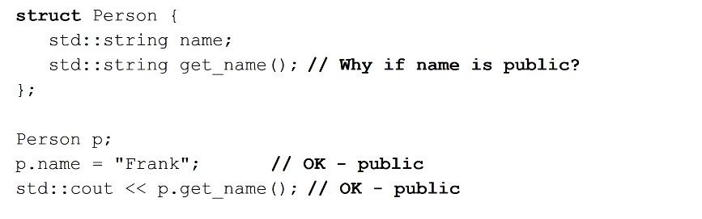

**Quelques directives générales**
+ **structure**
   + Utilisez `struct` pour les objets passifs avec accès public
   + Ne déclarez pas de méthodes dans `struct`

+ **classe**
   + Utiliser la classe pour les objets actifs avec accès privé
   + Implémentez les « getters/setters » si nécessaire
   + Implémenter les méthodes membres selon les besoins

## Ami d'une classe

+ **`Friend`**
   + Une fonction ou une classe qui a accès au membre de la classe privée
   + Et, cette fonction ou cette classe n'est « PAS » un membre de la classe à laquelle elle accède

+ **`Fonction`**
   + Peut être des fonctions régulières de non-membres
   + Peut être des méthodes membres d'une autre classe

+ **`Classe`**
   + Une autre classe peut avoir accès aux membres de la classe privée.

+ L'amitié doit être accordée PAS prise
   + Déclaré explicitement dans la classe qui accorde l'amitié
   + Déclaré dans le prototype de fonction avec le mot-clé `friend`

+ L'amitié n'est pas symétrique
   + Doit être explicitement accordé
     + Si A est un ami de B
     + B n'est PAS un ami de A

+ L'amitié n'est pas transitive
   + Doit être accordé explicitement
     + Si A est un ami de B ET
     + B est un ami de C
     + alors A n'est PAS un ami de C

**fonction non membre**
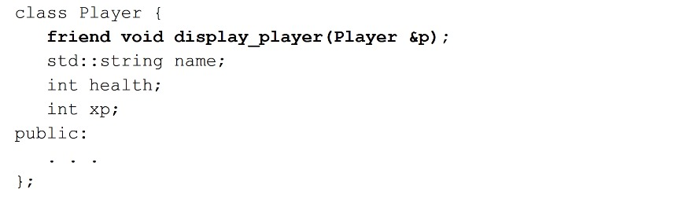
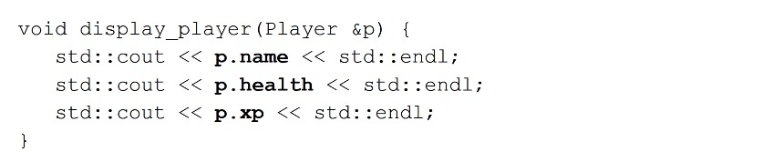

+ `display_player` peut également modifier les membres de données privées.

**fonction membre d'une autre classe**
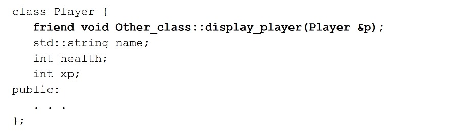
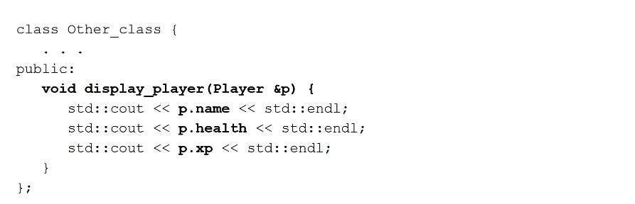

**Un autre cours en tant qu'ami**
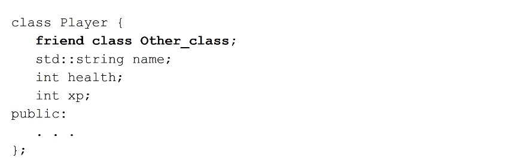


