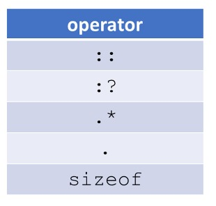

Section 14 : Operator Overloading
===

## Information
- Title:  `Operator Overloading`
- Authors:  `Etienne KOA`


## Aperçu
**Surcharge de l'opérateur**
- Qu'est-ce que la surcharge des opérateurs ?
- Surcharge de l'opérateur d'affectation `(=)`
   - Copier la sémantique
   - Déplacer la sémantique

- Surcharge des opérateurs en tant que fonctions membres
- Surcharge des opérateurs en tant que fonctions globales
- Surcharge des opérateurs d'insertion de flux `(<<)` et d'extraction `(>>)`

## Surcharge des opérateurs
**Qu'est-ce que la surcharge des opérateurs ?**

+ Utilisation de traditionnels tels que `+,=,*,etc.` avec des types définis par l'utilisateur.
+ Permet aux types définis par l'utilisateur de se comporter de manière similaire aux types intégrés
+ Peut rendre le code plus lisible et inscriptible
+ Pas fait automatiquement (sauf pour l'opérateur d'affectation). Ils doivent être explicitement définis.

**Qu'est-ce que la surcharge des opérateurs ?**

+ Supposons que nous ayons une classe Number qui modélise n'importe quel nombre

+ Utilisation des fonctions :

```
Number result = multiply (add(a, b), divide(c, d));
```

+ Utilisation des méthodes membres :

```
Number result = (a.add(b).multiply(c.divide(d)));
```

+ Utilisation d'opérateurs surchargés

```
Number result = (a+b)*(c/d);
```

**Quels opérateurs peuvent être surchargés ?**
+ La majorité des opérateurs `C++` peuvent être surchargés
+ Les opérateurs suivants ne peuvent pas être surchargés




**Quelques règles de base**
+ La priorité et l'associativité ne peuvent pas être modifiées
+ `arity` ne peut pas être modifié (c'est-à-dire ne peut pas rendre l'opérateur de division unaire)
+ Impossible de surcharger les opérateurs pour les types privilégiés (par exemple `int, double, etc.`)
+ Impossible de créer de nouveaux opérateurs
+ `[], (), ->,` et l'opérateur d'affectation `(=) doivent` être déclarés comme méthodes membres.
+ D'autres opérateurs peuvent être déclarés comme méthodes membres ou fonctions globales.

**Quelques exemples**


**Déclaration de classe Mystring**


## Surcharge des opérateurs

**Copier l'opérateur d'affectation `(=)`**

+ `C++` fournit un opérateur d'affectation par défaut utilisé pour attribuer un objet à un autre


+ La valeur par défaut est l'affectation par membre (copie superficielle)
   + Si nous avons un membre de données de pointeur brut, nous devons copier en profondeur

   

**Surcharge de l'opérateur d'affectation de copie (copie profonde)**


+ Surcharge de l'opérateur d'affectation de copie - étapes pour la copie complète

   + Vérifier l'auto-affectation
   


   + Désallouer le stockage pour `this -> str` puisque nous l'écrasons
   


   + Allouer du stockage pour la copie complète
   


   + Effectuer la copie
   


   + Renvoie le courant par référence pour permettre l'affectation de la chaîne
   


## Surcharge de l'affectation (déplacement de l'opérateur)

**Déplacer l'opérateur d'affectation (=)**

+ Vous pouvez choisir de surcharger l'opérateur d'affectation de déplacement
   + `C++` utilisera l'opérateur d'affectation de copie si nécessaire
   


+ Si nous avons un pointeur brut, nous devrions surcharger l'opérateur d'affectation de déplacement pour plus d'efficacité

+ Surcharge de l'opérateur d'affectation Move


+ Surcharge de l'opérateur d'affectation Move - étapes

   + Vérifier l'auto-affectation
   


   + Désallouer le stockage `this -> str` puisque nous l'écrasons
   


+ Surcharge de l'opérateur d'affectation Move - étapes pour la copie complète

   + Volez le pointeur de l'objet `rhs` et assignez-le à `this->str`
   


   + Annuler le pointeur `rhs`
   


   + Renvoie l'objet actuel par référence pour permettre l'affectation de la chaîne
   


## Surcharge des opérateurs en tant que fonctions membres

**Surcharge de l'opérateur**

+ Opérateurs unaires en tant que méthodes membres `(++, --, -, !)`


+ Mystring `operator` - mettre en minuscule


+ Opérateurs binaires comme méthode membre `(+, -, ==, !=, <,>, etc.)`


+ Mystring `opérateur ==`


+ Mystring `opérateur + (concaténation)`


## Surcharge des opérateurs en tant que fonctions globales

+ Opérateurs unaires en tant que fonctions globales `(++, --, -, !)`


+ Mystring `operator` - mettre en minuscule


**Mystring `opérateur -`**
+ Souvent déclaré comme fonctions `friend` dans la déclaration de classe


+ Opérateurs binaires comme fonctions globales `(+, -, ==, !=, <,>, etc.)`


+ Mystring`opérateur ==`


+ S'il est déclaré comme ami de `Mystring`, il peut accéder à l'attribut privé `str`.
+ Sinon, nous devons utiliser des méthodes getter.

+ Mystring `opérateur + (concaténation)`


## Surcharge des opérateurs d'insertion et d'extraction de flux

**Surcharge de l'opérateur**

+ opérateurs d'insertion et d'extraction de flux `(<<, >>)`


+ Cela n'a pas de sens à implémenter en tant que méthodes membres
   + L'opérande Lfet doit être une classe définie par l'utilisateur
   + Pas la façon dont nous utilisons habituellement ces opérateurs


+ Opérateur d'insertion de flux `(<<)`


+ Renvoie une référence au `ostream` afin que nous puissions continuer à insérer
+ Ne renvoie pas `ostream` par valeur !

+ Opérateur d'extraction de flux `(>>)`


+ Renvoie une référence au `istream` afin que nous puissions continuer à insérer
+ Mettre à jour l'objet transmis


