Section 17 : Smart Pointers
===

## Information
- Title:  `Smart Pointers`
- Authors:  `Etienne KOA`

## Aperçu

**Pointeurs intelligents**

+ Problèmes avec les pointeurs bruts
+ Que sont les pointeurs intelligents ?
+ Concept de propriété et RAII
+ Pointeurs intelligents `C++`
   + Pointeurs uniques(`unique_ptr`)
   + Pointeurs partagés(`shared_ptr`)
   + Pointeurs faibles (`weak_ptr`)

+ Supprimeurs personnalisés

## Quelques problèmes avec les pointeurs bruts

**Problèmes avec les pointeurs bruts**

+ `C++` offre une flexibilité absolue dans la gestion de la mémoire
   + Allocation
   + Désallocation
   + Gestion à vie

+ Quelques problèmes potentiellement graves
   + Pointeurs non initialisés (sauvages)
   + Fuites de mémoire
   + Pointeurs pendants
   + Pas d'exception sans danger

+ Propriété ?
   + À qui appartient le pointeur ?
   + Quand faut-il supprimer un pointeur ?

## Qu'est-ce qu'un pointeur intelligent ? Propriété et RAII

Quels sont-ils ?

+ Objets
+ Ne peut pointer que vers la mémoire allouée au tas
+ Appeler automatiquement la suppression lorsque vous n'en avez plus besoin
+ Adhérer aux principes RAII
+ Pointeurs intelligents `C++`
   + Pointeurs uniques(`unique_ptr`)
   + Pointeurs partagés(`shared_ptr`)
   + Pointeurs faibles (`weak_ptr`)
   + Pointeurs automatiques (`auto_ptr`) <span style="color:red">Obsolète<span>- nous n'en discuterons pas

```
#include <memory>
```

+ Défini par les modèles de classe
   + Wrapper autour d'un pointeur brut
   + Opérateurs surchargés
     + Sélection de déférence `(*)`
     + Sélection des membres `(->)`
     + L'athmétique du pointeur n'est pas prise en charge `(++, --, etc.)`

+ Peut avoir des suppresseurs personnalisés

**Un exemple simple**

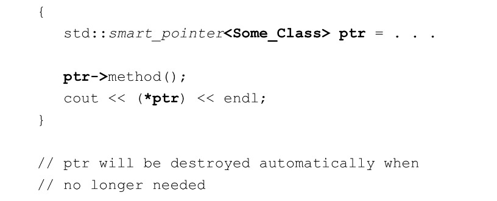

**RAII - L'acquisition de ressources est une initialisation**

+ Idiome ou modèle commun utilisé dans la conception de logiciels basé sur la durée de vie des objets conteneurs.
+ Les objets `RAII` sont alloués sur la pile
+ Acquisition de ressources
   + Ouvrir un fichier
   + Allouer de la mémoire
   + Acquérir une serrure
+ Est l'initialisation
   + La ressource est acquise chez un constructeur
+ Abandon des ressources
   + Fermer un fichier
   + Désallouer la mémoire
   + Libérez le bloc

## Pointeurs uniques

`unique_ptr`

+ Pointeur intelligent simple - très efficace !

+ `unique_ptr`
   + Pointe vers un objet pour taper « T » sur le tas
   + Il est unique - il ne peut y avoir qu'un seul `unique_ptr<T>` pointant vers l'objet sur le tas
   + Possède ce vers quoi il pointe
   + Ne peut pas être attribué ou copié
   + PEUT être déplacé
   + Lorsque le pointeur est détruit, ce qu'il pointe est automatiquement détruit

**`unique_ptr` - Création, initialisation et utilisation**

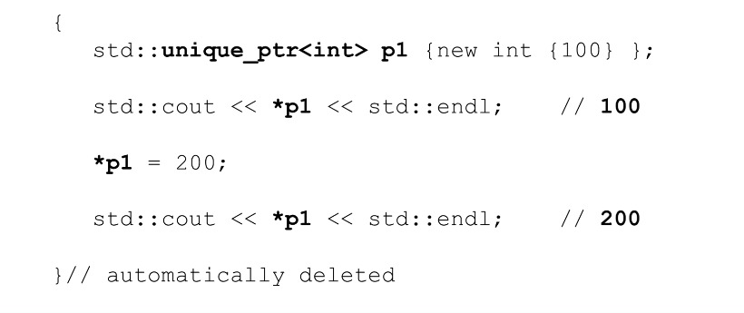

**`unique_ptr` - Quelques autres méthodes utiles**

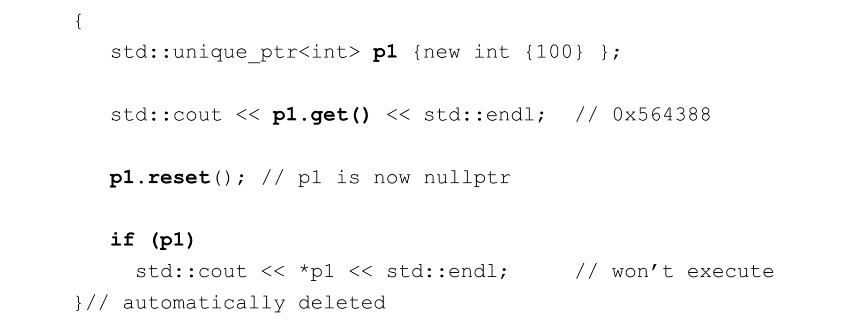

**`unique_ptr` - classes définies par l'utilisateur**

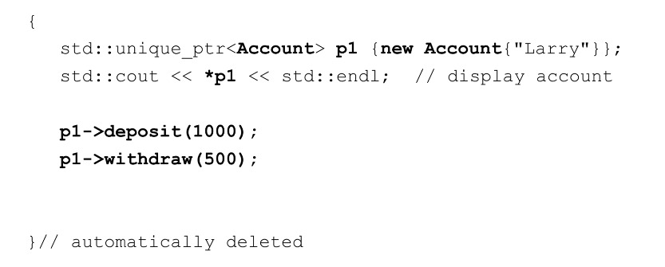

**`unique_ptr` - vecteurs et déplacement**

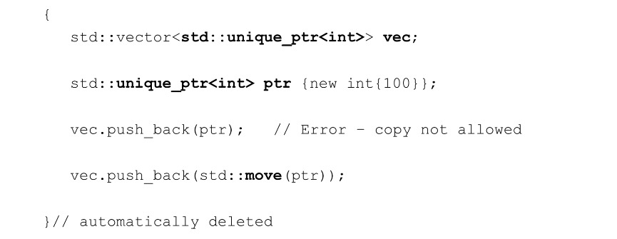

**`unique_ptr` - make_unique `(C++14)`**

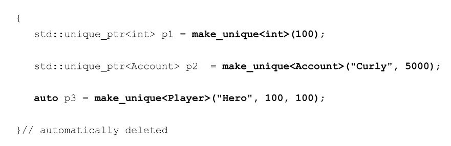

## Pointeurs partagés

`shared_ptr`

+ Fournit la propriété partagée des objets du tas

+ `shared_ptr<T>`
   + Pointe vers un objet de type `T` sur le tas
   + C'est unique - il peut y avoir plusieurs `shared_ptr` pointant vers le même objet sur le tas
   + Établit une relation de propriété partagée
   + PEUT être attribué et copié
   + PEUT être déplacé
   + Ne prend pas en charge la gestion des tableaux par défaut
   + Lorsque le nombre d'utilisations est nul, l'objet géré sur le tas est détruit


**`shared_ptr` - Création, initialisation et utilisation**


**`shared_ptr` - Quelques autres méthodes utiles**

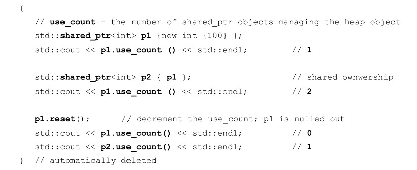

**`shared_ptr` - classes définies par l'utilisateur**

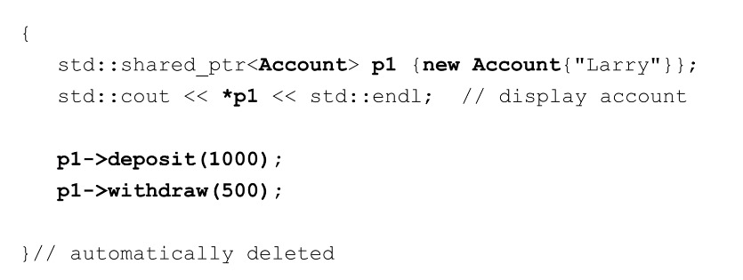

**`shared_ptr` - vecteurs et déplacement**

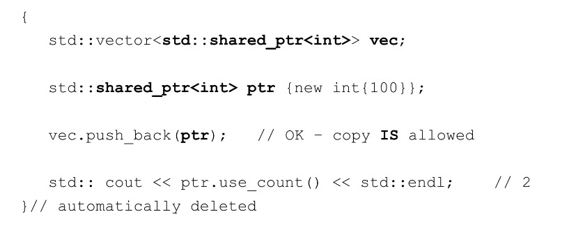

**`shared_ptr` - make_shared `(C++14)`**

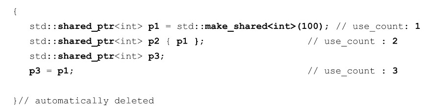

## Pointeurs faibles

`weak_ptr`

+ Fournit une référence « faible » non propriétaire

+ `weak_ptr`
   + Pointe vers un objet de type `T` sur le tas
   + Ne participe pas à la relation de propriété
   + Toujours créé à partir d'un `shared_ptr`
   + N'incrémente ni ne décrémente le nombre d'utilisations de référence
   + Utilisé pour empêcher les cycles de référence forts qui pourraient empêcher la suppression des objets

`weak_ptr` - Référence circulaire ou cyclique

+ A fait référence à B
+ B fait référence à A
+ Une forte propriété partagée empêche la désallocation du tas
+ Solution - rendre l'un des pointeurs non propriétaire ou « faible »
+ Désormais, le stockage en tas est désalloué correctement

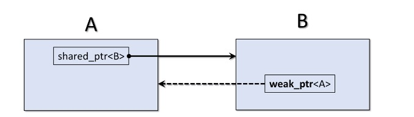

## Supprimeurs personnalisés

+ Parfois, lorsque nous détruisons un pointeur intelligent, nous avons besoin de plus que simplement détruire l'objet sur le tas
+ Ce sont des cas d'utilisation spéciaux
+ Les pointeurs intelligents `C++` vous permettent de fournir des suppresseurs personnalisés
+ De nombreuses façons d'y parvenir
   + Fonctions
   + Lambda
   + Autres...

**Supprimeurs personnalisés - fonction**

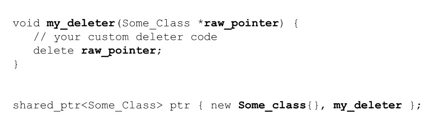
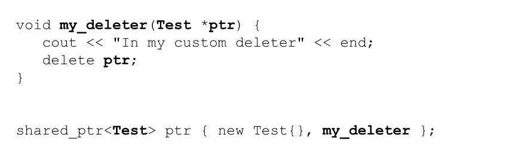

**Supprimeurs personnalisés - lambda**

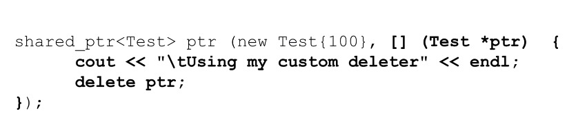

