Section 18 : Exception Handling
===

## Information
- Title:  `Exception Handling`
- Authors:  `Etienne KOA`


## Aperçu de la section
- Qu'est-ce qu'une exception ?
- Qu'est-ce qu'une gestion des exceptions ?
- Que lance-t-on et intercepte-t-on les exceptions ?
- Comment cela affecte-t-il le flux de contrôle ?
- Définir nos propres classes d'exceptions
- La bibliothèque d'exceptions de la bibliothèque standard
   + `std::exception` et `what()`


## Concepts de base et un exemple simple : Division par zéro

+ Gestion des exceptions
   + faire face à des situations extraordinaires
   + indique qu'une situation extraordinaire a été détectée ou s'est produite
   + le programme peut gérer les situations extraordinaires de manière appropriée

+ Qu'est-ce qui cause les exceptions ?
   + ressources insuffisantes
   + ressources manquantes
   + opérations invalides
   + violations de portée
   + débordements et débordements
   + Données illégales et autres

+ Coffre-fort d'exception
   + Quand votre code gère les exceptions

**Syntaxe `C++`**

+ **`lancer`**
   + lève une exception
   + suivi d'un argument

+ **`try {code pouvant lever une exception}`**
   + vous placez du code qui peut lever une exception dans un bloc try
   + si le code lève une exception, le bloc try est quitté
   + l'exception levée est gérée par un gestionnaire catch
   + si aucun gestionnaire catch n'existe, le programme se termine

+ **`catch {Exception ex} {code pour gérer l'exception}`**
   + code qui gère l'exception
   + peut avoir plusieurs gestionnaires de capture
   + peut ou non entraîner la fin du programme

**Diviser par zéro exemple**

+ Que se passe-t-il si le « total » est nul
   + crash, débordement ?
   + ça dépend

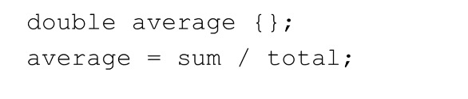
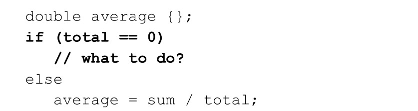
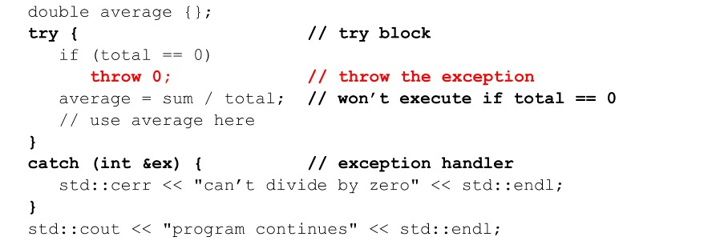

## Lancer une exception à partir d'une fonction

+ Lancer une exception à partir d'une fonction
+ Que renvoie-t-on si le total est nul ?

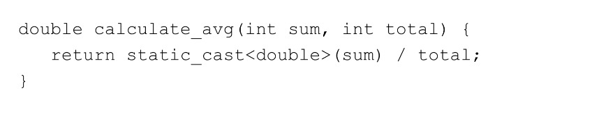


<br/>

+ Lancer une exception à partir d'une fonction
+ Lancez une exception si nous ne pouvons pas terminer avec succès

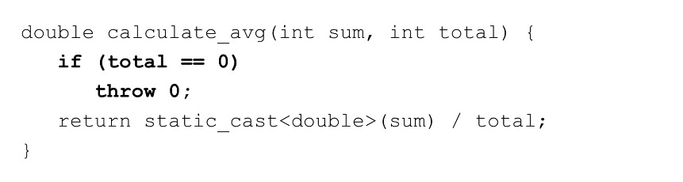

**La capture d'une exception a lancé une fonction**

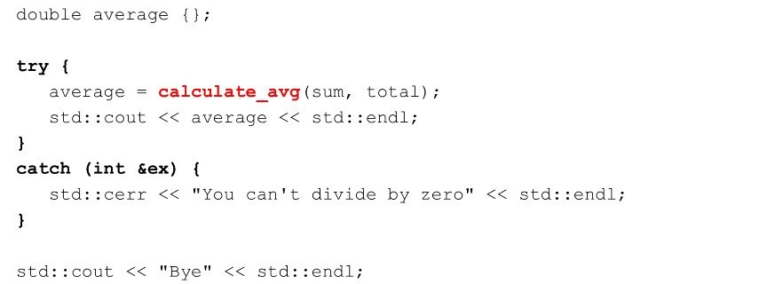

## Gestion des exceptions

+ Lancer une exception à partir d'une fonction
+ Que se passe-t-il si une fonction peut échouer de plusieurs manières
   + `gallons` vaut zéro
   + `miles` ou `gallons` est négatif

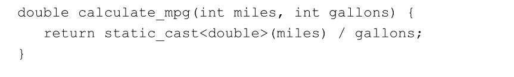

<br/>

+ Lancer une exception à partir d'une fonction
+ Lancez des exceptions de type différent pour chaque condition

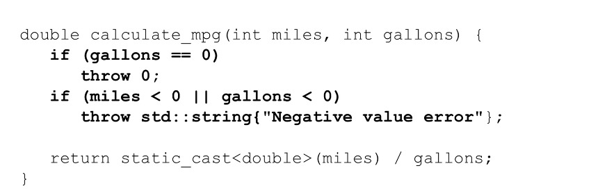

**La capture d'une exception a lancé une fonction**

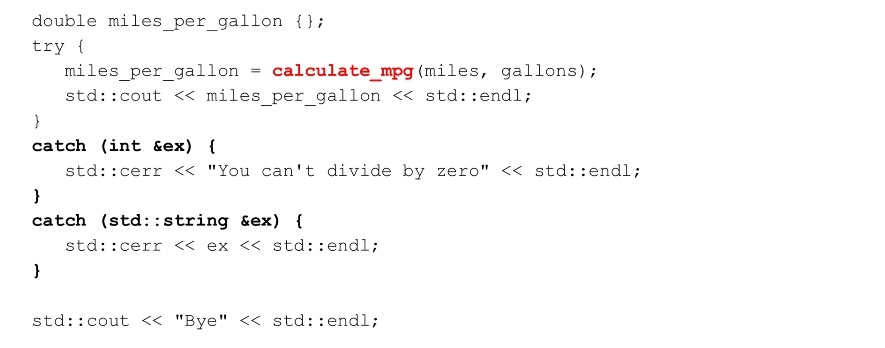

**Attraper tout type d'exception**

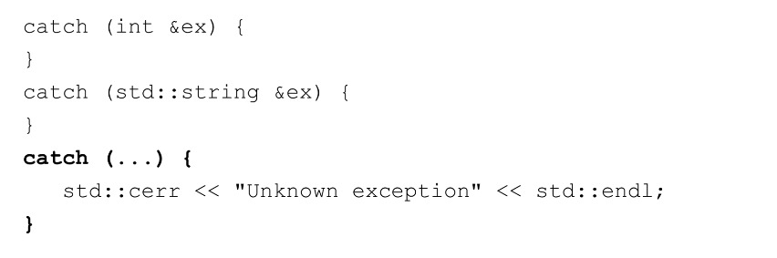

## Stacking Unwiding et comment ça marche

**Empilage et déroulement**

Si une exception est levée mais n'est pas interceptée dans la portée actuelle, « C++ » essaie de trouver un gestionnaire pour
en déroulant la pile.

+ La fonction dans laquelle l'exception n'a pas été interceptée se termine et est supprimée de la pile d'appels.

+ Si un bloc try a été utilisé, les blocs catch sont vérifiés pour une correspondance.

+ Si aucun bloc try n'a été utilisé ou si le gestionnaire catch ne correspond plus au déroulement du processus.

+ Si la pile est déroulée vers main et qu'il n'y a pas de gestionnaire catch, le programme se termine.

## Création de classes d'exception définies par l'utilisateur

**Exceptions définies par l'utilisateur**

+ Nous pouvons créer des classes d'exception et lancer des instances de ces classes

+ Bonne pratique :
   + lancer un objet pas un type primitif
   + lancer un objet par valeur
   + attraper un objet par référence (ou référence `const`)

**Création de classes d'exception**

```
class DivideByZeroException {

} ;

class NegativeValueException {

} ;
```

**Lancement de classes d'exception définies par l'utilisateur**

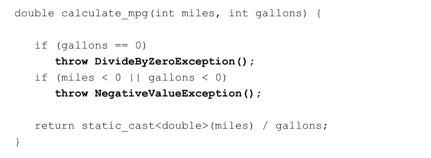

**Capture des exceptions définies par l'utilisateur**

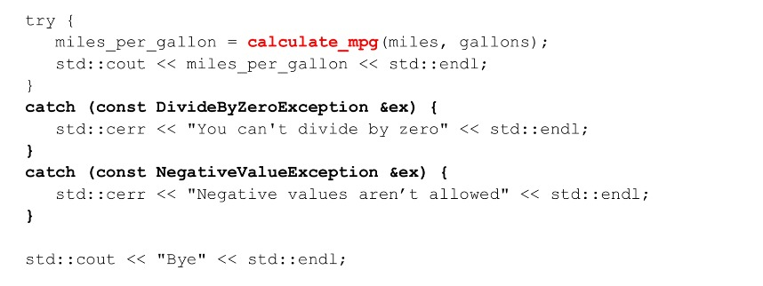


## Exceptions au niveau de la classe

Des exceptions peuvent également être levées depuis l'intérieur d'une classe :

+ Méthode

   + Ceux-ci fonctionnent de la même manière que pour les fonctions comme nous l'avons vu

+ Constructeur

   + Les constructeurs peuvent échouer
   + Les constructeurs ne renvoient aucune valeur
   + Lancez une exception dans le constructeur si vous ne pouvez pas initialiser un objet

+ Destructeur

   + Ne lancez PAS d'exceptions de votre destructeur

**Exceptions au niveau de la classe**

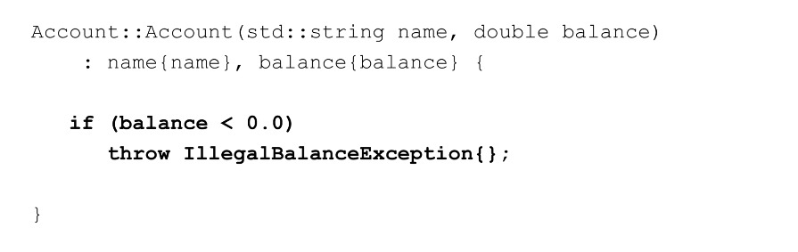
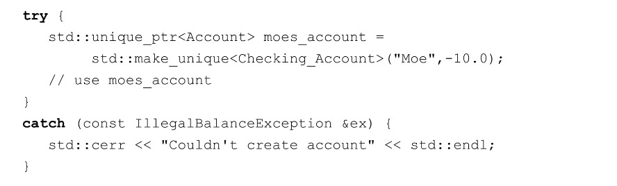

## La hiérarchie des classes `C++` `std::exception`

+ La hiérarchie des classes d'exceptions de la bibliothèque standard `C++`

+ `C++` fournit une hiérarchie de classes de classes d'exceptions

   + `std::exceptions` est la classe de base
   + toutes les sous-classes implémentent la fonction virtuelle `what()`
   + nous pouvons créer nos propres sous-classes d'exception définies par l'utilisateur

```
virtual const char * what() const noexecpt;
```

**La hiérarchie des classes d'exceptions de la bibliothèque standard `C++`**

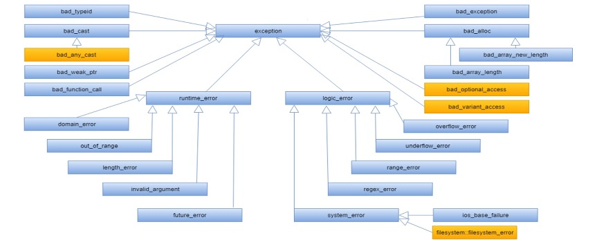

**Dériver notre classe de `std::exception`**

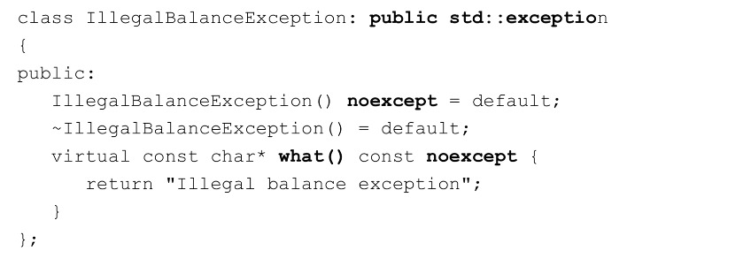


**Notre constructeur de classe de compte modifié**

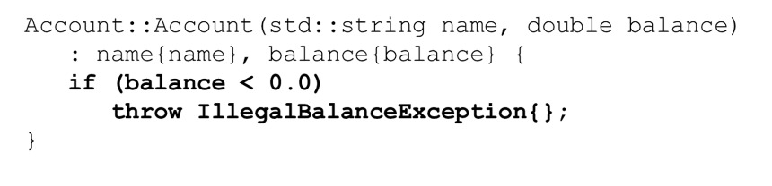

**Création d'un objet Compte**

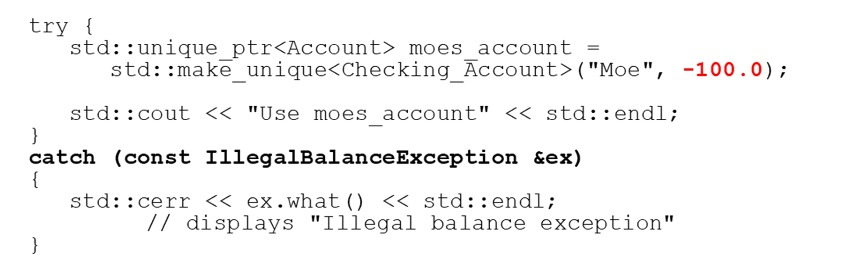
