Section 23 : Bonus Section - Enumerations
===

## Information
- Title:  `Bonus Section - Enumerations`
- Authors:  `Etienne KOA`

## Bonus Section Overview

**`C++` Énumérations**

+ Qu'est-ce qu'une énumération ?
   + Motivation
+ Structure d'une énumération
+ Type d'énumérations
   + Énumération sans portée
   + Énumération ciblée
+ Énumérations en cours d'utilisation

## Motivation

+ Qu'est-ce qu'une énumération ?

   + Un type défini par l'utilisateur qui modélise un ensemble de valeurs intégrales constantes

      + Les jours de la semaine (Mon, Tue, Wed, ...)
      + Les mois de l'année (Jan, Feb, Mar, ...)
      + Les couleurs dans un jeu de cartes (Clubs, Hearts, Spades, Diamonds)
      + Les valeurs dans un jeu de cartes (Ace, Two, Three, ...)
      + États du système (Idle, Defense_Mode, Attack_Mode, ...)
      + Les directions sur une boussole (North, South, East, West)

+ Avant les types énumérés
   + Constantes numériques sans nom
   + `Nombres magiques`

+ Ces constantes seraient utilisées comme conditions dans les instructions de contrôle
+ Souvent, on n'aurait aucune idée de ce que faisait un algorithme

+ En conséquence, de nombreux algorithmes souffraient d'une faible lisibilité et d'un nombre élevé d'erreurs logiques.

**Lisibilité**

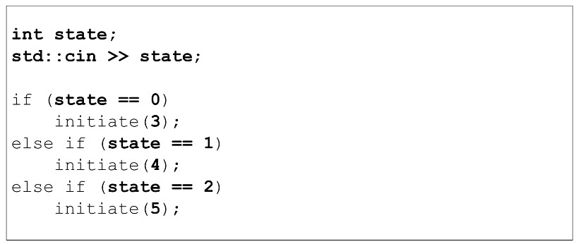
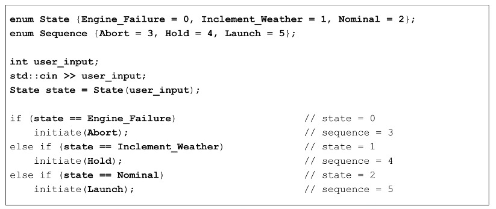

**Exactitude algorithmique**

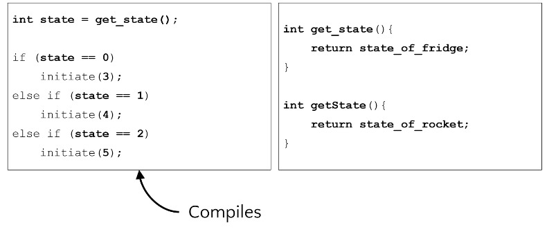
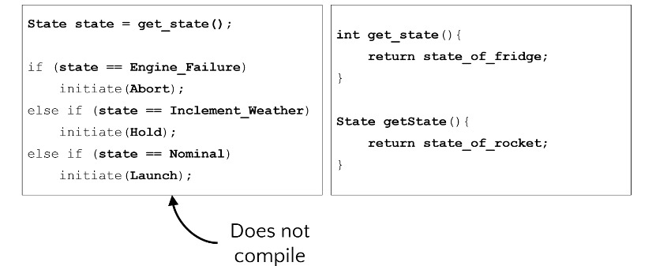

## La structure d'une énumération

**La structure d'une énumération**

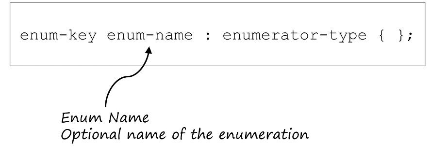
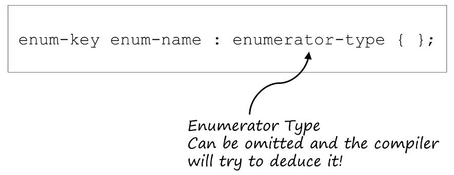
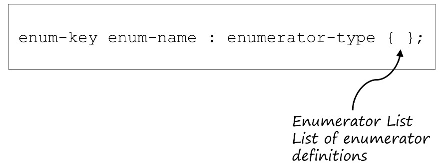

**Liste des énumérations**
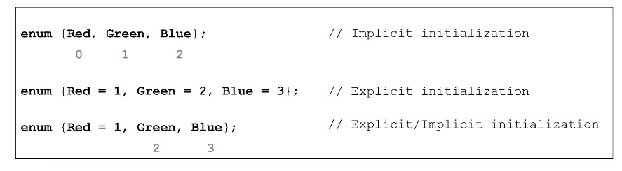

**Type d'énumération**
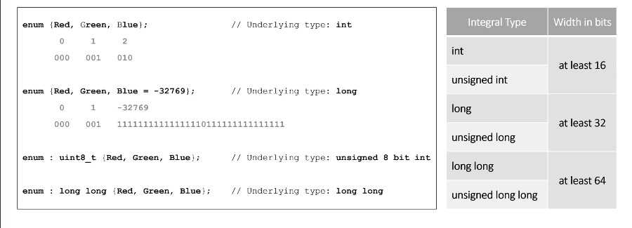

 

**Nom de l'énumération**
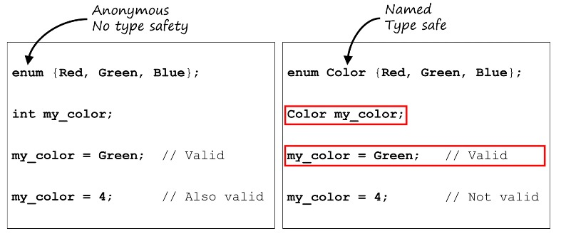

## Énumérations sans portée

+ Utilisation des instructions `if` et `switch` avec des énumérations sans portée

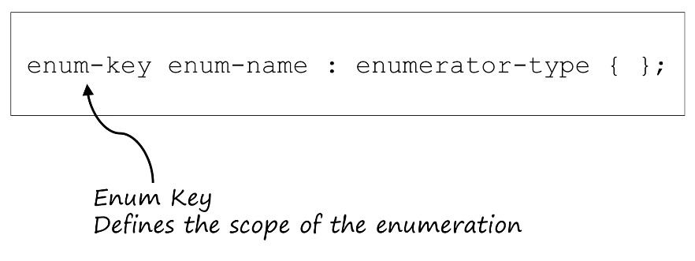

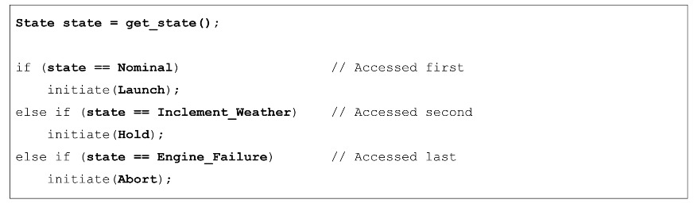

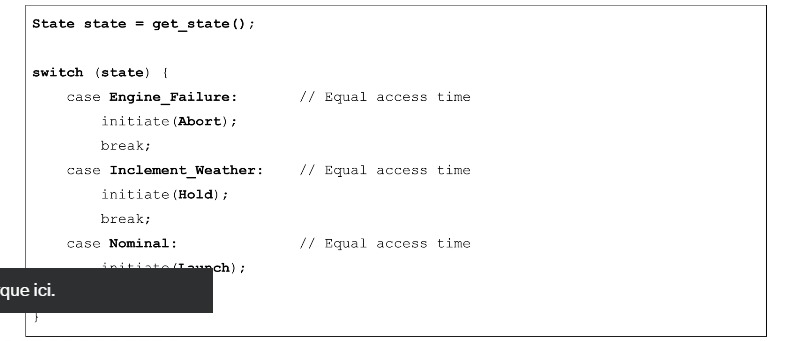

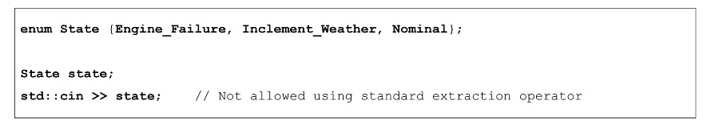

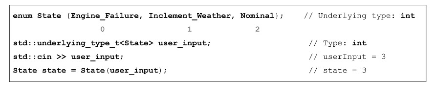

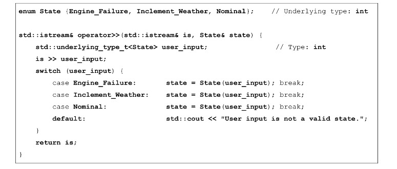

+ Utilisation de `cin` et `cout` avec des énumérations sans portée

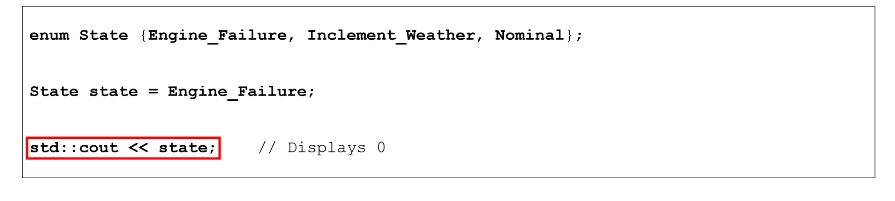

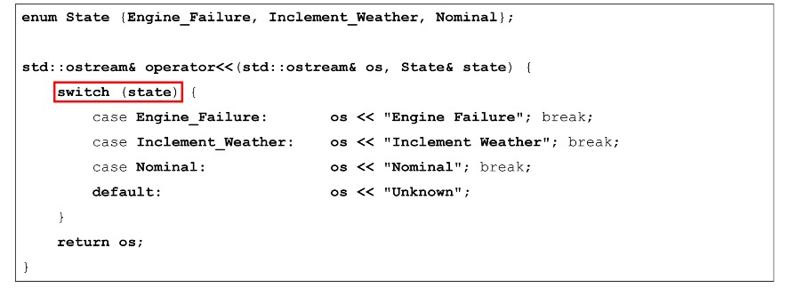

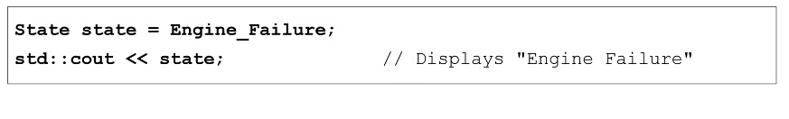

## Énumérations ciblées

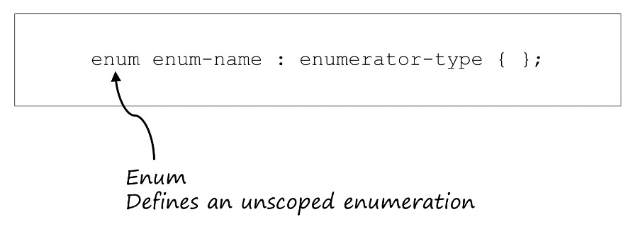

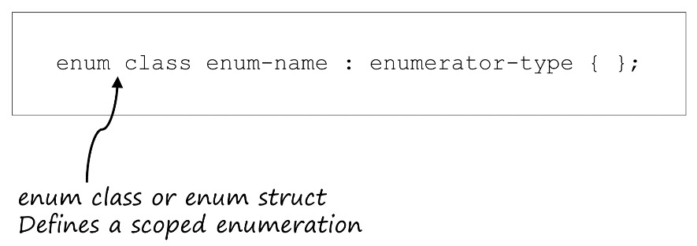

**Motivation**

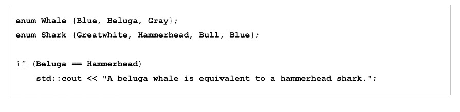

+ Utilisation des instructions `if` et `switch` avec des énumérations avec portée

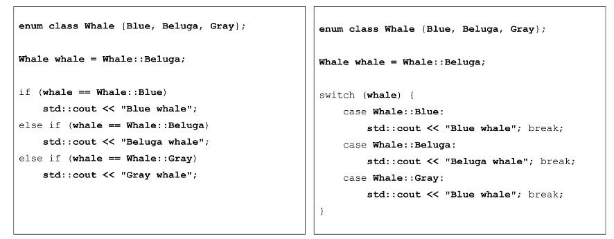

+ Utilisation des valeurs de l'énumérateur étendu

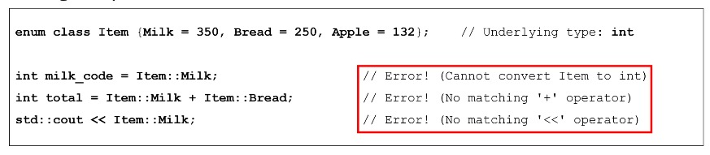
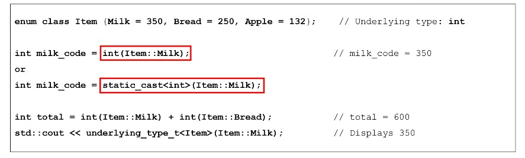

