Section 10 : Characters and Strings
===


## Information
- Title:  `Section 10 : Characters and Strings`
- Authors:  `ETIENNE KOA`


## Section Overview

+ Characters and Strings

  + Character functions
  + `C-style` Strings
  + Workings with `C-style` Strings
  + `C++` Strings
  + Working with `C++` Strings

## Characters Functions

```
#include <cctype>

                  #include <cctype>
                  function_name(char)
```

+ Fonction pour tester les caractères
+ Fonctions de conversion de la casse des caractères.

<br>

+ Tester les cractères

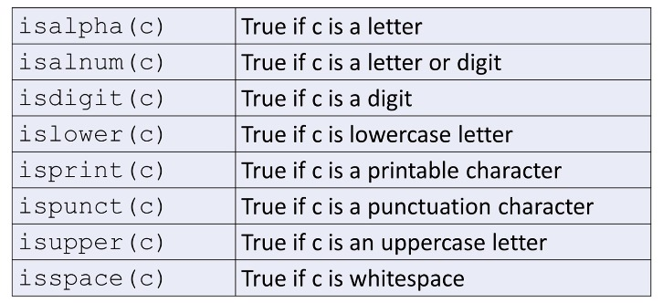

<br>

+ Conversion de caractères

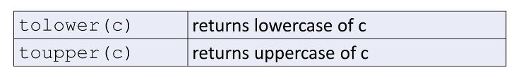

## Chaînes de style `C`

+ Séquence de caractères
   + contigu en mémoire
   + implémenté sous forme de tableau de caractères
   + terminé par un caractère nul (null)
     + `null` - caractère avec une valeur de zéro
   + Appelé chaînes terminées par zéro ou null.

+ Chaîne littérale
   + Séquence de caractères entre guillemets doubles, par ex. "Franck"
   + constante
   + terminé par un caractère nul

<br/>

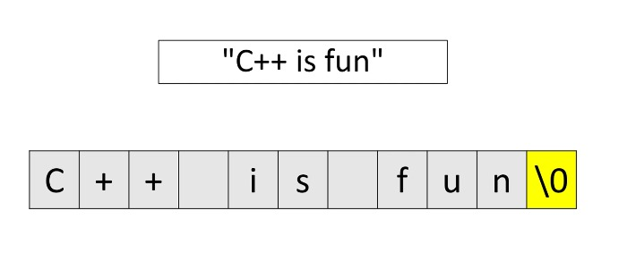

<br/>

+ déclarer des variables

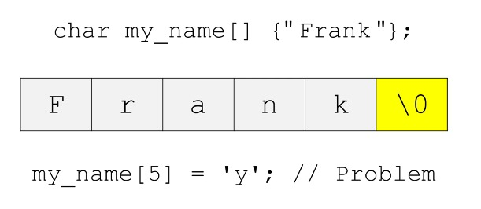
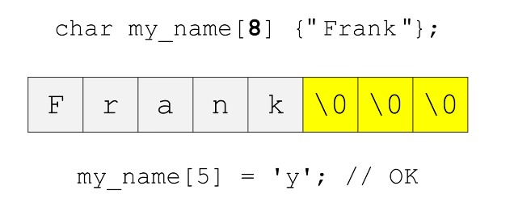
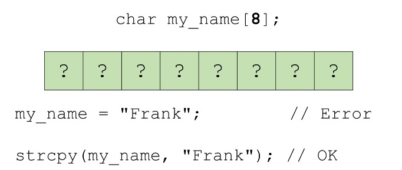

#### `#include <cstring>`

+ Fonctions qui fonctionnent avec les chaînes « C-style»

   + Copie
   + Concaténation
   + Comparaison
   + Recherche
   + et autres

+ Quelques exemples

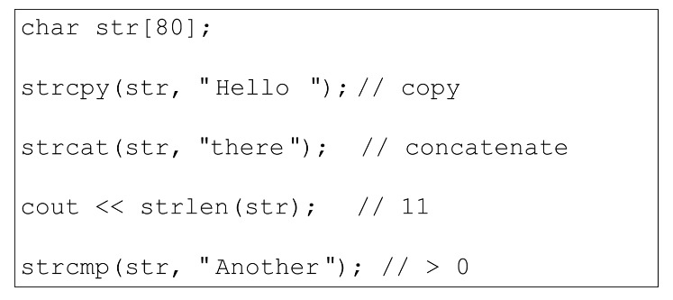

#### `#include <cstdlib>`

+ Fonctions à usage général

+ Inclut des fonctions pour convertir les chaînes de style C en

   + integer
   + float
   + long
   + etc


## `C++` Strings

+ `std::string` est une classe dans la `Standard Template Library`.

   + `#include <cstring>`
   + Espace de noms `std`
   + contigu en mémoire
   + taille dynamique
   + travailler avec les flux d'entrée et de sortie
   + de nombreuses fonctions membres utiles
   + nos opérateurs familiers peuvent être utilisés `(+, =, <, <=, >, >=, +=, ==, !=, [] ...)`.
   + peut être facilement converti en « style C » si nécessaire.
   + plus sûr

<br/>

+ Déclaration et initialisation

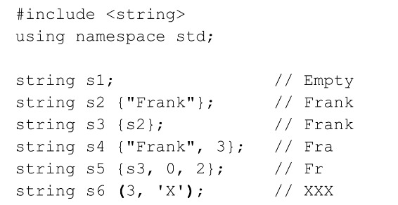

+ Assigner `=`

```
      string s1;
      s1 = "C++ Rocks!";

      string s2 {"Hello"};
      s2 = s1;
```


+ Concaténation

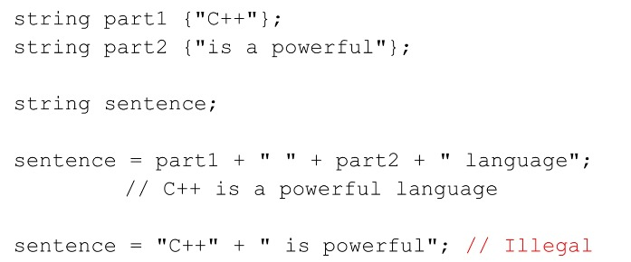

+ Accès aux méthodes `characters[]` et `at()`

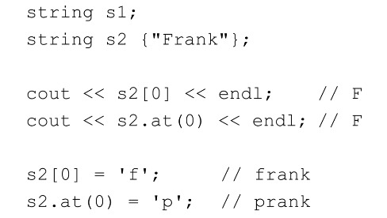
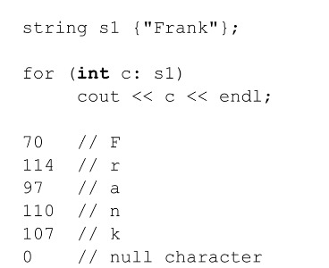

+ Comparaison

```
           == != > >= < <=
```

+ Les objets sont comparés caractère par caractère lexicalement.

   + Peut comparer :

     + deux objets `std::string`
     + Objet `std::string` et littéral de chaîne `C-style`.
     + Objet `std::string` et variable de chaîne `C-style`.


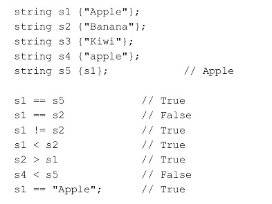

+ Sous-chaîne - `substr()`

   + Extraire une sous-chaîne d'un `std::string`

       ```
       objet.substr(start_index, length)
       ```
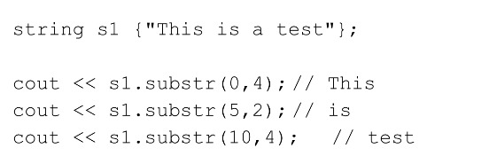


+ Recherche - `find()`

   + Renvoie l'index d'une sous-chaîne dans un `std::string`

         ```
         objet.find (search_string)
         ```
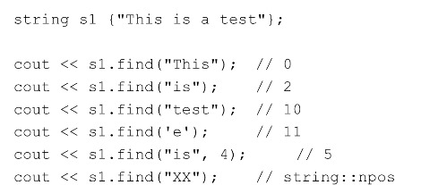


+ Suppression de caractères - `erase()` et `clear()`

   + Supprime une sous-chaîne de caractères d'un `std::string`

      ```
          object.erase(start_index,n length)
      ``` 
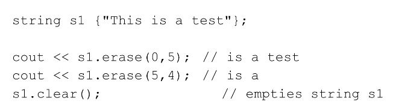


+ Autres méthodes utiles

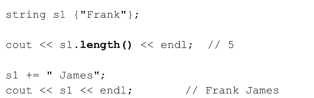

+ Bien d'autres encore...


+ Saisissez `>>` et `getline()`

   + Lecture de `std::string` depuis `cin`

