Section 15 : Inheritance
===

## Information
- Title:  `Inheritance`
- Authors:  `Etienne KOA`

## Aperçu
+ Héritage

+ Qu'est-ce que l'héritage ?
   + Pourquoi est-ce utile ?

+ Terminologie et notation

+ Héritage vs composition

+ Dériver des classes à partir de classes existantes
   + Types d'héritage

+ Membres protégés et accès aux cours

+ Constructeurs et Destructeurs

   + Passer des arguments aux constructeurs de classes de base
   + Ordre des appels des constructeurs et des destructeurs

+ Redéfinir les méthodes des classes de base
+ Hiérarchies de classes
+ Héritage multiple

## Qu'est-ce que l'héritage ?

**Qu'est-ce que c'est et pourquoi est-il utilisé ?**

+ Fournit une méthode pour créer de nouvelles classes à partir de classes existantes
+ La nouvelle classe contient les données et les comportements de la classe existante
+ Permettre la réutilisation des classes existantes
+ Nous permet de nous concentrer sur les attributs communs à un ensemble de classes
+ Permet aux nouvelles classes de modifier les comportements des classes existantes pour les rendre uniques
   + Sans réellement modifier la classe d'origine

**Héritage**

+ Cours associés

  + `Player, Enemy, Level Boss, Hero, Super Player, etc.`
  + `Account, Savings Account, Checking Account, Trust Account, etc.`
  + `Shape, Line, Oval, Circle, Square, etc.`
  + `Person, Employee, Student, Faculty, Staff, Administrator, etc.`

**Accounts**

+ Account
  + **balance, deposit, withdraw, ...**
+ Savings Account
  + **balance, deposit, withdraw, interest, rate ...**
+ Checking Account
  + **balance, deposit, withdraw, minimum balance, oer check free ...**
+ Trust Account
  + **balance, deposit, withdraw, interest rate, ...**

**Comptes - sans héritage - duplication de code**

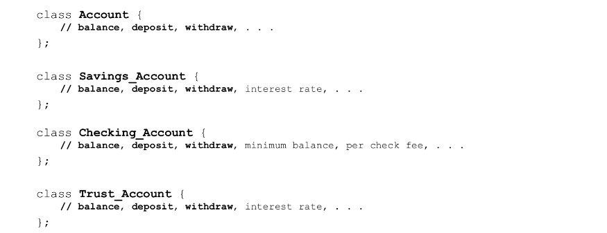

**Comptes - avec héritage - réutilisation du code**

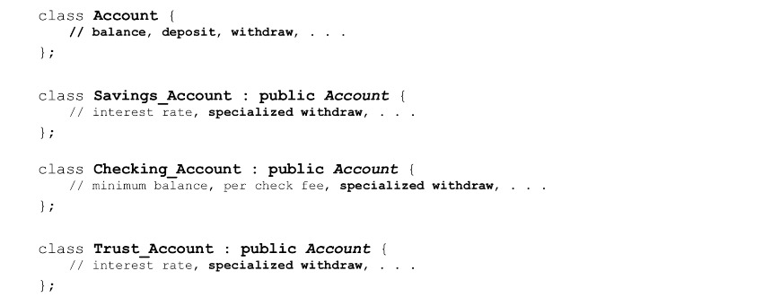

## Terminologie et notation

**Héritage - Terminologie**

+ Héritage
   + Processus de création de nouvelles classes à partir de classes existantes
   + Mécanisme de réutilisation

+ Héritage unique
   + Une nouvelle classe est créée à partir d'une autre classe « unique »

+ Héritage multiple
   + Une nouvelle classe est créée à partir de deux (ou plusieurs) autres classes

+ Classe de base (classe parent, super classe)
   + La classe étant étendue ou héritée de

+ Classe dérivée (classe enfant, sous-classe)
   + La classe créée à partir de la classe Base
   + Héritera des attributs et des opérations de la classe Base

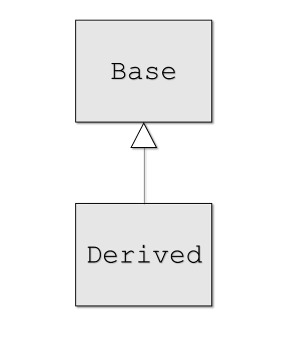

+ Relation `Is-A`
   + Héritage public
   + Les classes dérivées sont des sous-types de leurs classes de base
   + Peut utiliser un objet de classe dérivé partout où nous utilisons un objet de classe de base
  
+ Généralisation
   + Combiner des classes similaires en une seule classe plus générale basée sur des attributs communs

+ Spécialisation
   + Création de nouvelles classes à partir d'attributs ou d'opérations existants prouvant des attributs plus spécialisés

+ Héritage et hiérarchies de classes
   + Organisation de nos relations successorales

**Hiérarchie des classes**

+ Cours :
   + A
   + B est dérivé de A
   + C est dérivé de A
   + D est dérivé de C
   + E est dérivé de D

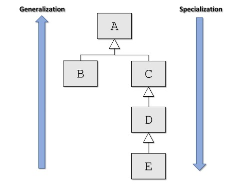

+ Cours :
   + Personne
   + L'employé est dérivé de Personne
   + L'étudiant est dérivé de la personne
   + La faculté est dérivée de l'employé
   + Le personnel est dérivé de l'employé
   + L'administrateur est dérivé de l'employé

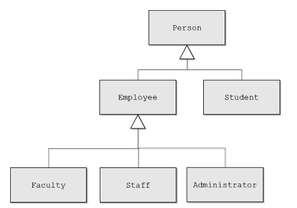

## Héritage vs composition

**Héritage public vs composition**

+ Les deux permettent la réutilisation des classes existantes

+ Héritage public
   + Relation `Is-A`
     + L'employé « est-une personne »
     + Le compte courant « est-un compte »
     + Cercle `Est-une` Forme

+Composition
   + Relation `has-a`
     + La personne « possède un compte »
     + Le joueur a une attaque spéciale
     + Cercle `a un` emplacement

**Héritage public vs composition**

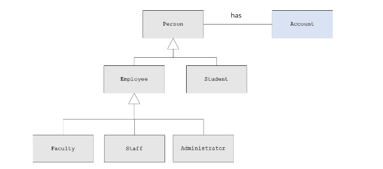

**Composition**

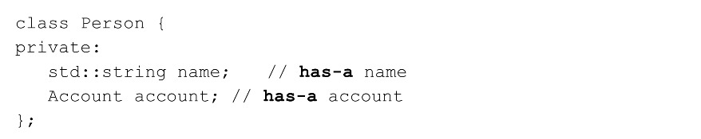

## Dériver des classes à partir de classes existantes

+ Syntaxe de dérivation `C++`

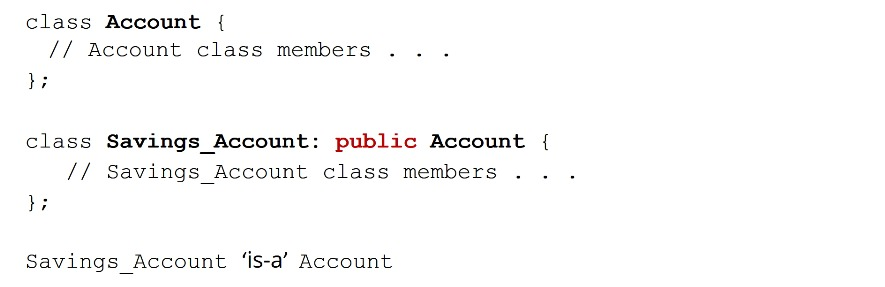

+ Le spécificateur d'accès peut être : `public, privé ou protégé`

+ Types d'héritage en `C++`

+ `public`
   + Le plus courant
   + Établit une relation « est-une » entre les classes de base et

+ `private` et `protected`
   + Établit une relation « la classe dérivée a une classe de base »
   + `Est mis en œuvre en termes de` relation
   + Différent de la composition

**Syntaxe de dérivation `C++`**

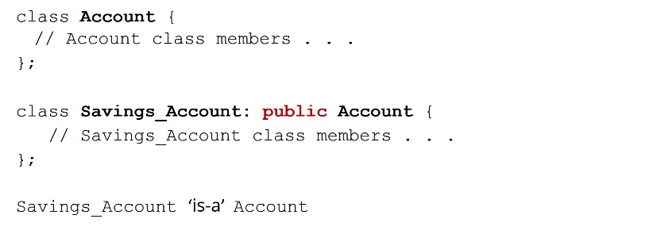

**`C++` créant des objets**

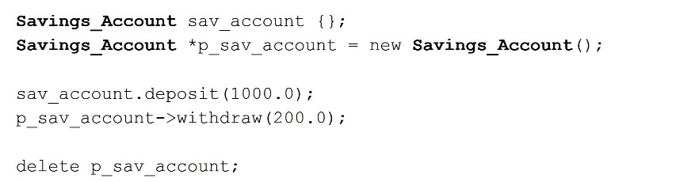

## Membres protégés et accès aux cours

+ Le modificateur de membre de classe protégé

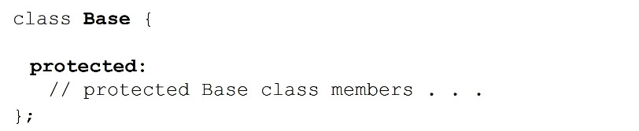

+ Accessible depuis la classe Base elle-même
+ Accessible depuis les classes Dérivées de Base
+ Non accessible par les objets de Base ou Dérivés

+ Le modificateur de membre de classe protégé

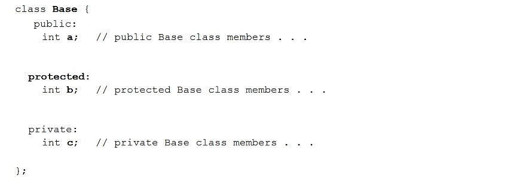

+ Accès avec héritage `public`

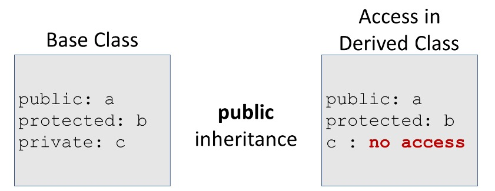

+ Accès avec héritage `private`

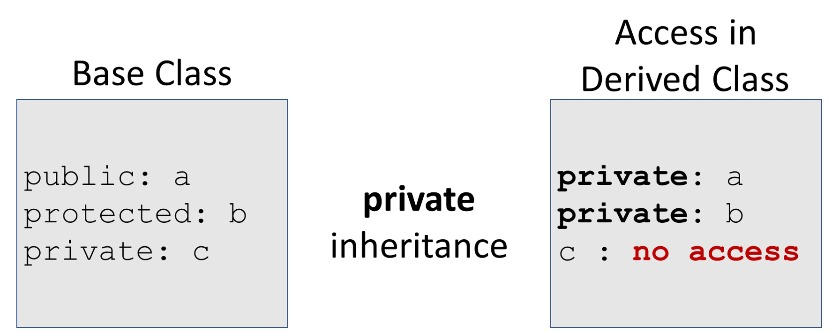

+ Accès avec héritage `protected`

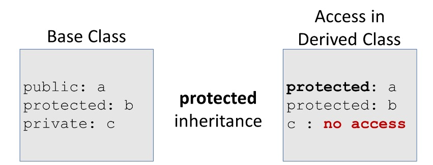

## Constructeurs et destructeurs

**Constructeurs et initialisation de classe**
+ Une classe dérivée hérite de sa classe Base

+ La partie Base de la classe Derived DOIT être initialisée AVANT que la classe Derived soit initialisée

+ Lorsqu'un objet dérivé est créé
   + Le constructeur de la classe de base s'exécute ensuite
   + Le constructeur de classe dérivée s'exécute

  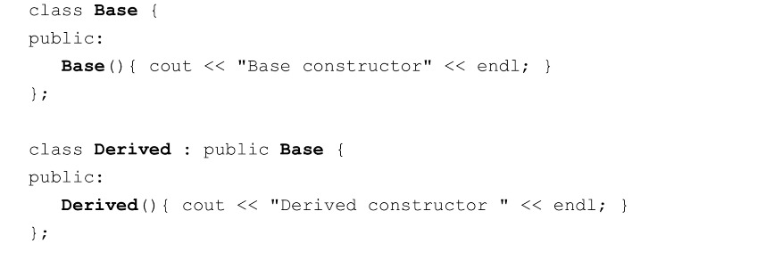
  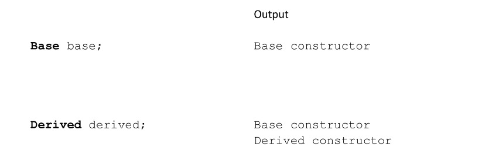

**Destructeurs**

+ Les destructeurs de classes sont invoqués dans l'ordre inverse en tant que constructeurs

+ La partie Derived de la classe Derived DOIT être détruite AVANT que le destructeur de classe Base ne soit invoqué

+ Lorsqu'un objet dérivé est détruit
   + Le destructeur de classe dérivée s'exécute ensuite
   + Le destructeur de classe de base s'exécute
   + Chaque destructeur doit libérer les ressources allouées dans ses propres constructeurs

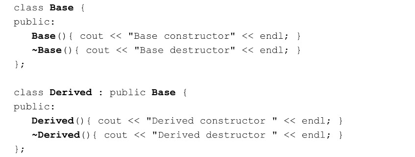

**Destructeurs et initialisation de classe**

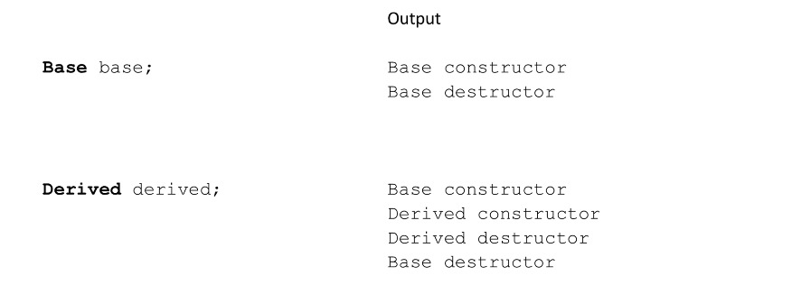

**Constructeurs et initialisation de classe**

+ Une classe dérivée n'hérite PAS

   + Constructeurs de classes de base
   + Destructeur de classe de base
   + Opérateurs d'affectation surchargés de classe de base
   + Fonctions d'ami de classe de base

+ Cependant, les constructeurs de classes dérivées, les destructeurs et les opérateurs d'affectation surchargés peuvent invoquer les versions de la classe de base.

+ `C++11` permet l'héritage explicite des constructeurs de base `non spéciaux` avec
   + `en utilisant Base :: Base` ; n'importe où dans la déclaration de classe dérivée
   + Beaucoup de règles impliquées, il est souvent préférable de définir vous-même les constructeurs

## Passer des arguments aux constructeurs de classes de base

**Héritage**

+ Passer des arguments aux constructeurs de classes de base
   + La partie Base de la classe Derivated doit être initialisée en premier
   + Comment contrôler exactement quel constructeur de classe de base est utilisé lors de l'initialisation ?
   + Nous pouvons invoquer le constructeur de classe Base que nous souhaitons dans la liste d'initialisation de la classe Derivated.

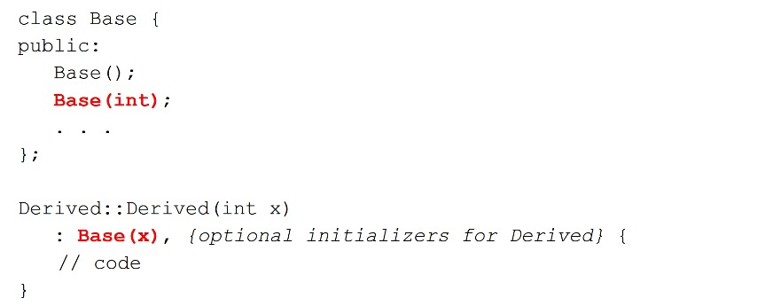

**Constructeurs et Destructeurs**
+ Constructeurs et initialisation de classe

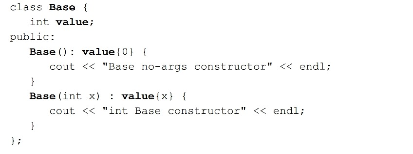
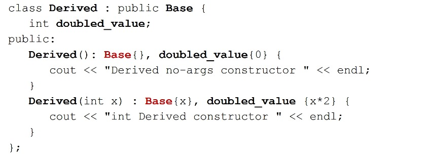
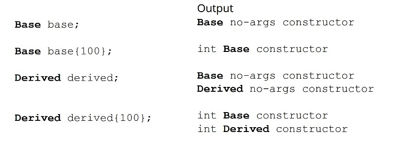

## Copier/Déplacer les constructeurs et l'opérateur = avec des classes dérivées

**Copier le constructeur**

+ Peut invoquer explicitement le constructeur de copie de base
   + L'objet dérivé `other` sera `tranché`

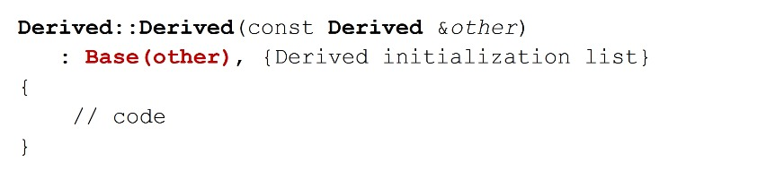
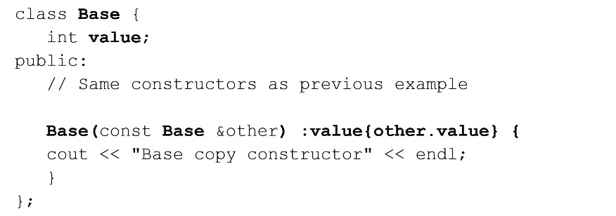
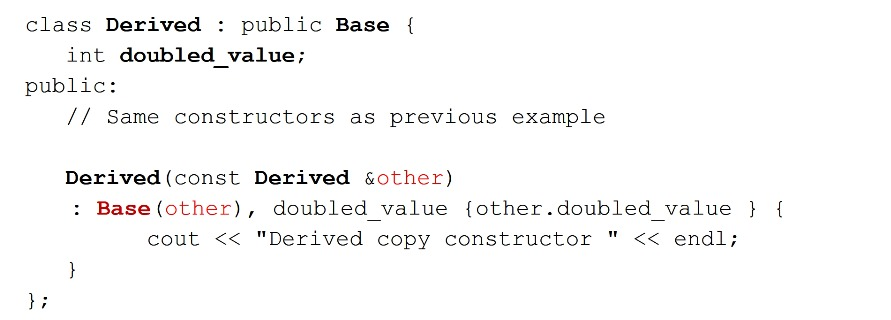

**Opérateur =**

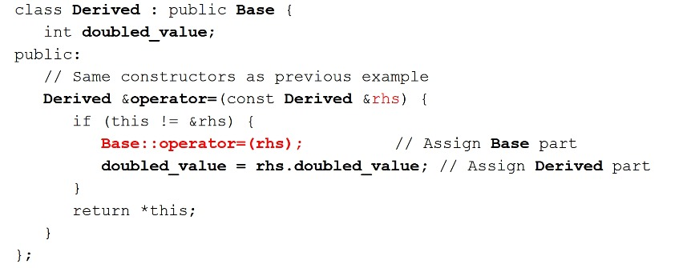

**Copier/Déplacer les constructeurs et l'opérateur =**

+ Souvent, vous n'avez pas besoin de fournir le vôtre

+ Si vous ne les définissez pas dans Dérivé
   + Ensuite, le compilateur les créera automatiquement et appellera la version de la classe de base

+ Si vous « FAIRE » fournissez des versions dérivées
   + Ensuite, « VOUS » devez invoquer vous-même les versions de base « explicitement »

+ Soyez prudent avec les pointeurs bruts
   + Surtout si Base et Derived ont chacun des pointeurs bruts
   + Fournissez-leur une sémantique de copie approfondie

## Redéfinition des méthodes de classe de base

**Héritage**

+ Utilisation et redéfinition des méthodes de la classe Base
   + La classe dérivée peut invoquer directement les méthodes de la classe de base
   + La classe définie peut `remplacer` ou `redéfinir` les méthodes de la classe de base
   + Très puissant dans le contexte du polymorphisme

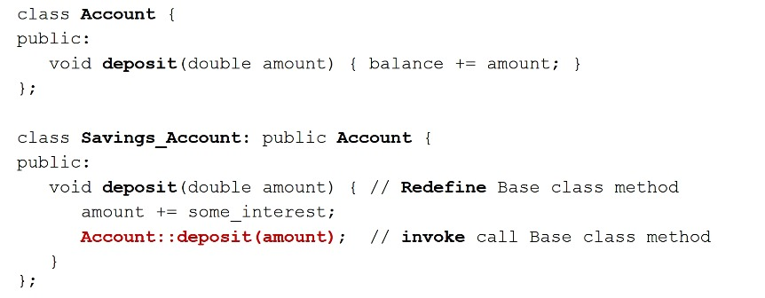

**Liaison statique des appels de méthode**

+ La liaison de la méthode à utiliser est effectuée au moment de la compilation

   + La liaison par défaut pour `C++` est statique
   + Les objets de classe dérivés utiliseront `Derived::deposit`
   + Mais, nous pouvons explicitement innover `Base::deposit` à partir de `Derived::deposit`
   + Ok, mais limité - une approche beaucoup plus puissante est la liaison dynamique que nous verrons dans la section suivante

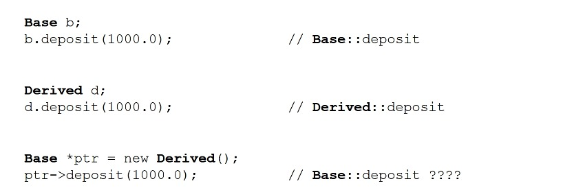

## Héritage multiple

+ Une classe dérivée hérite de deux ou plusieurs classes de base en même temps

+ Les classes de base peuvent appartenir à des hiérarchies de classes non liées

+ Un directeur de département
   + Faculté `Is-A` et
   + Administrateur `Is-A`

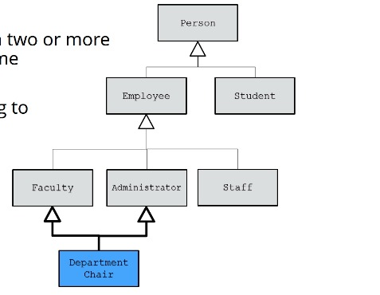

**Syntaxe C++**

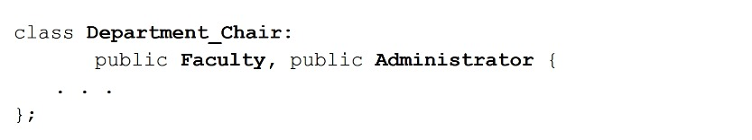

+ Au-delà du cadre de ce cours
+ Quelques cas d'utilisation convaincants
+ Facilement mal utilisé
+ Peut être très complexe

