Section 16 : Polymorphism
===

## Information
- Title:  `Polymorphism`
- Authors:  `Etienne KOA`


## Aperçu

**Polymorphisme et héritage**

+ Qu'est-ce que le polymorphisme ?

+ Utilisation de pointeurs de classe de base
+ Liaison statique ou dynamique
+ Fonctions virtuelles
+ Destructeurs virtuels
+ Les spécificateurs de remplacement et finaux
+ Utilisation de références de classe de base
+ Fonctions virtuelles pures et classes abstraites
+ Classes abstraites comme interfaces


## Qu'est-ce que le polymorphisme

+ Fondamental de la programmation orientée objet

+ Polymorphisme
   + Au moment de la **compilation/liaison anticipée/liaison statique**
   + **Exécution / liaison tardive / liaison dynamique**

+ Polymorphisme d'exécution
   + Être capable d'attribuer une signification différente à la même fonction au moment de l'exécution

+ Nous permet de programmer de manière plus abstraite
   + Pensez général plutôt que spécifique
   + Laissez `C++` déterminer quelle fonction appeler au moment de l'exécution

+ Ce n'est pas la valeur par défaut en `C++`, le polymorphisme d'exécution est obtenu via
   + Héritage
   + Pointeurs ou références de classe de base
   + Fonctions virtuelles

**Types de polymorphisme en `C++` ?**

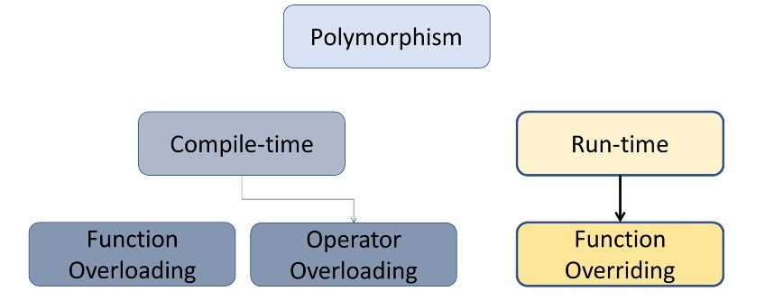

**Un exemple non polymorphe - Static Binding**

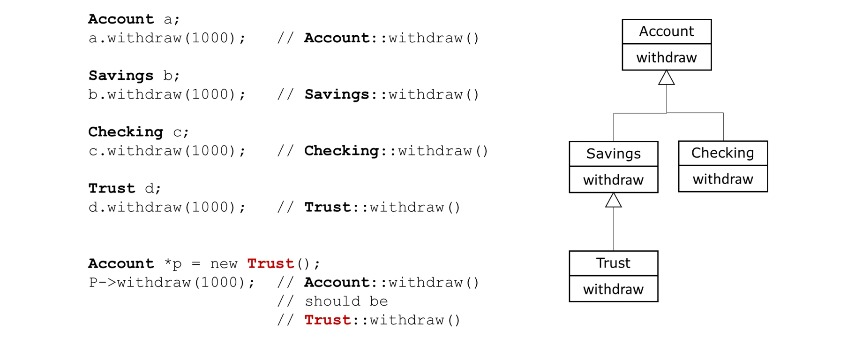
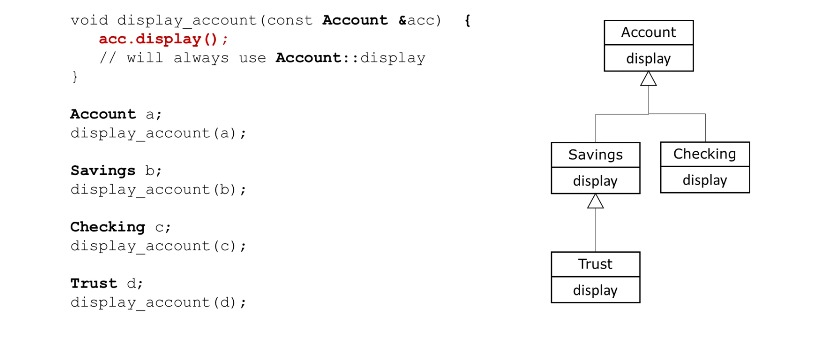

**Un exemple polymorphe - Dynamic Binding**

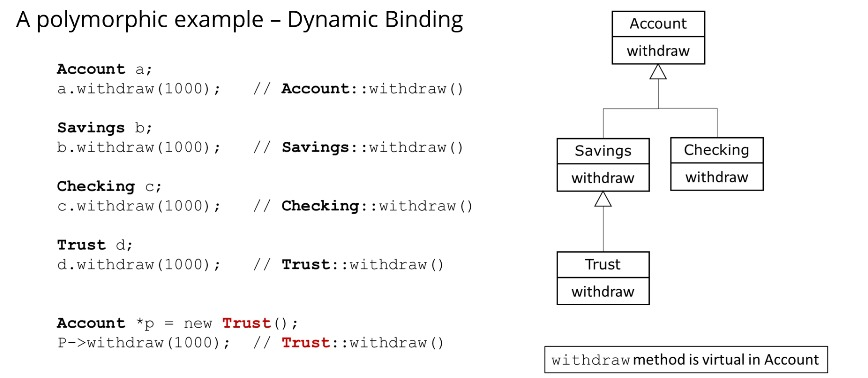
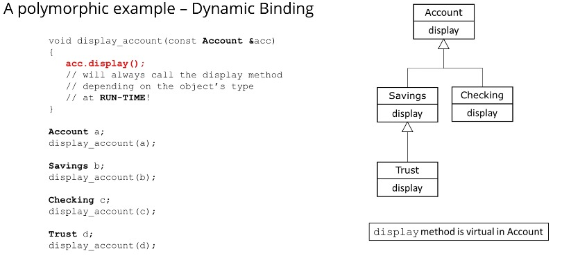

## Utilisation d'un pointeur de classe de base

**Utilisation d'un pointeur de classe de base**

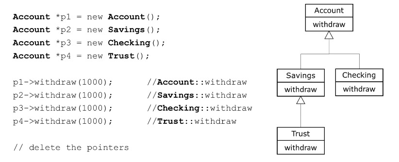
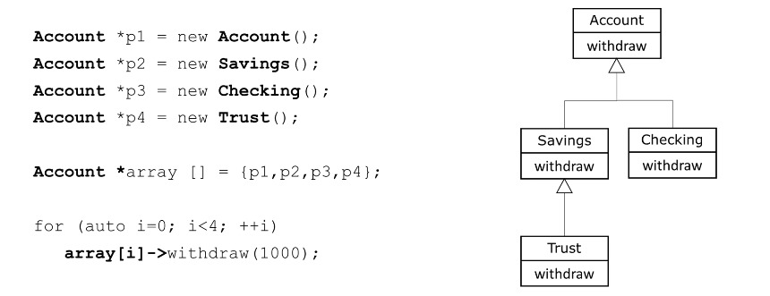
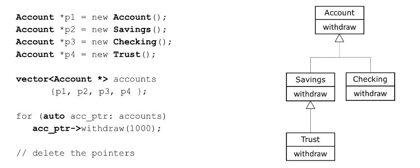

## Fonctions virtuelles

**Polymorphisme**

+ Fonctions virtuelles
   + Les fonctions redéfinies sont liées statiquement
   + Les fonctions remplacées sont liées dynamiquement
   + Les fonctions virtuelles sont remplacées
   + Permettez-nous de traiter tous les objets généralement comme des objets de la classe Base

**Déclaration de fonctions virtuelles**
+ Déclarez la fonction que vous souhaitez remplacer comme virtuelle dans la classe Base
+ Les fonctions virtuelles sont virtuelles tout au long de la hiérarchie à partir de ce point
+ Polymorphisme dynamique uniquement via le pointeur ou la référence de classe `Account`

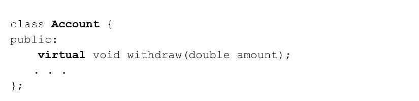

<br/>

+ Remplacer la fonction dans les classes dérivées
+ La signature de la fonction et le type de retour doivent correspondre EXACTEMENT
+ Mot-clé virtuel non obligatoire mais constitue une bonne pratique
+ Si vous ne fournissez pas de version remplacée, elle est héritée de sa classe de base

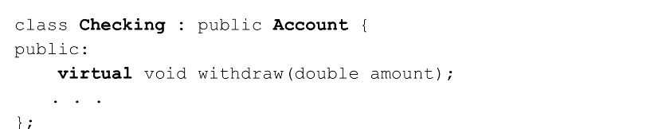

## Destructeurs virtuels

**Polymorphisme**

+ Destructeurs virtuels

   + Des problèmes peuvent survenir lorsque nous détruisons des objets polymorphes
   + Si une classe dérivée est détruite en supprimant son stockage via le pointeur de classe de base et la classe un destructeur non virtuel Alors le comportement n'est pas défini dans le standard `C++`.
   + Les objets dérivés doivent être détruits dans le bon ordre en commençant par le bon destructeur.

+ Solution/Règle :
   + Si une classe a des fonctions virtuelles
   + TOUJOURS fournir un destructeur virtuel public
   + Si le destructeur de classe de base est virtuel alors tous les destructeurs de classes dérivées sont également virtuels

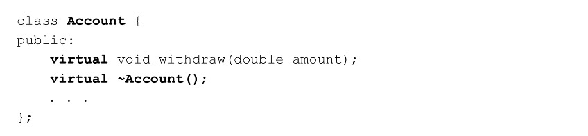

## Utilisation du spécificateur de remplacement

**Le spécificateur de remplacement**

+ Nous pouvons remplacer les fonctions virtuelles de la classe Base
+ La signature et le retour des fonctions doivent être EXACTEMENT les mêmes
+ S'ils sont différents, alors nous avons une redéfinition qui n'est PAS prioritaire
+ La redéfinition est liée statiquement
+ Le remplacement est lié dynamiquement
+ `C++11` fournit un spécificateur de remplacement pour que le compilateur assure le remplacement

+ Le spécificateur de remplacement

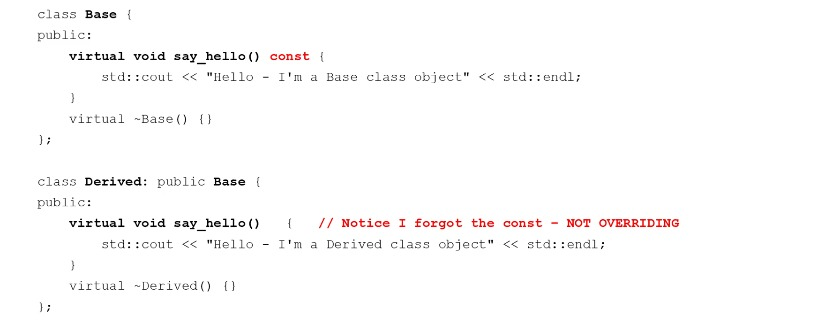
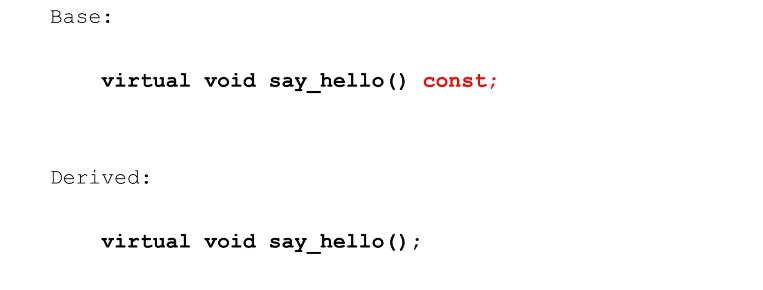

<br/>

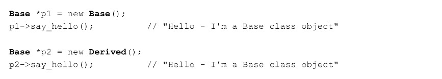

+ Pas ce à quoi nous nous attendions
+ Les signatures de la méthode `say_hello` sont différentes
+ Ainsi dérivé `redéfinit` `say_hello` au lieu de le remplacer !

<br/>

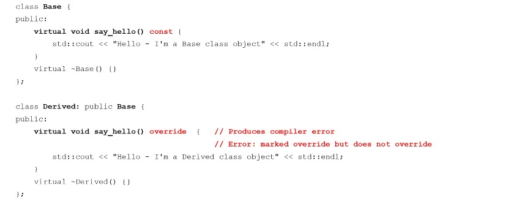

## Utilisation du spécificateur final

**Le spécificateur `final`**

+ `C++11` fournit le spécificateur final
   + Lorsqu'il est utilisé au niveau de la classe
   + Empêche une classe d'être dérivée de

   + Lorsqu'il est utilisé au niveau de la méthode
   + Empêche la méthode virtuelle d'être remplacée dans les classes dérivées

+ classe `final`

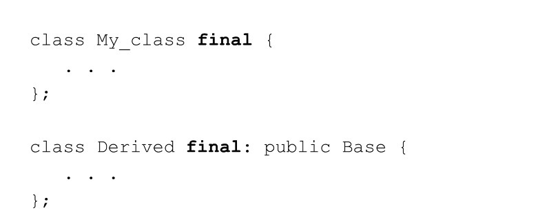


+ méthode `final`

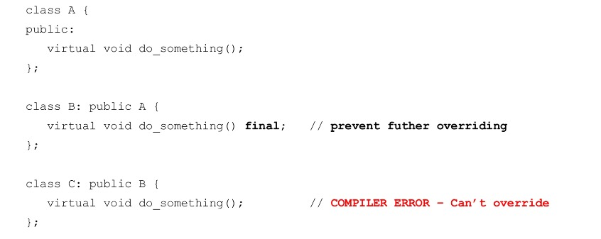

## Utilisation des références de classe de base

+ Nous pouvons également utiliser des références de classe Base avec un polymorphisme dynamique
+ Utile lorsque nous passons des objets à des fonctions qui attendent une référence de classe de base

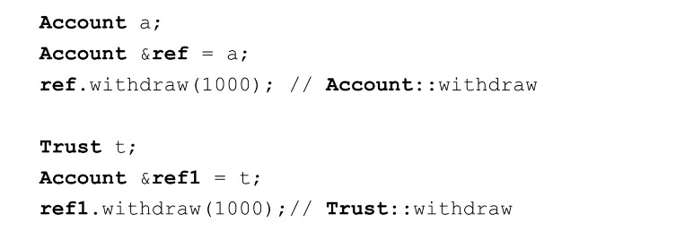
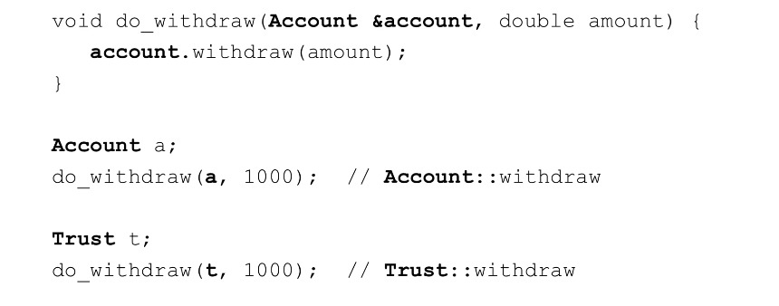

## Fonctions virtuelles pures et classes abstraites

+ Cours abstrait

   + Impossible d'instancier des objets
   + Ces classes sont utilisées comme classes de base dans les hiérarchies d'héritage
   + Souvent appelées classes de base abstraites

+ Cours de béton
   + Utilisé pour instancier des objets à partir de
   + Toutes leurs fonctions membres sont définies
     + `Checking Account, Savings Account`
     + `Facultaty, Staff`
     + `Enemy, Level Boss`

+ Classe de base abstraite
   + Trop générique pour créer des objets à partir de
     + `Shape, Employee, Account, Player`
   + Serveur en tant que parent des classes dérivées pouvant avoir des objets
   + Contient au moins une fonction virtuelle pure

+ Fonction virtuelle pure
  +  Utilisé pour créer une classe « abstraite »
  + Spécifié avec `=0` dans sa déclaration

  ```
  virtual void function() = 0; // pure virtual function
  ```

  + Ne fournissent généralement pas d'implémentations

+ Fonction virtuelle pure
  + Les classes dérivées DOIVENT remplacer la classe de base
  + Si la classe Derived ne remplace pas, alors la classe Derived est également abstraite
  + Utilisé lorsqu'il n'est pas logique qu'une classe de base ait une implémentation
    + Mais les classes concrètes doivent le mettre en œuvre

```
virtual void draw() = 0       // Shape
virtual void defend() = 0     // Shape
```
  
**Fonctions virtuelles pures et classes abstraites**

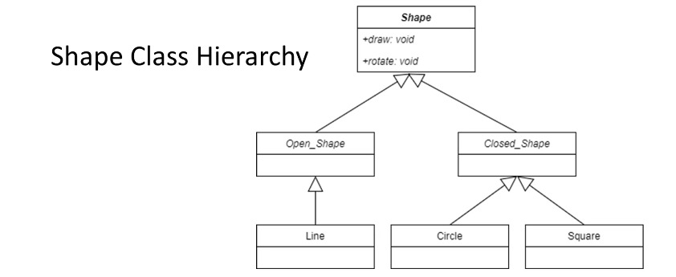
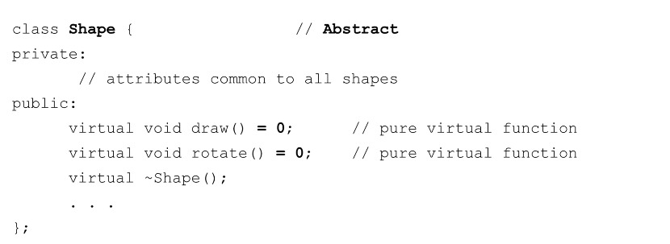
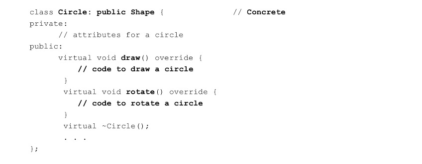

<br/>

**Classe de base abstraite**

+ Le résumé soit instancié

```
Shape shape;                  // Error
Shape *ptr = new Shape();     // Error
```

+ Nous pouvons utiliser des pointeurs et des références pour faire référence dynamiquement à des classes concrètes dérivées de alors


```
Shape *ptr = new Circle();
prt->draw();
ptr->rotate();
```

## Classes abstraites comme interfaces

**Qu'est-ce qu'utiliser une classe comme interface ?**

+ Une classe abstraite qui n'a que des fonctions virtuelles pures
+ Ces fonctions fournissent un ensemble général de services à l'utilisateur de la classe
+ Fourni en tant que public
+ Chaque sous-classe est libre d'implémenter ces services selon ses besoins
+ Chaque service (méthode) doit être implémenté
+ Les informations sur le type de service sont strictement appliquées

**Un exemple imprimable**
+ `C++` ne fournit pas de vraies interfaces
+ Nous utilisons des classes abstraites et des fonctions virtuelles pures pour y parvenir.
+ Supposons que nous voulions pouvoir fournir un support « imprimable » pour n'importe quel objet de notre choix sans connaître son implémentation au moment de la compilation.

```
std :: cout << any_object << std :: endl;
```

+ `any_object` doit être conforme à l'interface `Printable`

**Un exemple de formes**
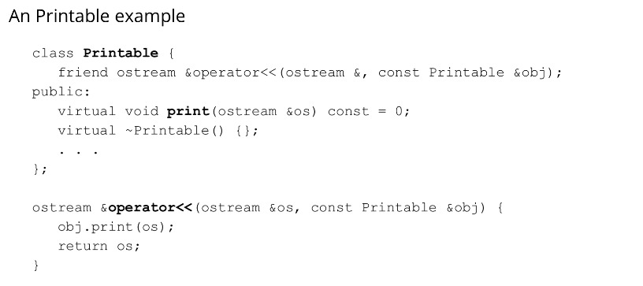
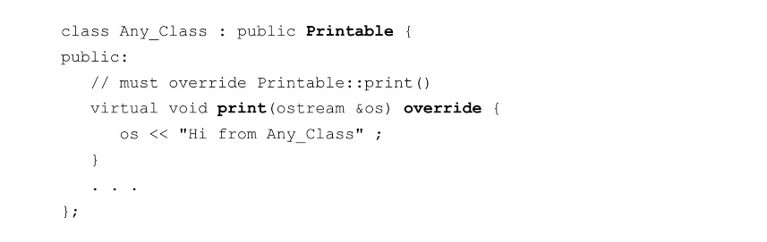
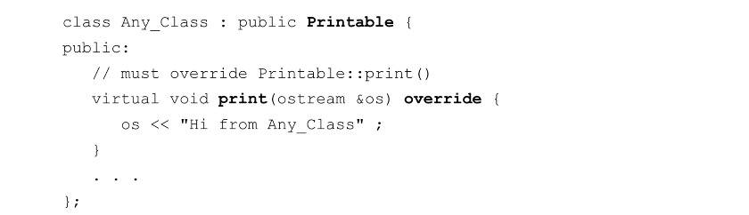
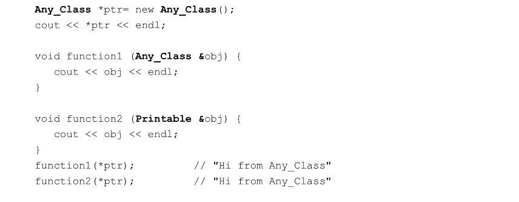

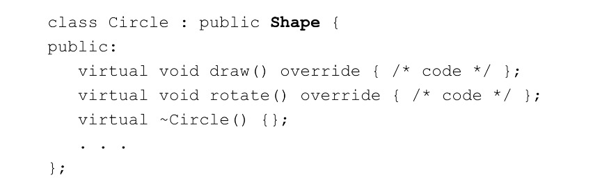
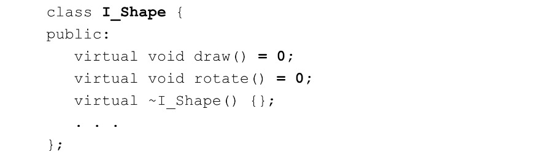
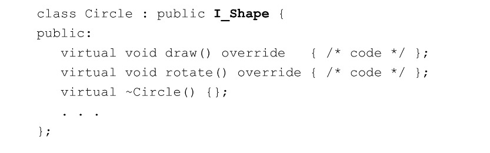

  
