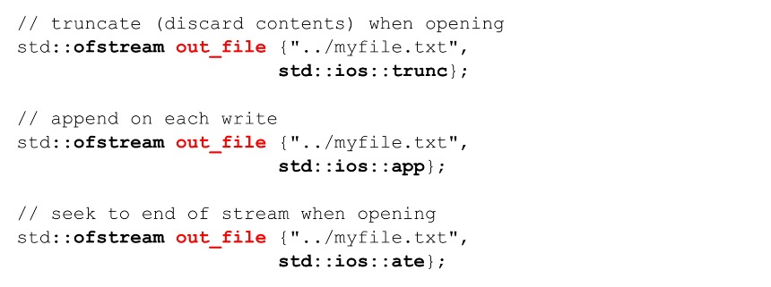

Section 19 : I/O and Streams
===

## Information
- Title:  `I/O and Streams`
- Authors:  `Etienne KOA`


## Aperçu de la section
- Flux et E/S
- Manipulateurs de flux
- Lire et écrire dans un fichier texte
- Utilisation de flux de chaînes

## Fichiers, flux et E/S

+ `C++` utilise les flux comme interface entre le programme et les périphériques d'entrée et de sortie
+ Indépendant de l'appareil lui-même
+ Séquence d'octets
+ Le flux d'entrée fournit des données au programme
+ Le flux de sortie reçoit les données du programme


**Fichiers d'en-tête communs**


**Classes de flux couramment utilisées**


**Objets de flux global**


+ Objets globaux - initialisés avant l'exécution principale.


+ La meilleure pratique consiste à utiliser `cerr` pour les messages d'erreur et `clog` pour les messages de journal.

## Manipulateurs de flux

+ Les flux ont des fonctions membres utiles pour contrôler le formatage

+ Peut être utilisé sur les flux d'entrée et de sortie

+ Le temps de l'effet sur le flux varie

+ Peut être utilisé comme fonctions membres ou comme manipulation

```
std::count.width(10);   /: member function
std::cout << std::setw(10); // manipulator
```

+ Nous nous concentrerons sur l'utilisation du manipulateur

**Common stream manipulators**

+ **Booléen**
  + `boolalpha, noboolalpha`

+ **Entier**
  + `dec, hex, oct, showbase, noshowbase, showpos, noshowpos, uppercase, nouppercase`

+ **Point flottant**
  + `fixed, scientific, setprecision, showpoint, noshowpoint, showpos, noswhopos`

+ **Largeur du champ, justification et remplissage**
  + `setw, left, right, internal, setfill`

+ **Autres**
  + `endl, flush, skipws, noskipws, ws`


## Stream Manipulators - boolean

**Formatage des types booléens**

+ La valeur par défaut lors de l'affichage des valeurs booléennes est 1 ou 0.
+ Parfois, les chaînes true ou false sont plus appropriées


+ Toutes les autres sorties booléennes seront affectées


## Manipulateurs de flux - nombres entiers

**Formatage des types entiers**

+ La valeur par défaut lors de l'affichage de valeurs entières est :

   + `noshowbase` - préfixe utilisé pour afficher le format hexadécimal ou octal
   + `nouppercase` - lors de l'affichage des valeurs `prefix` et `hex`, elles seront en minuscules.
   + `noshowpos` - aucun `+` n'est affiché pour les nombres positifs

+ Ces manipulateurs affectent toutes les sorties ultérieures vers le flux

**Formatage des types entiers - base de définition**


**Formatage des types entiers - affichage de la base**


**Formatage des types entiers - affichage hexadécimal en majuscule**


**Formatage des types entiers - affichage du signe positif**


**Définition/réinitialisation des types entiers**


## Manipulateurs de flux - Virgule flottante

**Formatage des types à virgule flottante**

+ La valeur par défaut lors de l'affichage des valeurs à virgule flottante est :

   + `setprecision` - nombre de chiffres affichés (6).
   + `fixed` - non fixe à un nombre ou à des chiffres spécifiques après la virgule décimale
   + `noshowpoint` - les zéros à droite ne sont pas affichés
   + `nouppercase` - lors de l'affichage en notation scientifique
   + `noshowpos` - aucun `+` n'est affiché pour les nombres positifs

+ Ces manipulateurs affectent toutes les sorties ultérieures du flux.

**Formatage des types à virgule flottante - précision**


**Formatage des types à virgule flottante - corrigé**


**Formatage des types à virgule flottante - fixé**


**Formatage des types à virgule flottante – scientifique**


**Formatage des types à virgule flottante - majuscules scientifiques**


**Formatage des types à virgule flottante - affichage du signe positif**


**Formatage des types à virgule flottante - zéros à droite**


**Retour aux paramètres généraux**


## Manipulateurs de flux - aligner et remplir

**Largeur du champ, aligner et remplir**

+ La valeur par défaut lors de l'affichage des valeurs à virgule flottante est :
   + `setw` - non défini par défaut
   + `left` - lorsqu'il n'y a pas de largeur de champ, à droite - lors de l'utilisation de la largeur de champ
   + `fill` - non défini par défaut - un espace vide est utilisé.

+ Certains de ces manipulateurs n'affectent que l'élément de données suivant mis sur le flux.

**Défaut**


**Largeur du champ - `setw`**


**Largeur du champ - `justification`**


**Largeur du champ - `setw`**


**Largeur du champ de remplissage - `setfill`**


**Largeur du champ - `setw`**


## Lecture à partir d'un fichier texte

**Fichiers d'entrée (`fstream` et `ifstream`)**

1. `#include <fstream>`

2. Déclarez un objet `fstream` ou `ifstream`.

3. Connectez-le à un fichier sur votre système de fichiers (l'ouvre en lecture)

4. Lire les données du fichier via le flux

5. Fermez le flux

**Ouverture d'un fichier en lecture avec `(fstream)`**


**Ouverture d'un fichier en lecture avec `(ifstream)`**


**Ouvrir un fichier en lecture avec `open`**


**Vérifiez si le fichier s'est ouvert avec succès `(is_open)`**


**Vérifiez si le fichier s'est ouvert avec succès - testez l'objet flux**


**Fermer un fichier**
+ Fermez toujours tous les fichiers ouverts pour éliminer toutes les données non écrites


**Lecture à partir de fichiers en utilisant `(>>)`**
+ Nous pouvons utiliser l'opérateur d'extraction pour une lecture formatée
+ De la même manière que nous l'avons utilisé avec `cin`


**Lecture à partir de fichiers à l'aide de `getline`**
+ Nous pouvons utiliser `getline` pour lire le fichier une ligne à la fois


**Lecture du fichier texte une ligne à la fois**


**Lecture du fichier texte un caractère à la fois `(get)`**


## Écrire dans un fichier texte

**Fichiers de sortie (`fstream` et `ofstream`)**

+ `fstream` et `ofstream` sont couramment utilisés pour les fichiers de sortie

1. `#include <fstream>`

2. Déclarez un objet `fstream` ou `ofstream`

3. Connectez-le à un fichier sur votre système de fichiers (l'ouvre en écriture)

4. Écrivez des données à un moment donné via le flux

5. Fermez le flux

+ Les fichiers de sortie seront créés s'ils n'existent pas

+ Les fichiers de sortie seront écrasés (tronqués) par défaut

+ Peut être ouvert pour que de nouvelles écritures soient ajoutées

+ Peut être ouvert en mode texte ou binaire

**Ouverture d'un fichier en écriture avec `(fstream)`**


**Ouverture d'un fichier en écriture avec `(ofstream)`**





**Ouverture d'un fichier en écriture avec open**


**Vérifiez si le fichier s'est ouvert avec succès `(is_open)`**


**Vérifiez si le fichier s'est ouvert avec succès - testez l'objet flux**


**Fermer un fichier**
+ Fermez toujours tous les fichiers ouverts pour éliminer toutes les données non écrites


**Lecture à partir de fichiers en utilisant `(<<)`**
+ Nous pouvons utiliser l'opérateur d'insertion pour l'écriture formatée
+ De la même manière que nous l'avons utilisé avec `cout`


**Copier un fichier texte une ligne à la fois**


**Copier un fichier texte une ligne à la fois `(get/put)`**


## Utilisation de flux de chaînes

**`stringstream, istringstream et ostringstream`**

1. `#include <sstream>`

2. Déclarez un objet `stringstream, istringstream ou ostringstream`

3. Connectez-le à un `std::string`

4. Lire/écrire des données depuis/vers le flux de chaînes à l'aide d'E/S formatées


**Lecture à partir d'un `stringstream`**


**Écrire dans un `stringstream`**


**Validation de l'entrée avec `stringstream`**


## Emplacements de fichiers avec certains IDE populaires

+ Emplacement des fichiers et IDE


  

