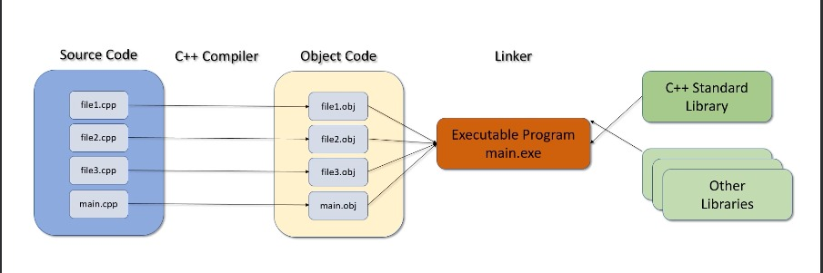
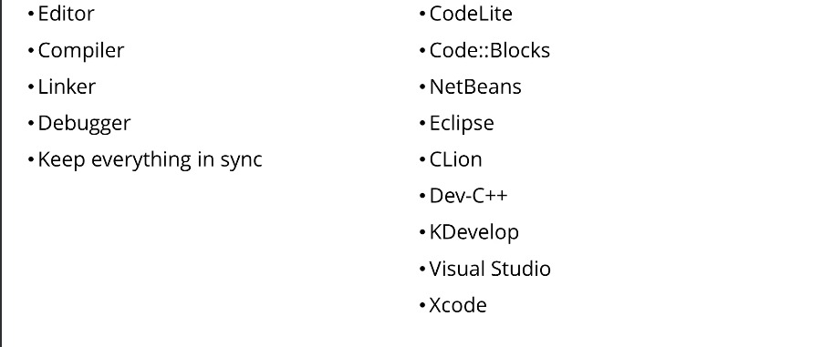

Section 1 : Introduction
===

## Informations sur le papier
- Titre : `Programmation C++`
- Auteurs : `Etienne KOA`

## Pourquoi apprendre le C++

+ **Populaire**

   + Beaucoup de code est encore écrit en `C++`
   + Index de popularité des langages de programmation
   + Communauté active, Github, Stack Overflow

+ **Pertinent**

   + `Windows, Linux, Mac OSX, Photoshop, Ilustrator, MySQL, MongoDB, moteurs de jeux, plus...`

   + `Amazon, Apple, Microsoft, PayPal, Google, Facebook, MySQL, Oracle, HP, IBM, plus...`

   + `VR, Unreal Engine, Machine Learning, Réseaux & Télécom, plus...`

+ **Puissant**

   + rapide, flexible, évolutif, portable.
   + Procédure et Orienté Objet

+ `Bonnes opportunités de carrière`

   + Des compétences `C++` toujours recherchées
   + `C++` = `Salaire++`

## Top du langage de programmation populaire

+ [Tiobe Index](https://www.tiobe.com/tiobe-index/)
+ [PyPL Index](https://pypl.github.io/PYPL.html)
+ [IEE Index](https://spectrum.ieee.org/the-2017-top-programming-languages)
+ [RedMonk Rankings](https://redmonk.com/sogrady/2017/06/08/language-rankings-6-17/)
+ [ZDNET](https://www.zdnet.com/article/which-programming-languages-are-most-popular-and-what-does-that-even-mean/)

## C++ moderne et norme C++

+ Début des années 1970
   + Langage de programmation `C`
   + Dennis Ritchie

+ 1979
   + Bjarne Stroustrup
   + `C` avec classes

+ 1983
   + Nom changé en `C++`

+ 1989
   + Première sortie commerciale

+ 1998

   + Norme `C++98`

+ 2003

   + Norme `C++030`

+ 2011

   + Norme `C++11`

+ 2014

   + Norme `C++14`

+ 2017

   + Norme `C++17`

---

+ Classique `C++`

   + Norme pré-C++11

+ `C++` moderne

   + `C++11`
     + Beaucoup de nouvelles fonctionnalités

   + `C++14`
     + Petits changements

   + `C++17`
     + Simplification

   + Bonnes pratiques
   + Lignes directrices de base

# Comment ça marche ?

+ Vous devez dire à l'ordinateur « EXACTEMENT » quoi faire

   + Programme - comme une recette

+ Langage de programmation

   + Code source
   + Haut niveau
   + Pour les humains

+ `Éditeur` - Utilisé pour saisir le texte du programme

   + Fichiers `.cpp` et `.h`

+ Représentation binaire ou autre bas niveau
   + Code objet
   + pour les ordinateurs

+ `Compilateur` - traduit du haut niveau au bas niveau

+ `Linker` - relie notre code avec d'autres bibliothèques

   + Crée un programme exécutable

+ `Test et débogage` - recherche et correction des erreurs du programme

## Le processus de construction C++

## Projets de développement intégré (IDE)

  
### Licence

[Licence](../LICENSE)

