Section 20 - The Standard Template Library (STL)
===

## Information
- Title:  `The Standard Template Library (STL)`
- Authors:  `Etienne KOA`


## Section Overview
- What is the STL
- Generic programming/Meta-programming
  - Preprocessor macros
  - Function templates
  - Class templates

- STL COntainers
- STL Iterators
- STL Algorithms

- Array
- Vector
- Deque
- List and Forward List
- Set and Multi Set
- Map and Multi Map
- Stack and Queue
- Priority Queue
- Algorithms

---

- Qu'est-ce que la STL
- Programmation générique/Méta-programmation
   - Macros du préprocesseur
   - Modèles de fonctions
   - Modèles de cours

- Conteneurs STL
- Itérateurs STL
- Algorithmes STL

- Tableau
-Vecteur
- Dequé
- Liste et liste de transfert
- Ensemble et ensemble multiple
- Carte et Multi-Carte
- Pile et file d'attente
- File d'attente de priorité
- Algorithmes


## Qu'est-ce que la `STL` ?

- Une bibliothèque de classes et de fonctions génériques puissantes, réutilisables, adaptables
- Implémenté à l'aide de modèles `C++`
- Implémente des structures de données et des algorithmes communs
- Immense bibliothèque de classe !!
- Alexandre Stepanov (1994)

**Pourquoi utiliser le `STL` ?**

- Assortiment de contenants couramment utilisés
- Complexité connue en termes de temps et de taille
- Essayé et testé - Réutilisabilité !!!
- Cohérent, rapide et sécurisé
- Extensible

**Elements of the STL**

- Conteneurs
   - Collections d'objets ou de types primitifs (array, vector, deque, stack, set, map, etc.)

- Algorithmes
   - Fonctions de traitement des séquences d'éléments issus de conteneurs (find, max, count, accumulate, sort, etc.)


- Itérateurs
   - Générer des séquences d'éléments à partir de conteneurs (forward, reverse, by value, by reference, constant, etc.)


**Un exemple simple**

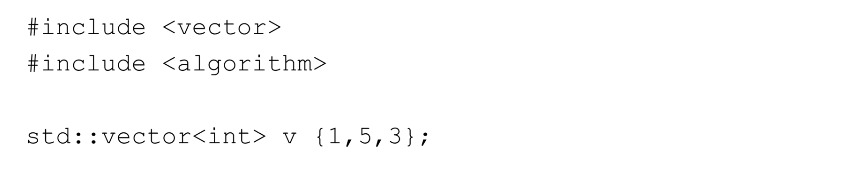

**Un exemple simple : trier un vecteur**

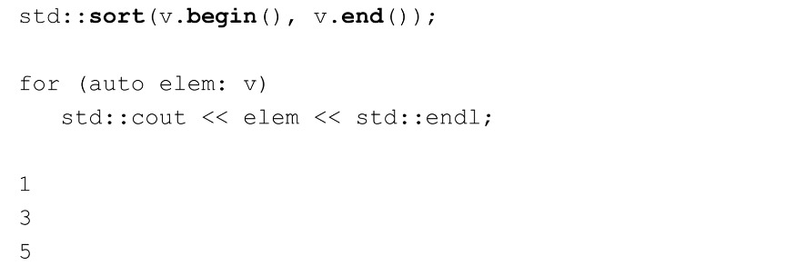

**Un exemple simple : inverser un vecteur**

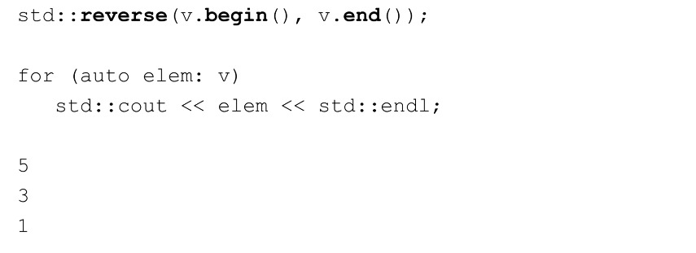

**Un exemple simple : accumuler**

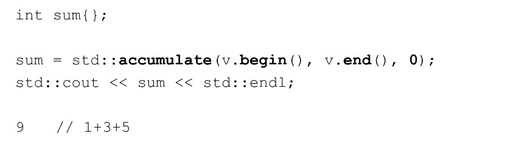

**Type de conteneurs**

- Conteneurs de séquence
   - array, vector, list, forward_list, deque

- Conteneurs associatifs
   - set, multi, set, map, multi map

- Adaptateurs de conteneur
   - stack, queue, priority queue


**Type d'itérateurs**

- Itérateurs d'entrée - du conteneur au programme
- Itérateurs de sortie - du programme au conteneur
- Itérateurs avant - naviguez un élément à la fois dans une direction
- Itérateurs bidirectionnels - naviguez un élément à la fois dans les deux sens
- Itérateurs à accès aléatoire - accédez directement à un élément de conteneur

**Type d'algorithmes**

- Environ 60 algorithmes dans la STL
- Non modifiable
- Modification

## Programmation générique avec des macros

+ Programmation générique

   ```
    Écrire du code qui fonctionne avec une variété de types d'arguments, à condition que ces types d'arguments répondent à des exigences syntaxiques et sémantiques spécifiques, Bjarne Stroustrup
   ```


+ Macros ***<span style="color:red">attention</span>***

+ Modèles de fonctions
+ Modèles de cours


**Macros `(#define)`**

+ Directives du préprocesseur `C++`
+ Aucune information sur le type
+ Distribution simple


```
#define MAX_SIZE 100

#define PI 3.14159
```

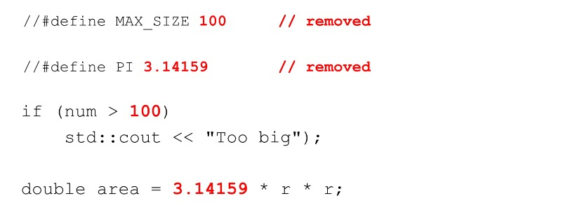

**Fonction `max`**

+ Supposons que nous ayons besoin d'une fonction pour déterminer le « max » de 2 « entiers ».

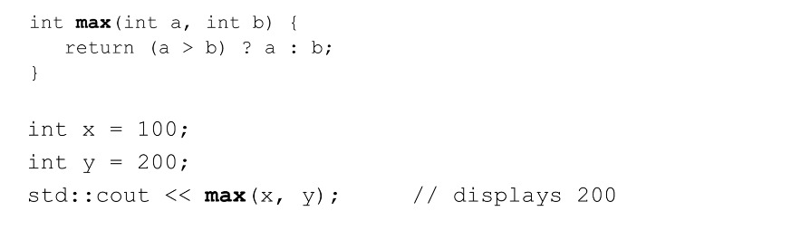

+ Supposons maintenant que nous devions déterminer le « maximum » de 2 « doubles » et de 2 « caractères ».

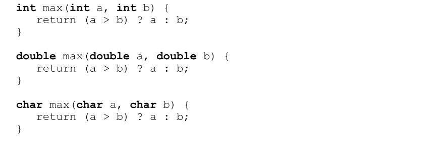

**Macors avec arguments `(#define)`**
+ Nous pouvons plutôt écrire une macro générique avec des arguments.


+ Il faut faire attention aux macros

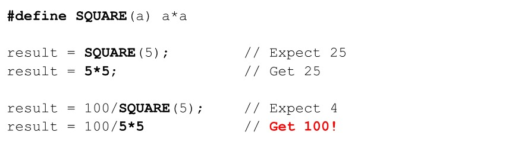
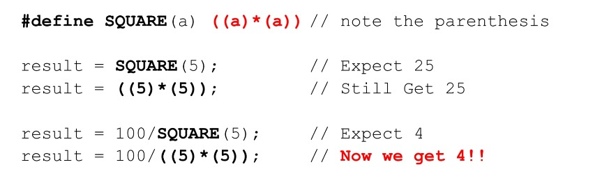

## Programmation générique avec des modèles de fonctions

+ Qu'est-ce qu'un modèle `C++` ?

   + Plan
   + Modèles de fonctions et de classes
   + Autoriser le « pluggin-in » pour tout type de données
   + Le compilateur génère la « fonction/classe » appropriée à partir du plan
   + Programmation `Générique`/méta-programmation


**Revoyons la fonction `max` de la dernière conférence**


**Fonction `max`**

+ Supposons que nous ayons besoin d'une fonction pour déterminer le « max » de 2 « entiers ».


**Fonction `max` comme fonction de modèle**

+ Nous pouvons remplacer le type que nous voulons généraliser par un nom, disons `T`.
+ Mais maintenant, cela ne sera pas compilé.


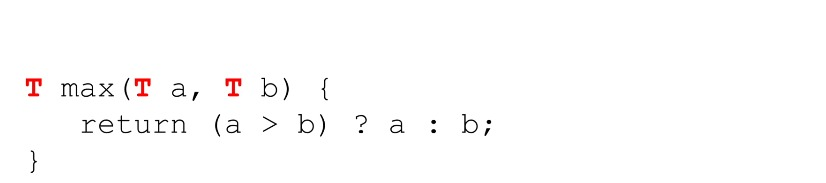


<br/>

+ Nous devons indiquer au compilateur qu'il s'agit d'une fonction modèle.
+ Nous devons également lui dire que `T` est le modèle.


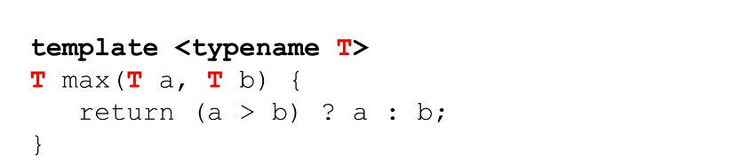

+ Nous pouvons également utiliser `class` au lieu de `typename`

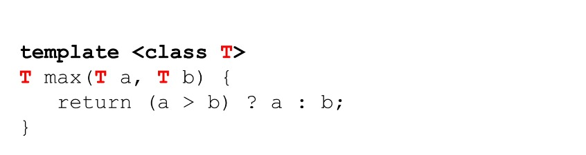

<br/>

+ Le compilateur peut désormais générer la fonction appropriée à partir du modèle.
+ Notez que cela se produit au moment de la compilation !

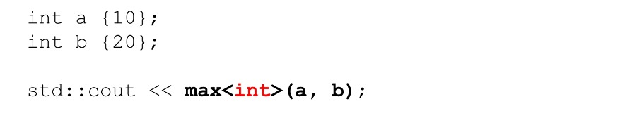

<br/>

+ Plusieurs fois, le compilateur peut déduire le type et le paramètre de modèle n'est pas nécessaire.
+ En fonction du type de `a` et `b`, le compilateur le déterminera.

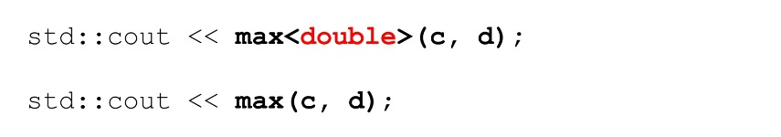

<br/>

+ Et nous pouvons utiliser « presque » n’importe quel type dont nous avons besoin.

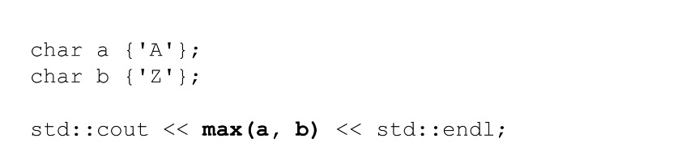

<br/>

+ Notez que le type DOIT prendre en charge l'opérateur `>` soit de manière native, soit en tant qu'opérateur surchargé `(opérateur >)`

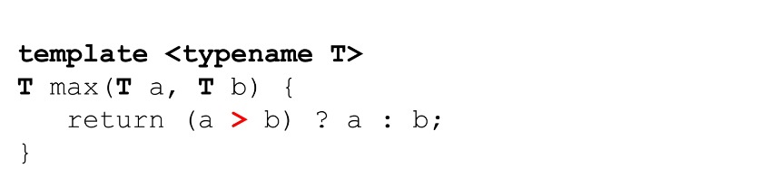

<br/>

+ Ce qui suit ne sera pas compilé à moins que `Player` surcharge `operator>`

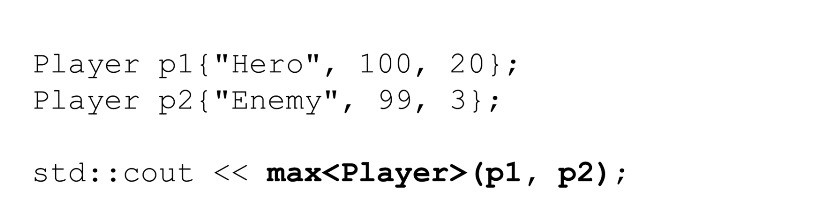

<br/>

**plusieurs types comme paramètres de modèle**

+ Nous pouvons avoir plusieurs paramètres de modèle
+ Et leurs types peuvent être différents

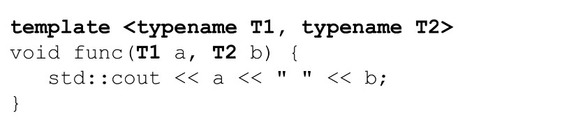

<br/>

+ Lorsque nous utilisons la fonction, nous fournissons les paramètres des modèles
+ Souvent le compilateur peut les déduire


## Programmation générique avec modèle de classe

**Qu'est-ce qu'un Tempale `C++` `Class` ?**

+ Similaire au modèle de fonction, mais au niveau de la classe
+ Permet de « brancher » n'importe quel type de données
+ Le compilateur génère la classe appropriée à partir du plan.

<br/>

+ Disons que nous voulons qu'une classe contienne des éléments où l'élément a un nom et un entier.

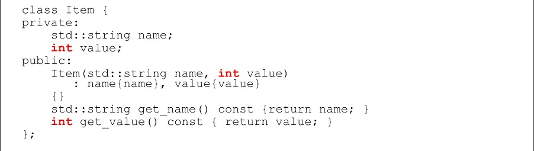

<br/>

+ Mais nous aimerions que notre classe `item` puisse conserver tout type de données en plus de la chaîne.
+ Nous ne pouvons pas surcharger les noms de classe
+ Nous ne voulons pas utiliser le polymorphisme dynamique.

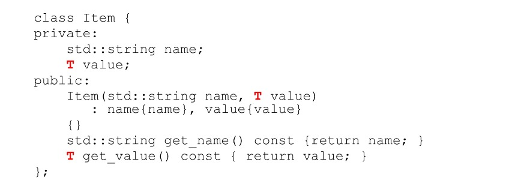
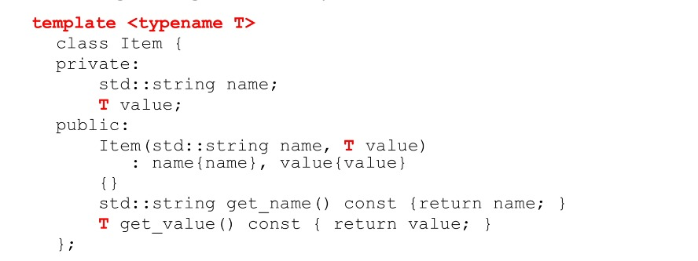
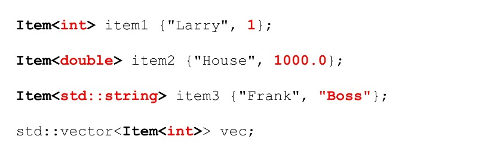

**Plusieurs types comme paramètres de modèle**

+ Nous pouvons avoir plusieurs paramètres de modèle
+ Et leurs types peuvent être différents

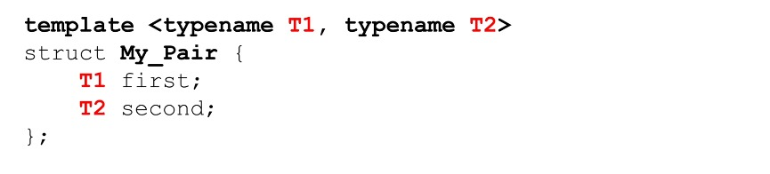
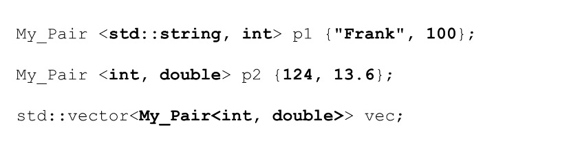


**`std::pair`**

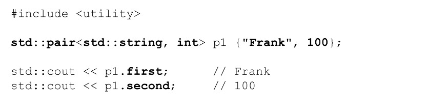


## Introduction aux conteneurs `STL`

**Conteneurs**

+ Structures de données pouvant stocker des objets de « presque » n'importe quel type

   + Classe basée sur un modèle

+ Chaque conteneur a des fonctions membres

   + Certains sont spécifiques au conteneur
   + D'autres sont disponibles pour tous les conteneurs

+ Chaque conteneur a un fichier d'en-tête associé

  + `#include <container_type>`


**Conteneurs - Commun**

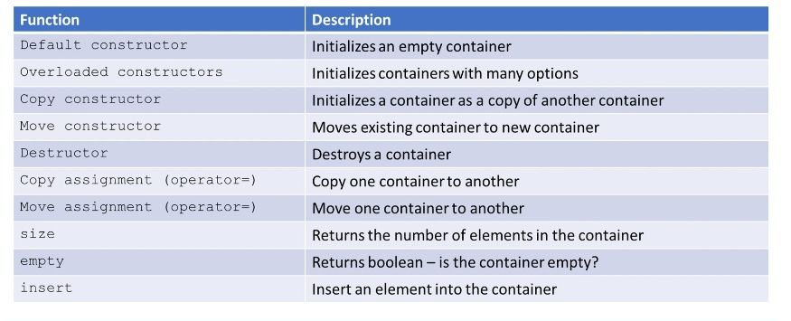
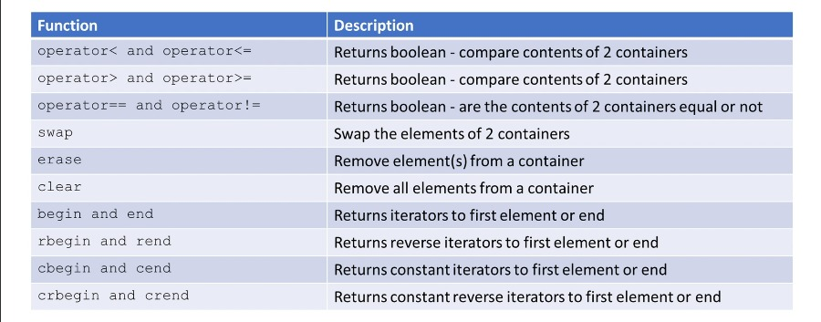


**Conteneur - éléments**

+ Quels types d'éléments peut-on stocker dans des conteneurs ?

+ Une `copie` de l'élément sera stockée dans le conteneur

   + Toutes les primitives OK

+ L'élément doit être

   + Copiable et assignable (constructeur de copie / affectation de copie)
   + Mobile pour plus d'efficacité (déplacer le constructeur / déplacer l'affectation)


+ Les conteneurs associatifs ordonnés doivent pouvoir comparer des éléments

  + `oparator <, operator ===`


## Introduction aux itérateurs `STL`

**Itérateurs**

+ Permet d'abstraire un conteneur arbitraire sous forme de séquence d'éléments
+ Ce sont des objets qui fonctionnent comme des pointeurs par conception
+ La plupart des classes de conteneurs peuvent être parcourues avec des itérateurs.

**Déclaration des itérateurs**

+ Les itérateurs doivent être déclarés en fonction du type de conteneur sur lequel ils vont itérer

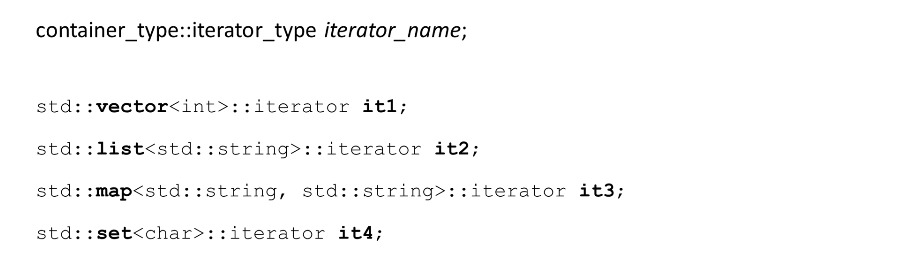


**Méthodes de début et de fin de l'itérateur**

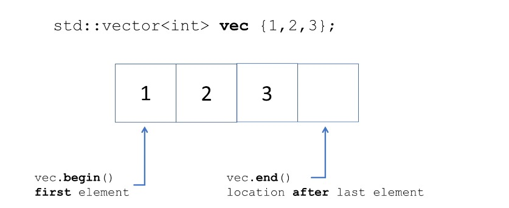

**Déclaration des itérateurs**

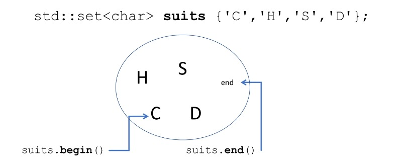

**Initialisation des itérateurs**

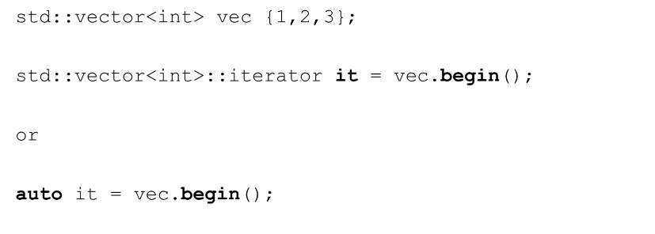

**Opérations dont les itérateurs `(it)`**

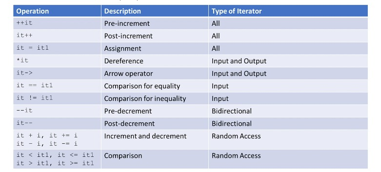

**Utilisation d'itérateurs - `std::vector`**

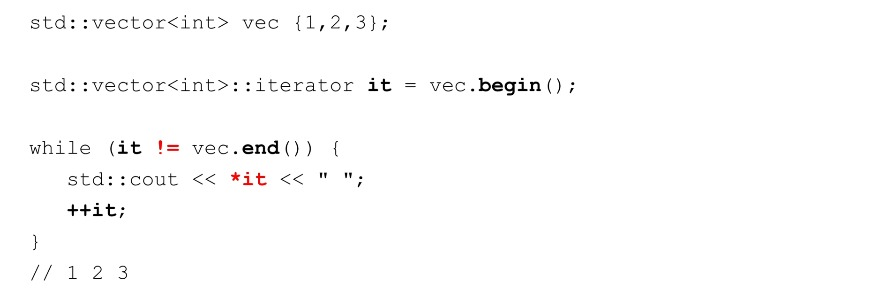
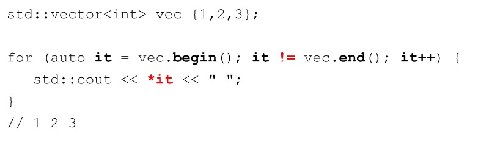

+ Voici comment fonctionne la boucle for basée sur une plage

**Utilisation d'itérateurs - `std::set`**

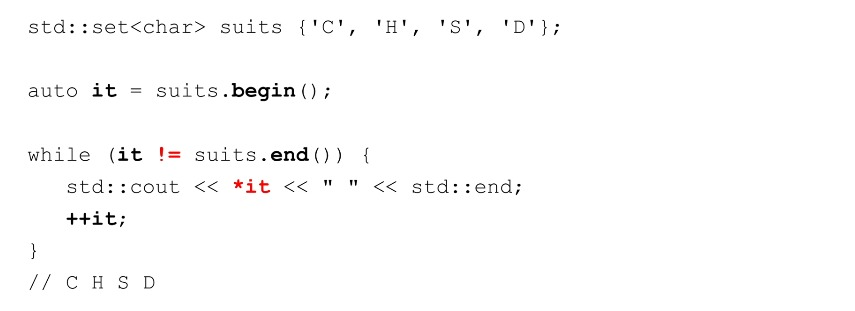

**Itérateurs inversés**

+ Fonctionne à l'envers
+ Le dernier élément est le premier et le premier est le dernier
+ `++` déplace le backend, `--` avance

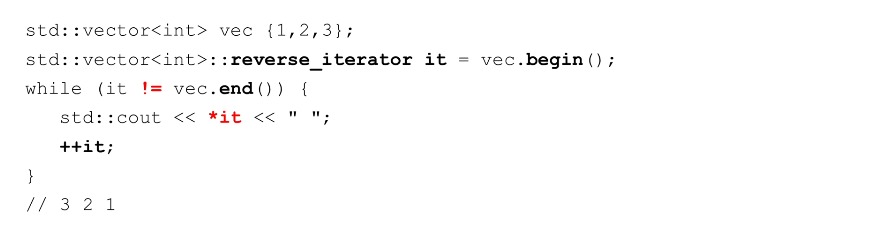

**Autres itérateurs**

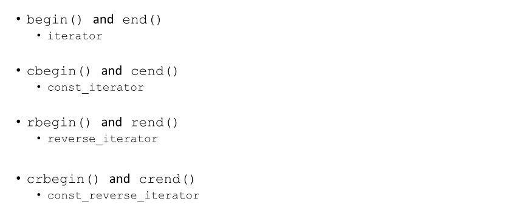

## Introduction aux algorithmes `STL`

**Algorithmes**

+ Les algorithmes `STL` fonctionnent sur des séquences d'éléments de conteneur qui leur sont fournies par un itérateur

+ `STL` possède de nombreux algorithmes communs et utiles

+ Trop de choses à décrire dans cette section
   + http://en.cpppreference.com/w/cpp:algorithm

+ De nombreux algorithmes nécessitent des informations supplémentaires pour faire leur travail

   + Foncteurs (objets fonction)
   + Pointeurs de fonction
   + Expressions lambda `(C++11)`

**Algorithmes et itérateurs**

`#include <algorithm>`

+ Différents conteneurs prennent en charge différents types d'itérateurs
   + Détermine les types d'algorithmes pris en charge
+ Tous les algorithmes `STL` attendent des itérateurs comme arguments
   + Détermine la séquence obtenue à partir du conteneur

**Invalidation de l'itérateur**

+ Les itérateurs pointent vers des éléments de conteneur
+ Il est possible que les itérateurs deviennent invalides pendant le traitement
+ Supposons que nous parcourions un vecteur de 10 éléments
   + Et on `clear()` le vecteur en itérant ? ce qui se produit ?
   + Comportement non défini : nos itérateurs pointent vers des emplacements non valides

**Exemple d'algorithme - `find` avec des types primitifs**

+ L'algorithme `find` tente de localiser la première occurrence d'un élément dans un conteneur
+ Beaucoup de variantes
+ Renvoie un itérateur pointant vers l'élément localisé ou `end()`

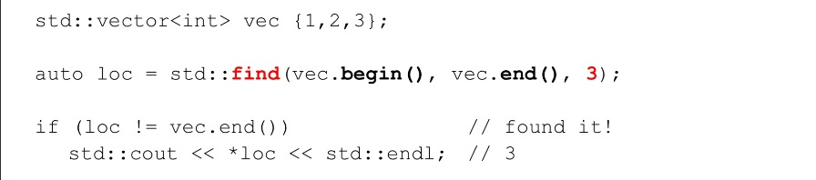

**Exemple d'algorithme - `find` avec des types définis par l'utilisateur**

+ Trouver doit pouvoir comparer des objets
+ `operators==` est utilisé et doit être fourni par votre classe

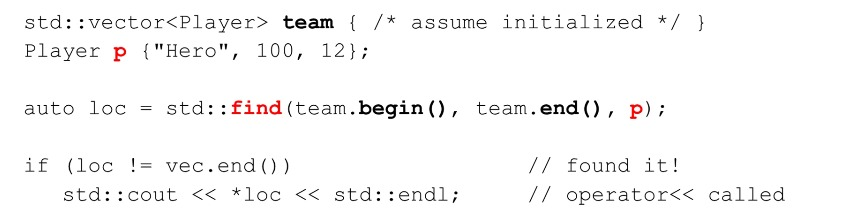

**Exemple d'algorithme - `for_each`**

+ L'algorithme `for_each` applique une fonction à chaque élément de la séquence d'itérateurs.

+ La fonction doit être fournie à l'algorithme comme :

   + Foncteur (objet fonction)
   + Pointeur de fonction
   + Expression lambda `(C++11)`

+ Mettons au carré chaque élément


**`for_each` - en utilisant un foncteur**

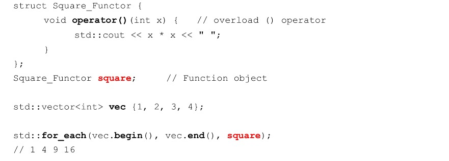

**`for_each` - en utilisant un pointeur de fonction**

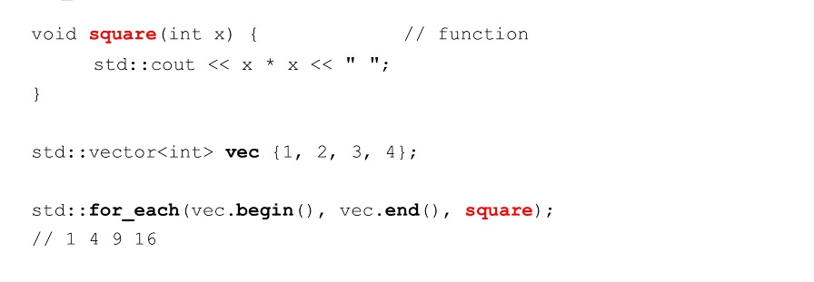

**`for_each` - en utilisant une expression lambda**

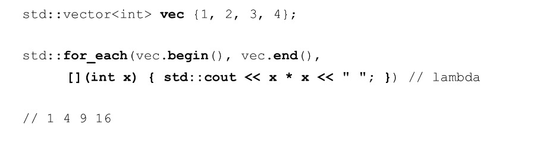

## Conteneur de séquence - Tableau

**`std::array (C++11)`**

`#include <tableau`

+ Taille fixe
   + La taille doit être connue au moment de la compilation

+ Accès direct aux éléments

+ Donne accès au tableau brut sous-jacent

+ Utiliser à la place des tableaux bruts lorsque cela est possible

+ Tous les itérateurs disponibles et n'invalident pas


**`std::array` - Initialisation et affectation**

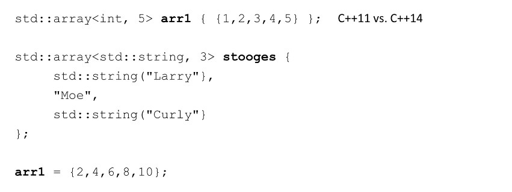

**`std::array` - méthodes courantes**

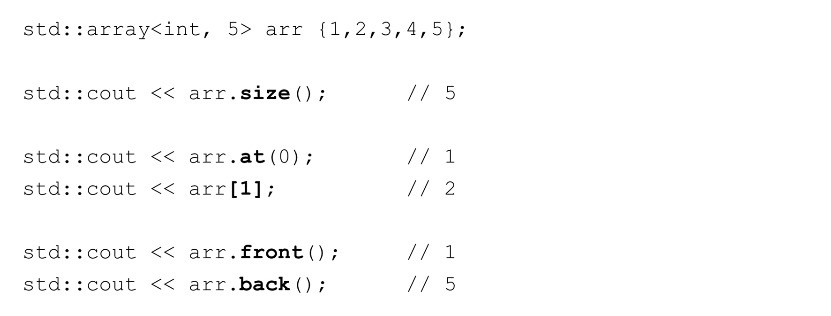
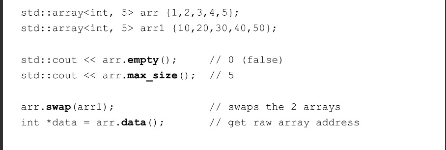

+ https://en.cpppreference.com/w/
+ https://en.cpppreference.com/w/cpp/container/array
+ https://en.cpppreference.com/w/cpp/container/array/front


## Conteneurs de séquence - Vecteur

**`std::vecteur`**

`#include <vecteur>`

+ Taille dynamique
   + Hnadled automatiquement
   + Peut s'étendre et se contracter selon les besoins
   + Les éléments sont stockés dans la mémoire contiguë sous forme de tableau

+ Accès direct aux éléments (temps constant)

+ Insertion et suppression rapides à l'arrière (temps constant)

+ Insertion ou suppression d'éléments (temps linéaire)

+ Tous les itérateurs disponibles et peuvent invalider

`std :: vecteur`

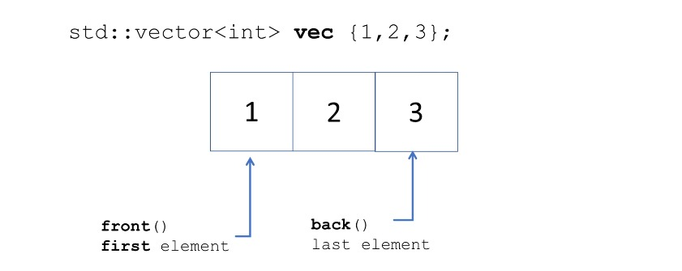
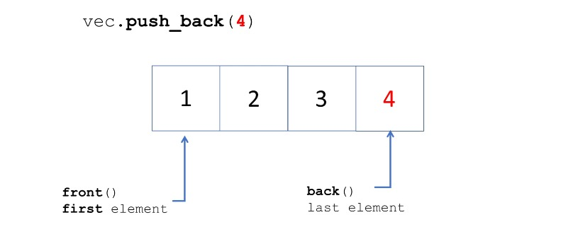

**`std::vector` - initialisation et affectation**

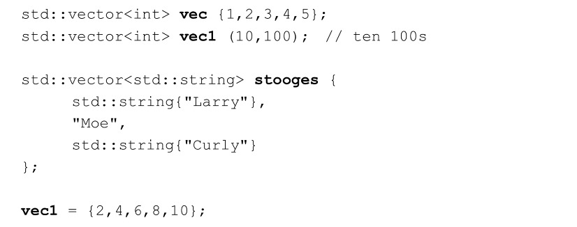


**`std::vector` - Méthodes courantes**

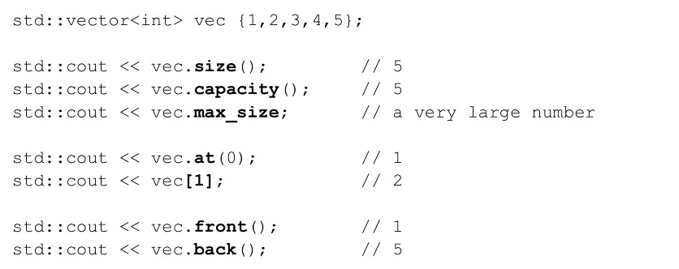
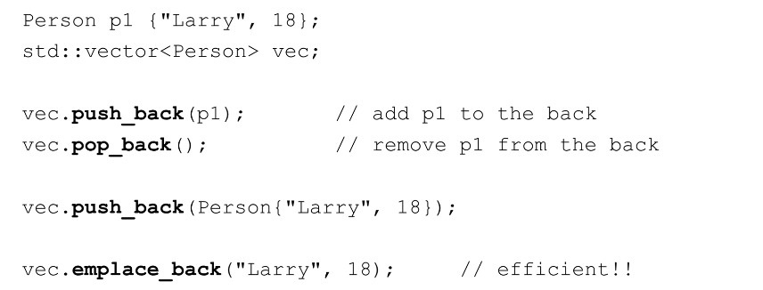
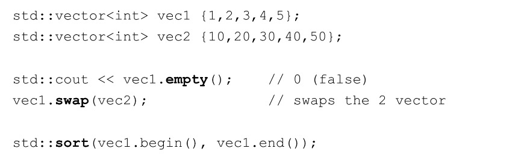
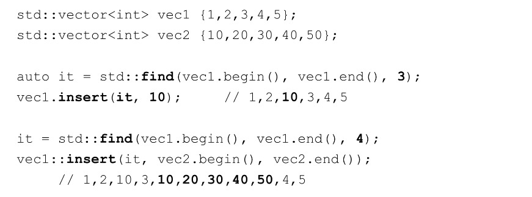

## Conteneurs de séquence - Deque

**`std::deque` (file d'attente à double extrémité)**

`#include <deque>`

+ Taille dynamique
   + Hnadled automatiquement
   + Peut s'étendre et se contracter selon les besoins
   + Les éléments ne sont PAS stockés dans la mémoire contiguë.

+ Accès direct aux éléments (temps constant)

+ Insertion et suppression rapides au recto et au verso (temps constant)

+ Insertion ou suppression d'éléments (temps linéaire)

+ Tous les itérateurs disponibles et peuvent invalider


**`std::deque` - initialisation et affectation**

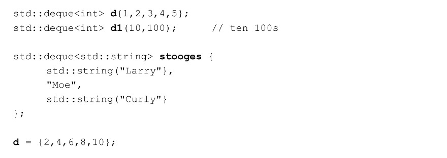

**`std::deque`**

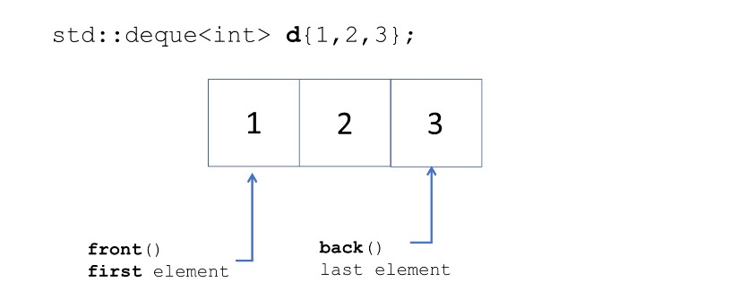

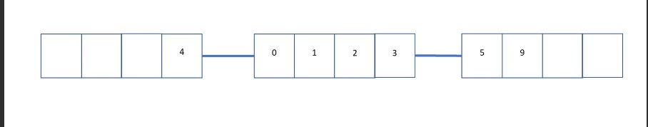

**`std::deque` - méthodes courantes**

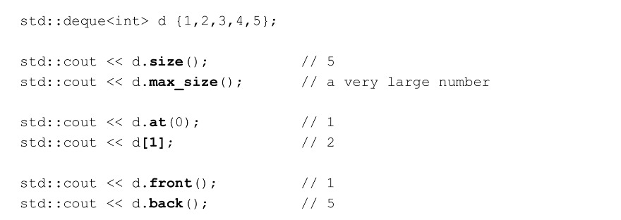
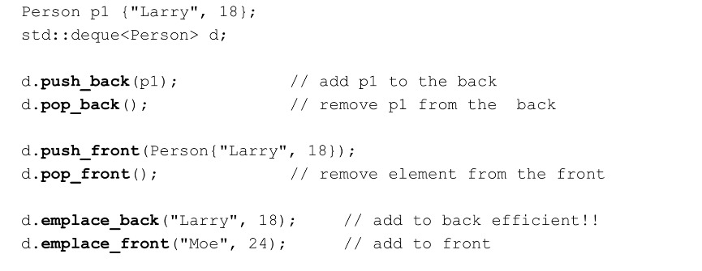

## Sequence Containers - List and Forward List

`std :: list`

`#include <list>`

+ Taille dynamique
   + Liste des éléments
   + `list` est bidirectionnelle (doublement liée)

+ L'accès aux éléments dynamiques n'est PAS fourni

+ Insertion et suppression rapides d'éléments n'importe où dans le conteneur (temps constant)

+ Tous les itérateurs disponibles et invalidés lorsque l'élément correspondant est supprimé

`std :: list`

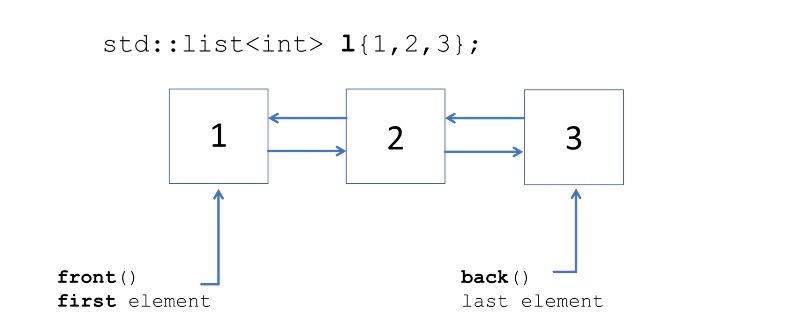

**`std::list` - initialisation et affectation**

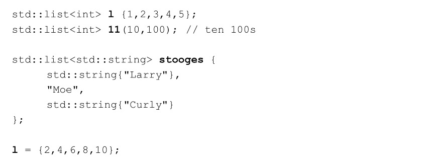

**`std::list` - méthodes courantes**

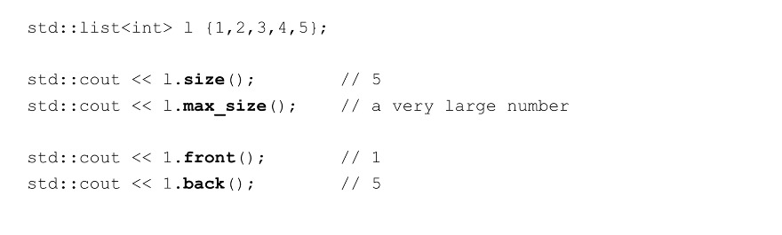
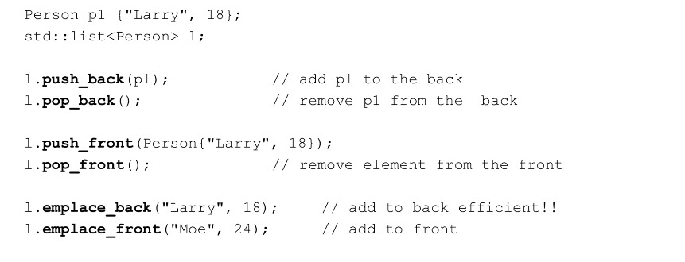

**`std::list` - méthodes qui utilisent des itérateurs**

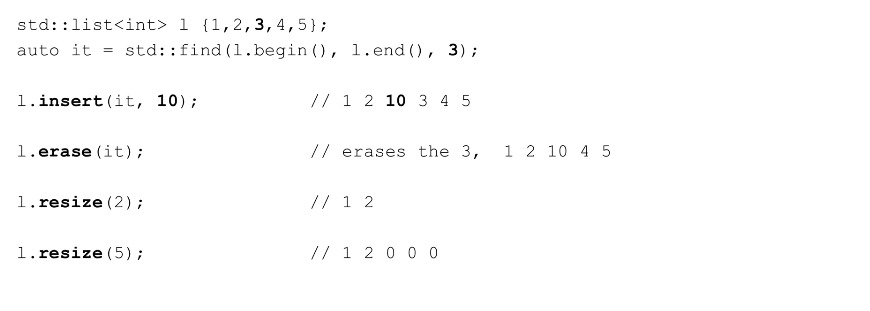

**`std::list` - méthodes courantes**

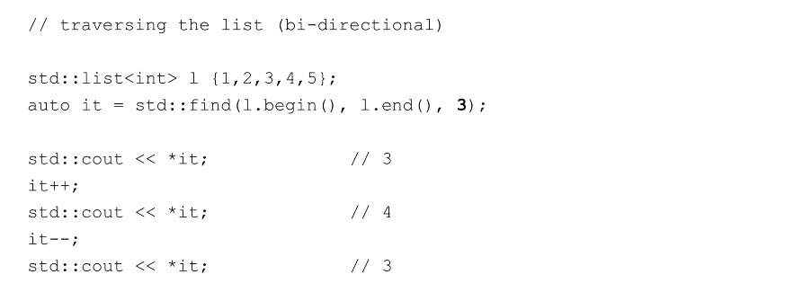

**`std::forward_list`**

`#include <forward_list>`

+ Taille dynamique
   + Listes d'éléments
   + `list` unidirectionnelle (uniquement liée)
   + Moins saturé qu'un `std::list`

+ L'accès direct aux éléments n'est PAS fourni

+ Insertion et suppression rapides d'éléments n'importe où dans le conteneur (temps constant)

+ Itérateurs inversés non disponibles. Les itérateurs sont invalidés lorsque l'élément correspondant est supprimé

**`std::forward_list`**

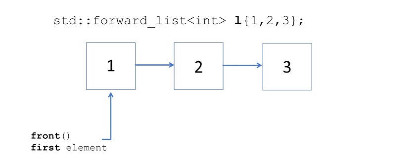

**`std::forward_list` - méthodes courantes**

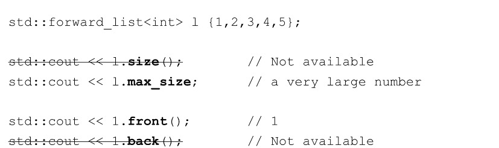

**`std::forward_list` - méthodes qui utilisent des itérateurs**

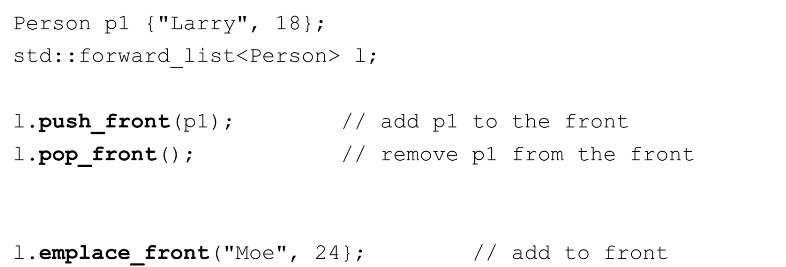
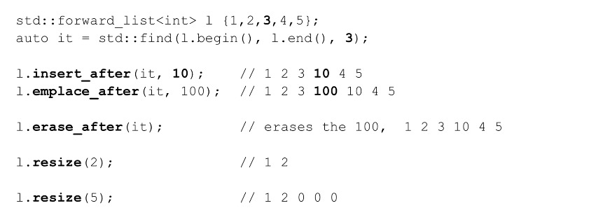

## Conteneurs associatifs - Ensembles

+ Les conteneurs `STL Set`

+ Conteneurs associatifs

   + Collection d'objets stockés qui permettent une récupération rapide à l'aide d'une clé
   + `STL` fournit des `Sets` et `Maps`
   + Généralement implémenté sous la forme d'un « arbre » ou de « hashsets » binaires équilibrés
   + La plupart des opérations sont très efficaces

+ Sets

  + `std::set`
  + `std::unordered_set`
  + `std::multiset`
  + `std::unordered_multiset`


<br/>

`std :: set`

`#include <ensemble>`

+ Semblable à un ensemble mathématique
+ Commandé par clé
+ Aucun élément en double
+ Tous les itérateurs disponibles et invalidés lorsque l'élément correspondant est supprimé

**`std::set` - initialisation et affectation**

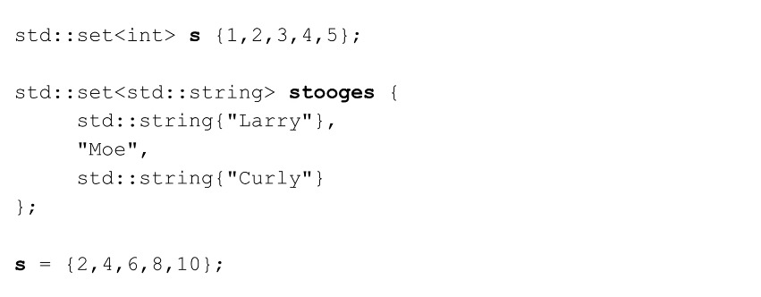

**`std::set` - méthodes courantes**

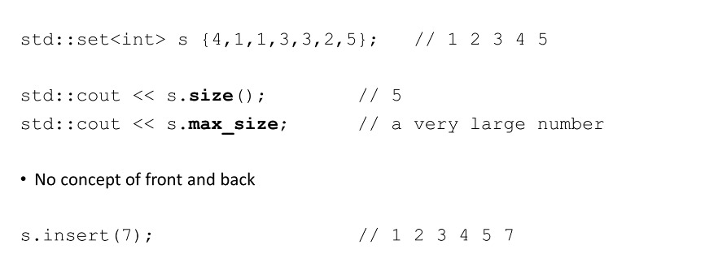
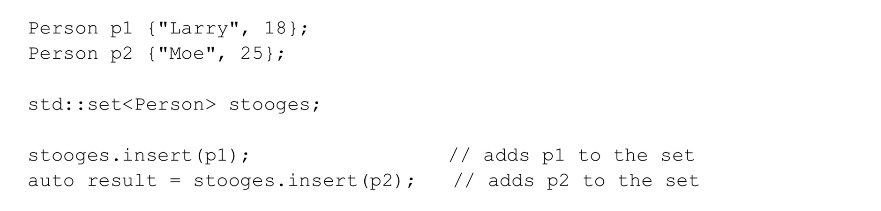

+ Utilise `operator<` pour commander !
+ renvoie un `std::pair<iterator, bool>`
   + `find` est un itérateur vers l'élément inséré ou vers le doublon dans l'ensemble
   + `second` est un booléen indiquant le succès ou l'échec

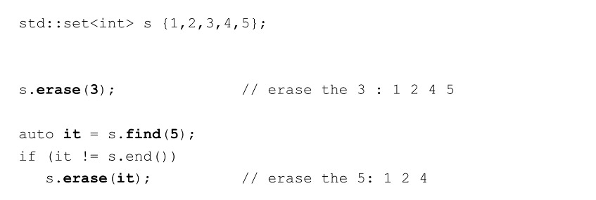
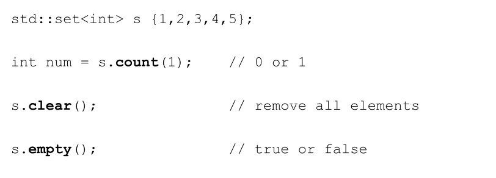

`std ::unordered_set`

`#include <unordered_set>`

+ Les éléments ne sont pas ordonnés
+ Aucun élément en double autorisé
+ Les éléments ne peuvent pas être modifiés
   + Doit être effacé et un nouvel élément installé
+ Aucun itérateur inverse n'est autorisé

`std ::unordered_multiset`

`#include <unordered_set>`

+ Les éléments sont illimités
+ Permet les éléments en double
+ Aucun itérateur inverse n'est autorisé

## Conteneurs associatifs - Maps

`std::map`

`#include <map>`


+ Semblable à un dictionnaire
+ Les éléments sont stockés sous forme de paires clé-valeur `(std::pair)`
+ Commandé par clé
+ Aucun élément en double (les clés sont uniques)
+ Accès direct aux éléments à l'aide de la clé
+ Tous les itérateurs et invalidés lorsque les éléments correspondants sont supprimés

**`std::map` - initialisation et affectation**

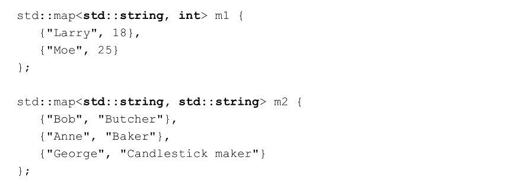

**`std::map` - méthodes courantes**

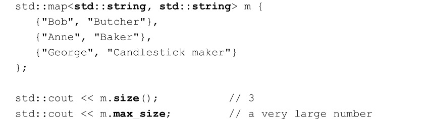
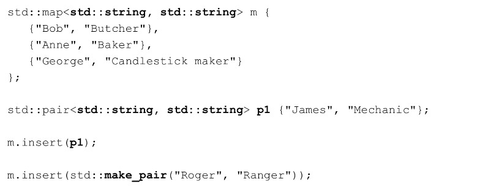
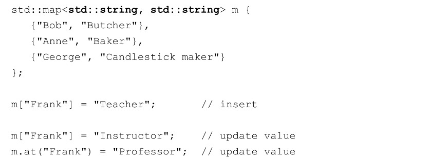
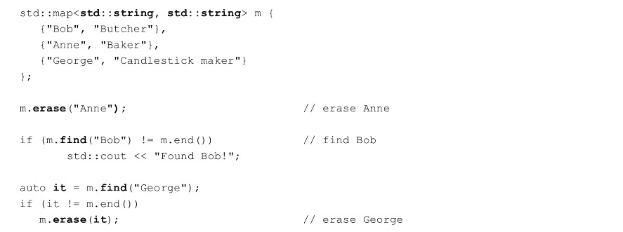
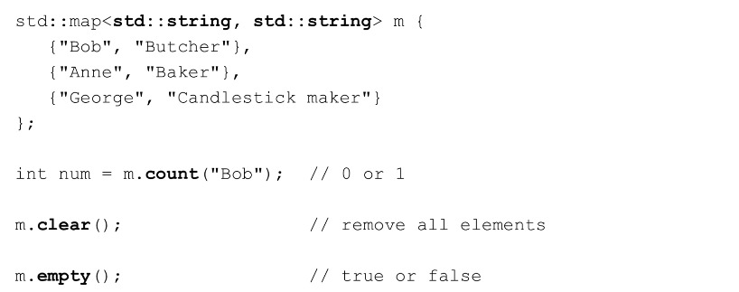

`std ::unordered_map`

`#include <carte_non ordonnée>`

+ Les éléments ne sont pas ordonnés
+ Aucun élément en double autorisé
+ Aucun itérateur inverse n'est autorisé

## Adaptateurs de conteneur - Pile

`std :: pile`

+ Structure de données Last-In-First-Out (LIFO)
+ Implémenté en tant qu'adaptateur sur un autre conteneur `STL`. Peut être implémenté en tant que `vecteur, liste` ou `deque`.
+ Toutes les opérations se produisent à une extrémité de la « pile » (en haut).
+ Aucun itérateur n'est pris en charge

`std :: pile`

`#include <pile>`

+ `push` - insère un élément en haut de la pile
+ `pop` - supprime un élément du haut de la pile
+ `top` - accède à l'élément supérieur de la pile
+ `empty` - la pile est-elle vide ?
+ `size` - nombre d'éléments dans la pile

**`std::stack` - Initialisation**

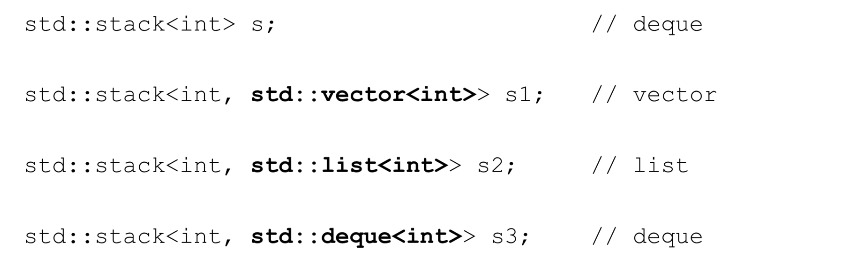

**`std::stack` - Méthodes courantes**

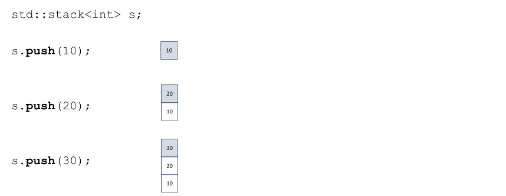
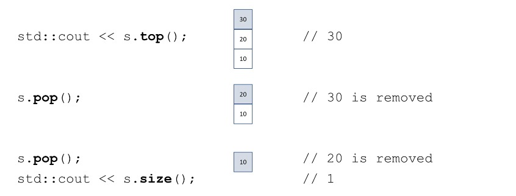

## Adaptateurs de conteneur – File d'attente

`std::queue`

+ Structure de données premier entré, premier sorti (FIFO)
+ Implémenté en tant qu'adaptateur sur un autre conteneur `STL`. Peut être implémenté en tant que `list` ou `deque`.
+ Les éléments sont poussés au niveau du backend et extraits de la police.
+ Aucun itérateur n'est pris en charge


`std::queue`

`#include <queue>`

+ `push` - insère un élément à la fin de la file d'attente
+ `pop` - supprime un élément de la police de la file d'attente
+ `front` - accéder à l'élément à l'avant
+ `back` - accéder à l'élément à l'arrière
+ `empty` - la file d'attente est-elle vide ?
+ `size` - nombre d'éléments dans la file d'attente


**`std::queue` - Initialisation**

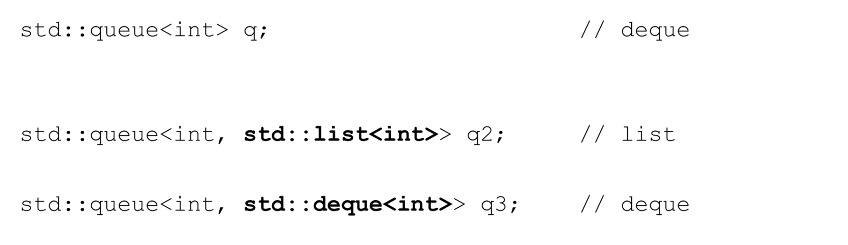

**`std::queue` - Méthodes courantes**

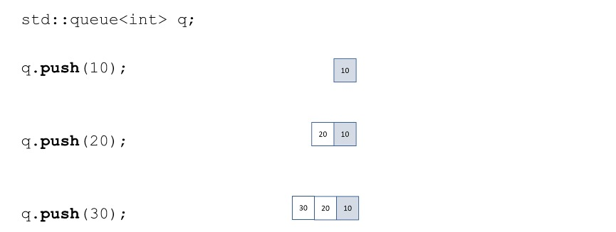
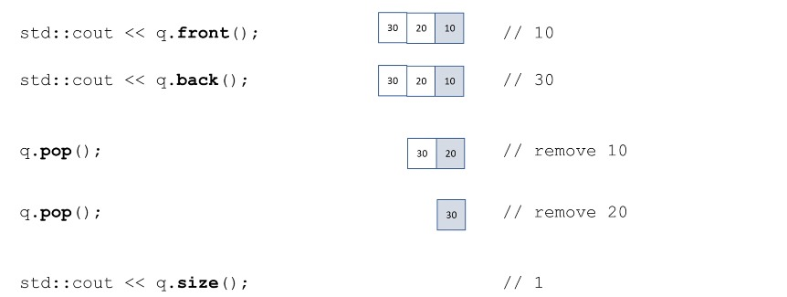

## Adaptateurs de conteneurs - File d'attente prioritaire

`std ::priority_queue`

+ Permet l'insertion et le retrait d'éléments dans l'ordre depuis l'avant du conteneur

+ Les éléments sont stockés en interne sous forme de vecteur par défaut

+ Les éléments sont insérés dans l'ordre « prioritaire » (la plus grande valeur sera toujours au premier plan)

+ Aucun itérateur n'est pris en charge


`std::priority_queue`

`#include <queue>`

+ `push` - insère un élément dans l'ordre trié
+ `pop` - supprime l'élément supérieur (le plus grand)
+ `top` - accéder à l'élément supérieur (le plus grand)
+ `empty` - la file d'attente est-elle vide ?
+ `size` - nombre d'éléments dans la file d'attente

**`std::priority_queue` - Initialisation**

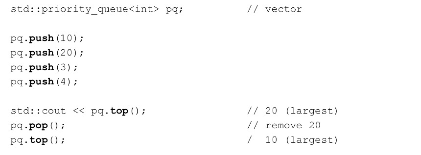