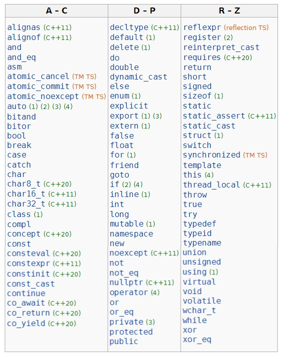
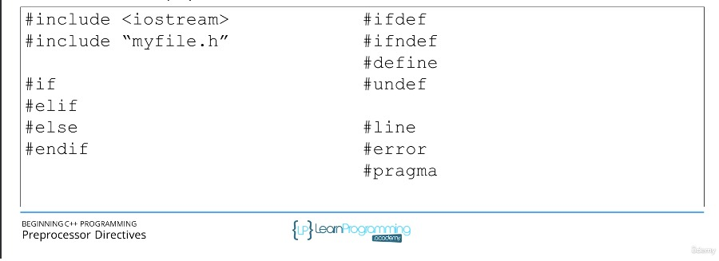
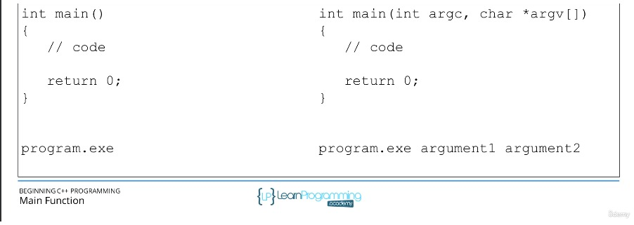
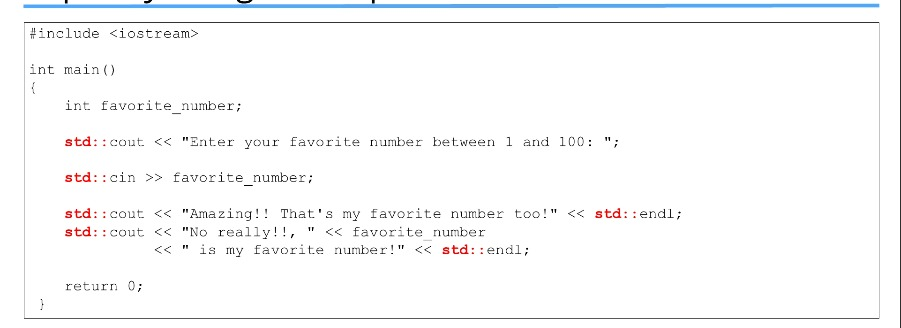
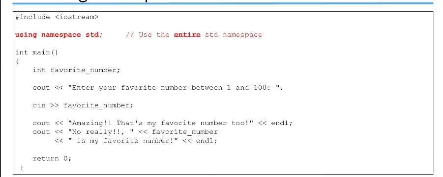
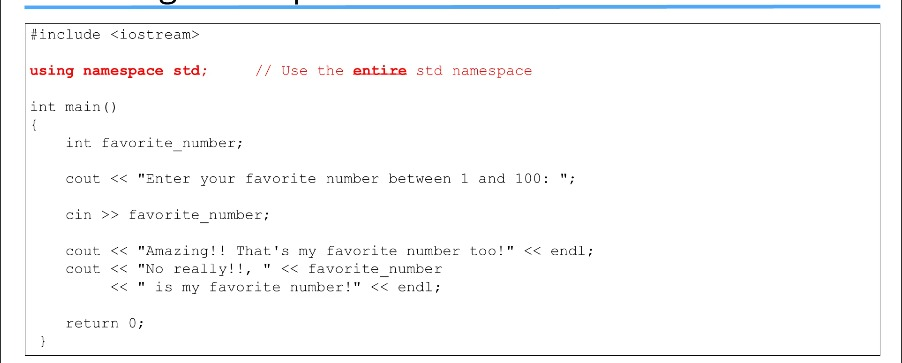

Section 5 : Structure of a C++ Program
===


## Informations sur le papier
- Titre : `Programmation C++`
- Auteurs : `Etienne KOA`

## Aperçu de la section
+ La structure d'un programme `C++`.

   + Composants de base
   + Directives du préprocesseur
   + La fonction principale
   + Espaces de noms
   + Commentaires
   + E/S de base


## Les mots-clés C++




## `#include` Directive du préprocesseur

+ Qu'est-ce qu'un préprocesseur ?
+ Ça fait quoi ?
+ Les directives commencent par `#`
+ Commandes au préprocesseur



## La fonction principale()

+ Chaque programme `C++` doit avoir exactement 1 fonction `main()`.
+ Point de départ de l'exécution du programme.
+ return 0 indique une exécution réussie du programme.
+ 2 versions toutes deux valables



## Espaces de noms

+ Pourquoi `std::cout` et pas seulement `cout` ?
+ Qu'est-ce qu'un conflit de nom ?
+ Noms donnés aux parties du code pour aider à réduire les conflits de noms.
+ `std` est le nom de l'espace de noms `C++` `standard`.
+ Les frameworks tiers auront leurs propres espaces de noms.
+ Opérateur de résolution de portée `::`
+ Comment utiliser ces espaces de noms ?

## Explicitité à l'aide des espaces de noms




## La directive using namespace



## Qualifié en utilisant la variante nameapce




## E/S de base utilisant `cin` et `cout`

+ `cout, cin, cerr` et `clog` sont des objets représentant des flux.

+ `cout`

   + flux de sortie standard.
   + console

+ `cin`

   + flux d'entrée standard
   + clavier

+ `<<`

   + Opérateur d'insertion
   + flux de sortie

+ `>>`

   + opérateur d'extraction
   + flux d'entrée

## `cout` et `<<`

+ Insérez les données dans le flux `cout`

```
cout << données ;
```

+ Peut être enchaîné

```
cout << "les données 1 sont " << data1;
```

+ N'ajoute pas automatiquement de sauts de ligne

```
cout << "les données 1 sont " << data1 << endl;
cout << "les données 1 sont "<< data1 << "\n";
```


### `cin` et `>>`

+ Données extraites du flux `cin` en fonction du type de données.

```
cin >> data ;
```

+ Peut être enchaîné

```
cin >> data1 >> data2;
```

+ Peut échouer si les données saisies ne peuvent pas être interprétées. Les « données » peuvent avoir une valeur indéterminée.