Title
===


## Informations sur le papier
- Titre : Programmation C++
- Auteurs : `Etienne KOA`

## Aperçu de la section
+ Variables et constantes
+ Déclarer des variables
+ Types primitifs `C++`
   + entier
   + virgule flottante
   + booléen
   + personnage

+ Opérateur `sizeof`.
+ Qu'est-ce qu'une constante ?
+ Déclarer des constantes
+ Constantes littérales
+ Expressions constantes

## Qu'est-ce qu'une variable ?

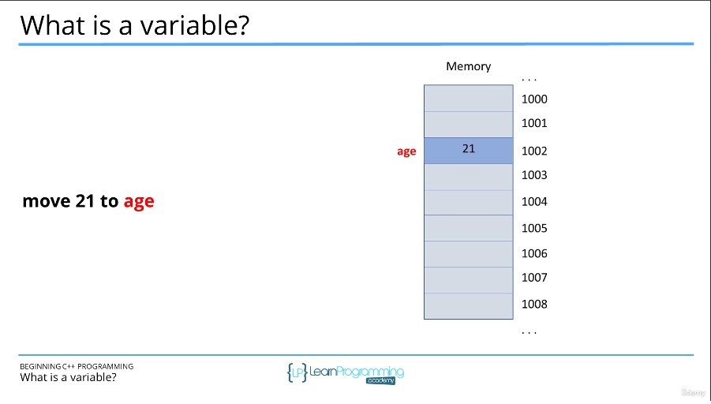

+ Une `variable` est une abstraction pour un emplacement mémoire.
+ Autoriser les programmeurs à utiliser des noms significatifs et non des adresses mémoire.
+ Les variables ont

   + `Type` - leur catégorie (integer, real number, string, Person, Account ...)
   + `Valeur` - le contenu (10, 3.14, "Franck"...)

+ Les variables « doivent » être déclarées avant d'être utilisées.
+ La valeur d'une variable peut changer.

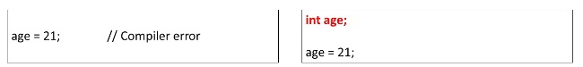


## Déclaration et initialisation des variables

+ Déclaration de variables

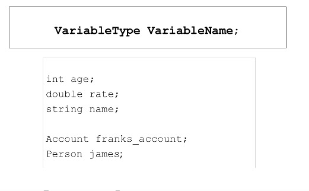

+ Nommer les variables

   + Peut contenir des lettres, des chiffres et des traits de soulignement.
   + Doit commencer par une lettre ou un trait de soulignement `(_)`
     + Impossible de commencer par un chiffre

   + Impossible d'utiliser les mots-clés réservés `C++`.
   + Impossible de redéclarer un nom dans la même portée.
     + rappelez-vous que `C++` est sensible à la casse.


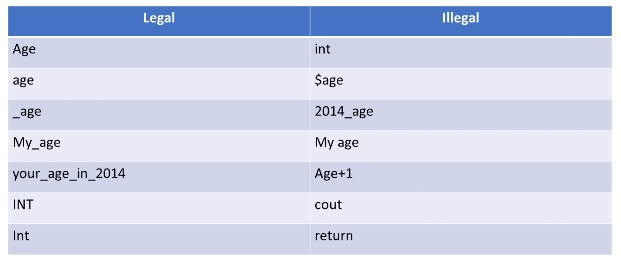

+ Nommer les variables - Style et meilleures pratiques.

+ Soyez cohérent avec vos conventions de dénomination.

   + `myVariableName` contre `my_variable_name`
   + évitez de commencer les noms par des traits de soulignement.

+ Utilisez des noms significatifs

   + ni trop long ni trop court

+ N'utilisez jamais de variables avant de les initialiser.
+ Déclarez les variables proches du moment où vous en avez besoin dans votre code.

+ Initialisation des variables

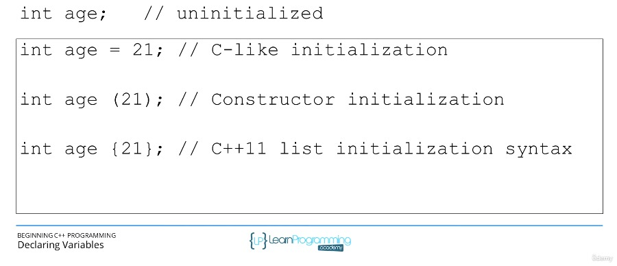

## Types de données primitifs C++

+ Types de données fondamentaux implémentés directement par le langage `C++`.

   + types de caractères
   + types entiers
     + `signé` et `non signé`
   + Types à virgule flottante
   + Type booléen
   + `Size` et `precision` dépendent souvent du compilateur
     + `#include<climits>`

+ Tailles de caractères

   + Exprimé en bits
   + Plus il y a de bits, plus il y a de valeurs pouvant être représentées.
   + Plus il y a de bits, plus il faut de stockage.

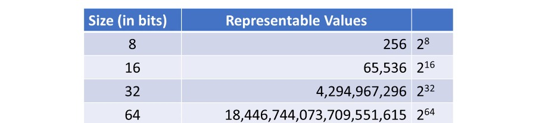

+ Types de caractères

   + Utilisé pour représenter des caractères uniques, « A », « X », « @ ».
   + Les types plus sauvages sont utilisés pour représenter des jeux de caractères larges.

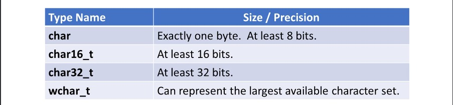

+ Types entiers

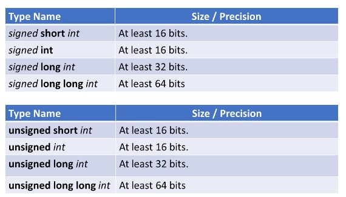

+ Type à virgule flottante

   + Utilisé pour représenter des nombres non entiers.
   + Représenté par mantisse et exposant (notation scientifique)
   + La précision est le nombre de chiffres de la mantisse.
   + La précision et la taille dépendent du compilateur.


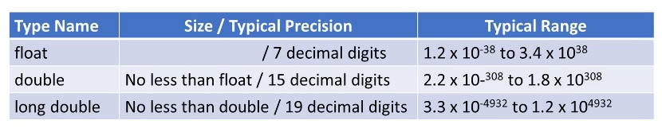

+ Type booléen

   + Utilisé pour représenter le vrai et le faux.
   + Zéro est faux.
   + Non nul est vrai.


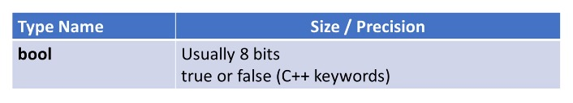

## Utilisation de l'opérateur `sizeof`

+ L'opérateur `sizeof`.

   + détermine la taille en `octets` d'un type ou d'une variable.

+ Exemples :

```
    sizeof(int)
    sizeof(double)
    sizeof(some_variable)
    sizeof some_variable
```

+ `<climits>` ou `<cfloat>`

   + Les fichiers d'inclusion `climits` ou `cfloat` contiennent des informations de taille et de précision sur votre implémentation de `C++`.

```
     INT_MAX
     INT_MIN
     LONG_MIN
     LONG_MAX
     FLT_MIN
     FLT_MAX
```

## Qu'est-ce qu'une constante ?

+ Comme les variables `C++`

   + Avoir des noms
   + Occuper le stockage
   + Sont généralement tapés

## Type de constantes en C++

+ Constantes littérales
+ Constantes déclarées
   + mot-clé `const`
+ Expressions constantes
   + mot-clé `constexpr`
+ Constantes énumérées
   + mot-clé `enum`
+ Constantes définies
   + `#définir`

+ Le type de constante le plus évident

```
    x = 12 ;
    y = 1,56 ;
    name = "Franck";
    middle_initial = 'J';
```

+ Constantes littérales entières

```
    12 - un entier
    12U - un entier non signé
    12L - un nombre entier long
    12LL - un entier long et long
```

+ Constantes littérales « à virgule flottante »

```
     12.1 - un doublé
     12.1F - un flotteur
     12,1 L - un double long
```

+ Constantes littérales `Caractère` (codes d'échappement)


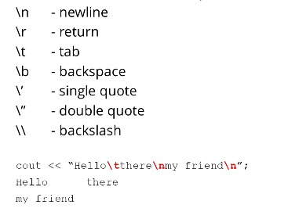


+ Constantes déclarées à l'aide du mot-clé `const`.


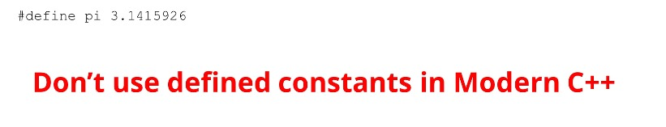