Section 7 : Arrays and Vectors
===


## Informations sur le papier
- Titre : Programmation C++
- Auteurs : `Etienne KOA`


## Aperçu de la section

+ Tableaux et vecteurs
+ Tableaux

   + Qu'est-ce qu'ils sont
   + Pourquoi nous utilisons des tableaux
   + Déclaration et initialisation
   + Accéder aux éléments du tableau

+ Tableaux multidimensionnels

+ Vecteurs

   + Qu'est-ce qu'ils sont
   + Avantages par rapport aux baies
   + Déclaration et initialisation

## Tableaux

+ Qu'est-ce qu'un tableau ?

   + Type de données composé ou structure de données
     + Collection d'éléments

   + Tous les éléments sont du même type
   + Chaque élément est accessible directement


```
       int test_score_1 {0} ;
       int test_score_2 {0} ;
       int test_score_3 {0} ;
       int test_score_4 {0} ;
       int test_score_5 {0} ;
       . . .
       int test_score_100 {0} ;
```


## Caractéristiques

+ Taille fixe
+ Les éléments sont tous du même type
+ Stocké de manière contiguë en mémoire
+ Les éléments individuels sont accessibles par leur position ou leur index.

+ Le premier élément est à l'index 0
+ Le dernier élément est à la taille d'index-1

+ Pas de vérification pour voir si vous êtes hors limites

+ Toujours initialiser les tableaux
+ Très efficace
+ L'itération (bouclage) est souvent utilisée pour traiter

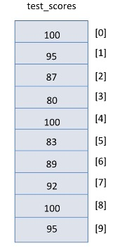

## Déclarer

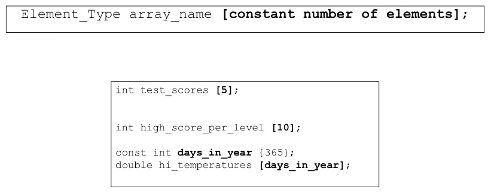

## Initialisation

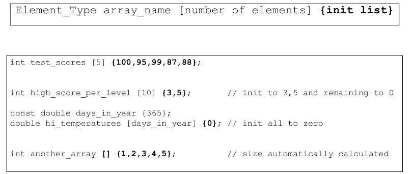

## Accéder aux éléments du tableau

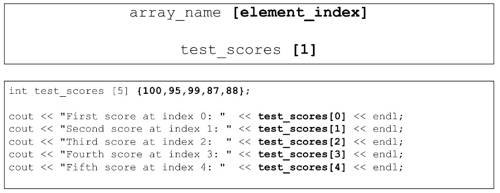


## Changer le contenu des éléments du tableau

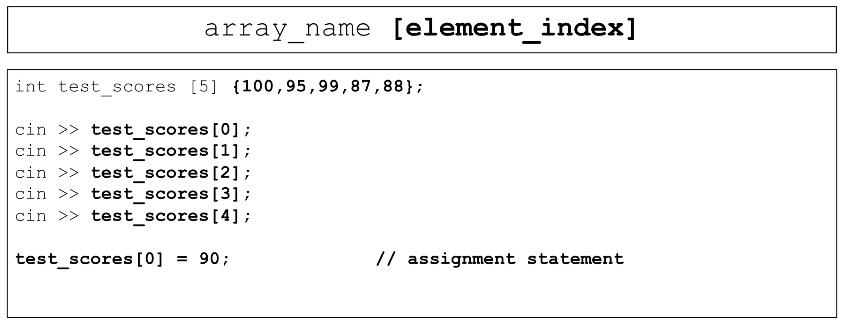

## Comment ça marche ?

+ Le nom du tableau représente l'emplacement du premier élément du tableau (index 0).

+ L'[index] représente le décalage depuis le début du tableau.

+ `C++` effectue simplement une calcul pour trouver le bon élément.

+ N'oubliez pas - aucune vérification des limites

## Tableaux multidimensionnels

+ Déclarer des tableaux multidimensionnels

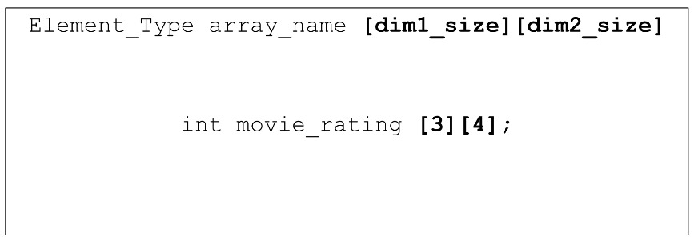


+ Tableaux multidimensionnels

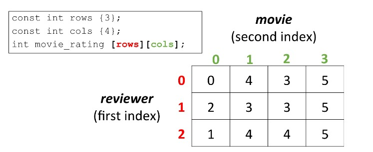


+ Accès aux éléments du tableau dans des tableaux multidimensionnels.

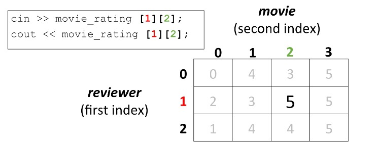

+ Initialisation d'un tableau multidimensionnel

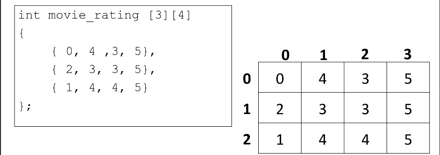


## Vecteurs

+ Supposons que nous souhaitions stocker les résultats des tests de mon école.

+ Je n'ai aucun moyen de savoir combien d'élèves s'inscriront l'année prochaine.

+Options :
   + Choisissez une taille que vous ne dépasserez probablement pas et utilisez des tableaux statiques.
   + Utilisez un tableau dynamique tel que vectoriel.

## Qu'est-ce qu'un vecteur ?

+ Conteneur dans la bibliothèque de modèles standard `C++`.

+ Un tableau dont la taille peut augmenter et diminuer au moment de l'exécution.

+ Fournit une sémantique et une syntaxe similaires à celles des tableaux.

+ Très efficace

+ Peut fournir une vérification des limites

+ Peut utiliser de nombreuses fonctions intéressantes comme trier, inverser, rechercher et plus encore.


## Déclarer

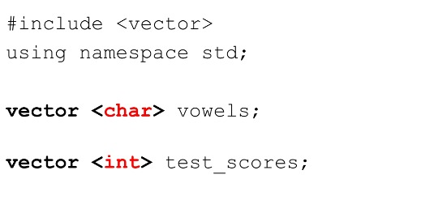

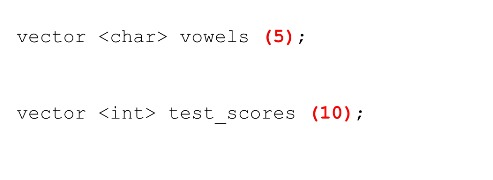


## Initialisation

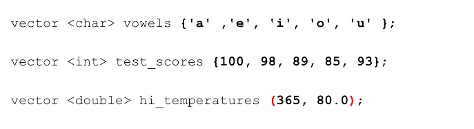

## Caractéristiques

+ Taille dynamique
+ Les éléments sont tous du même type
+ Stocké de manière contiguë en mémoire
+ Les éléments individuels sont accessibles par leur position ou leur index.

+ Le premier élément est à l'index 0.
+ Le dernier élément a la taille d'index-1.

+ [] - pas de vérification pour voir si vous êtes hors limites.
+ Fournit de nombreuses fonctions utiles qui vérifient les limites.

+ Éléments initialisés à zéro
+ Très efficace
+ L'itération (bouclage) est souvent utilisée pour traiter


## Accès aux éléments vectoriels - syntaxe du tableau

+ Accès aux éléments vectoriels - syntaxe de tableau

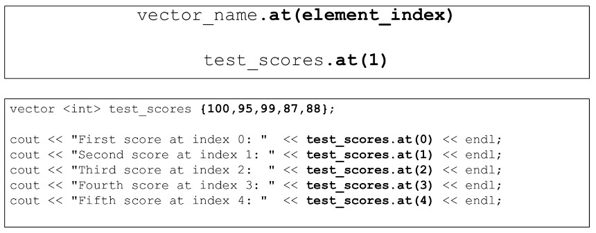


+ Accès aux éléments - syntaxe vectorielle


+ Modification du contenu des éléments vectoriels - syntaxe vectorielle.

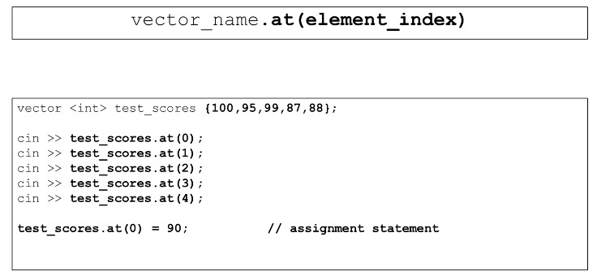

+ Alors, quand poussent-ils selon les besoins ?

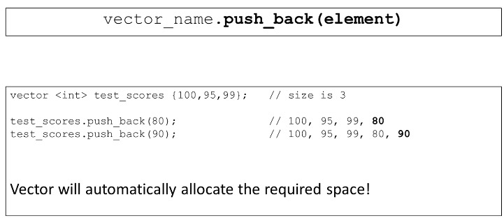

+ Et si vous êtes hors limites ?

   + Les tableaux ne vérifient jamais les limites
   + De nombreuses méthodes vectorielles permettent de vérifier les limites
   + Une exception et un message d'erreur sont générés

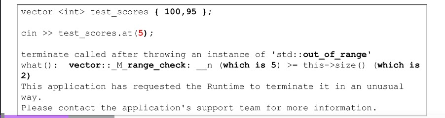