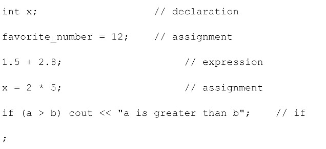

Section 8 : Statements and Operators
===


## Informations sur le papier
- Titre : Programmation C++
- Auteurs : `Etienne KOA`

## Aperçu de la section

+ Expressions, instructions et opérateurs

   +Expressions
   + Déclarations et instructions de bloc
   + Opérateurs

     + Mission
     + Arithmétique
     + Incrémenter et décrémenter
     + Égalité
     + Relationnel
     + Logique
     + Mission composée
     + Précédent

## Expressions et déclarations

+Expressions

   + Une expression est :

     + L'élément de base d'un programme
     + `une séquence d'opérateurs et d'opérandes qui spécifie un calcul`
     + Calcule une valeur à partir d'un certain nombre d'opérandes
     + Il y a bien plus dans les expressions - ce n'est pas nécessaire à ce niveau.

+ Expressions - exemples


+ déclarations

   + Une déclaration est :

     + Une ligne complète de code qui effectue une action.
     + Généralement terminé par un point-virgule
     + Contient généralement des expressions
     + `C++` a de nombreux types d'instructions
       + `expression, null, composé, sélection, itération, déclaration, saut, blocs d'essai et blocs`.

+ déclarations - exemples



## Utilisation des opérateurs

+ `C++` possède un riche ensemble d'opérateurs

   + unaire, binaire, ternaire

+ Les opérateurs courants peuvent être regroupés comme suit :

   + Mission
   + Arithmétique
   + Incrémenter/décrémenter
   + Égalité
   + Relationnel
   + Logique
   + accès membre
   + Autre

## Opérateur d'affectation (=)

```
              lhs = rhs
```

+ `rhs` est une expression qui est évaluée à une valeur.
+ La valeur du `rhs` est stockée dans le `lhs`.
+ La valeur du `rhs` doit être de type compatible avec le `lhs`.
+ Le `lhs` doit être assignable.
+ L'expression d'affectation est évaluée par rapport à ce qui a été attribué par ujsut.
+ Plus d'une variable peut être affectée dans une seule instruction.

## Expressions et conversions mixtes

#### 1) Conversions

+ Les types « Supérieur » et « Lower » sont basés sur la taille des valeurs que les types peuvent contenir.

   + `Long double, double, float, unsigned long, long, unsigned int, int`.
   + Les types `short` et `char` sont toujours convertis en `int`.

+ `Type Coercion : ` conversion d'un opérande vers un autre type de données.
+ `Promotion : ` conversion vers un type supérieur
   + Utilisé dans les expressions mathématiques.

+ `Dégradation : ` conversion vers un type inférieur.
   + Utilisé avec une affectation au type inférieur.


#### 2) Expressions de types mixtes

+ Exemples


+ Casting de type explicite - `static_cast<type>`


## Test d'égalité

+ Les opérateurs `==` et `!=`.

   + Compare les valeurs de 2 expressions.
   + Évalue à un « booléen (vrai ou faux, 1 ou 0) »
   + Couramment utilisé dans les instructions de flux de contrôle.


## Opérateurs relationnels


## Opérateurs logiques


+ `not (!)`


+ `and (&&)`


+ `or (||)`


+ Priorité

    + `not` a une priorité plus élevée que `and`
    + `and` a une priorité plus élevée que `or`

    + `not` est un opérateur unaire
    + Opérateurs binaires `and` et `or`

+ Exemples


+ Évaluation des courts-circuits

   + Lors de l'évaluation d'une expression logique `C++` s'arrête dès que le résultat est connu.


## Opérateurs d'affectation de composés

+ `op=`


+ `Exemples`


## Priorité des opérateurs (liste non complète)

+ De haut en bas


+ Qu'est-ce que l'associativité ?

   + Utiliser des règles de priorité lorsque les opérateurs adjacents sont différents

   ```
   expr1 op1 expr2 op2 expr3 // priorité
   ```

+ Utiliser des règles d'associativité lorsque les opérateurs adjacents ont la même priorité

```
    expr1 op1 expr2 op1 expr3 // associativité
```

+ Utilisez des parenthèses pour lever absolument tout doute.

+ Exemple :

